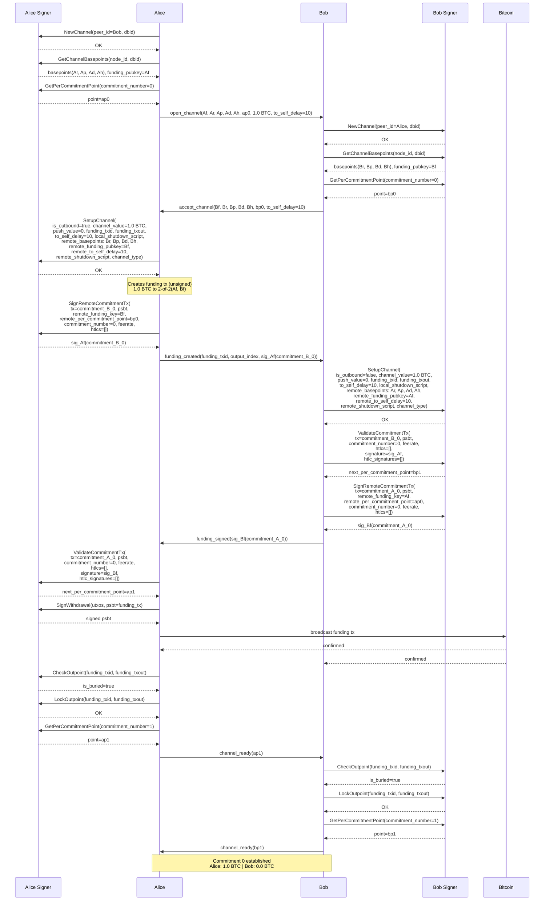
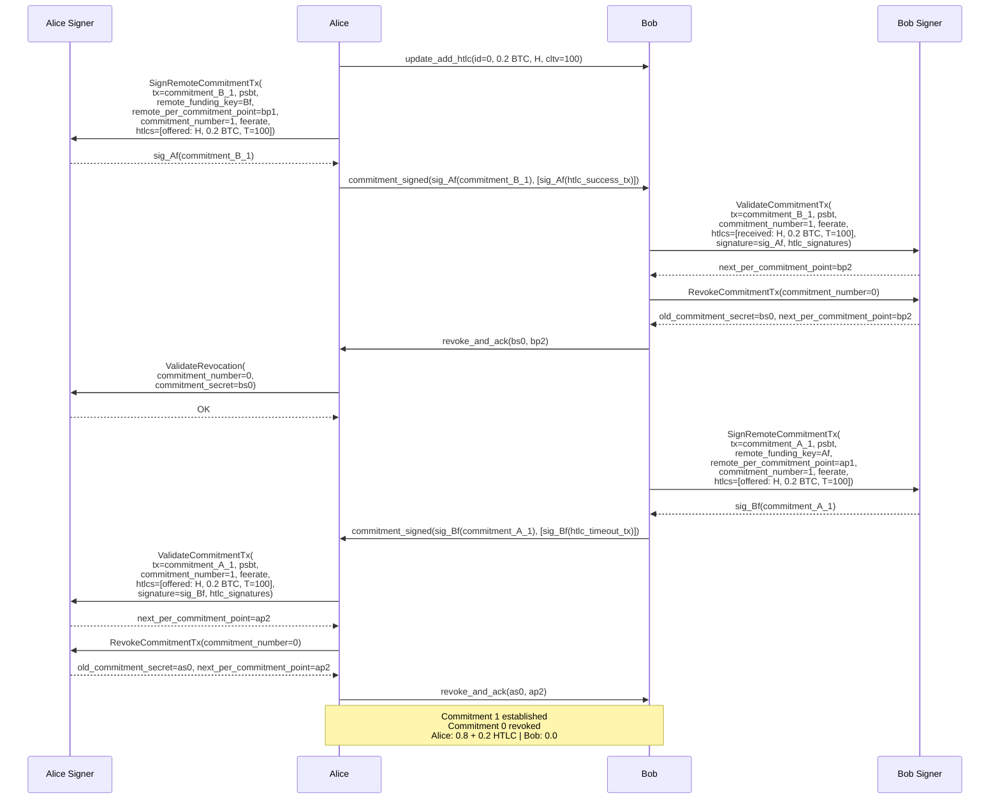
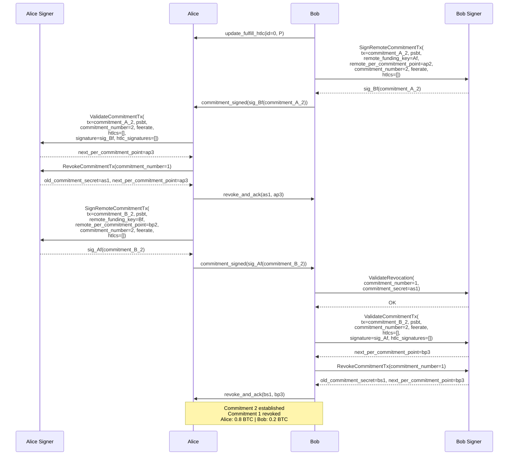
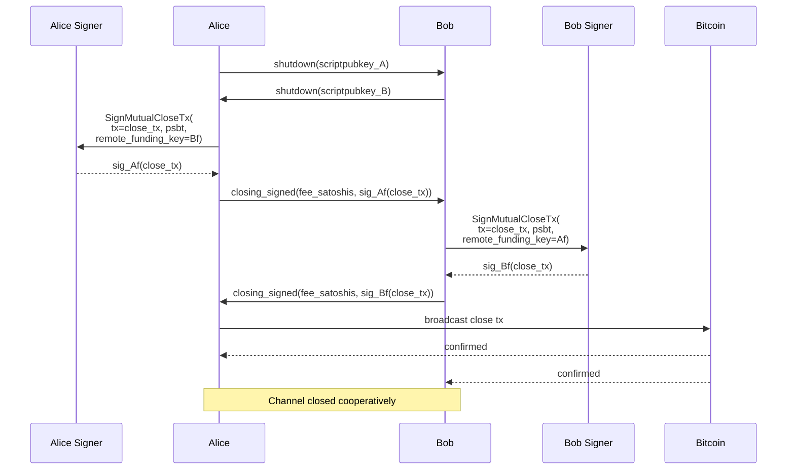

# Scenario 01 — Alice Pays Bob (VLS Signer — Current/Separate Calls)

Same scenario as `../reference/01-alice-pays-bob.md`, but showing VLS signer calls for both Alice and Bob. This is the **current** version reflecting how VLS works today — each API call is separate (no batching).

For notation (`Af`, `Ar`, `ap0`, `rp(...)`, etc.) see [Key Derivation](../reference/lightning-key-derivation.md#notation-legend).

Parameters verified against VLS source at commit `75e3a46b`. Diagrams assume **protocol version 6** (current default, `DEFAULT_MAX_PROTOCOL_VERSION`) — separate `RevokeCommitmentTx`, `GetPerCommitmentPoint` returns point only.

### Source References

Wire message definitions — `vls-protocol/src/msgs.rs`:

| Call | Message struct | Line |
|------|---------------|------|
| NewChannel | `NewChannel` | [msgs.rs:487](../validating-lightning-signer/vls-protocol/src/msgs.rs#L487) |
| GetChannelBasepoints | `GetChannelBasepoints` | [msgs.rs:231](../validating-lightning-signer/vls-protocol/src/msgs.rs#L231) |
| GetPerCommitmentPoint | `GetPerCommitmentPoint` | [msgs.rs:337](../validating-lightning-signer/vls-protocol/src/msgs.rs#L337) |
| SetupChannel | `SetupChannel` | [msgs.rs:500](../validating-lightning-signer/vls-protocol/src/msgs.rs#L500) |
| SignRemoteCommitmentTx | `SignRemoteCommitmentTx` | [msgs.rs:353](../validating-lightning-signer/vls-protocol/src/msgs.rs#L353) |
| ValidateCommitmentTx | `ValidateCommitmentTx` | [msgs.rs:566](../validating-lightning-signer/vls-protocol/src/msgs.rs#L566) |
| RevokeCommitmentTx | `RevokeCommitmentTx` | [msgs.rs:644](../validating-lightning-signer/vls-protocol/src/msgs.rs#L644) |
| ValidateRevocation | `ValidateRevocation` | [msgs.rs:587](../validating-lightning-signer/vls-protocol/src/msgs.rs#L587) |
| SignWithdrawal | `SignWithdrawal` | [msgs.rs:186](../validating-lightning-signer/vls-protocol/src/msgs.rs#L186) |
| CheckOutpoint | `CheckOutpoint` | [msgs.rs:524](../validating-lightning-signer/vls-protocol/src/msgs.rs#L524) |
| LockOutpoint | `LockOutpoint` | [msgs.rs:600](../validating-lightning-signer/vls-protocol/src/msgs.rs#L600) |
| SignMutualCloseTx | `SignMutualCloseTx` | [msgs.rs:392](../validating-lightning-signer/vls-protocol/src/msgs.rs#L392) |

Handler implementations — `vls-protocol-signer/src/handler.rs`:

| Call | Handler | Line |
|------|---------|------|
| NewChannel | `RootHandler::do_handle` | [handler.rs:750](../validating-lightning-signer/vls-protocol-signer/src/handler.rs#L750) |
| GetChannelBasepoints | `RootHandler::do_handle` | [handler.rs:757](../validating-lightning-signer/vls-protocol-signer/src/handler.rs#L757) |
| GetPerCommitmentPoint | `ChannelHandler::do_handle` | [handler.rs:1228](../validating-lightning-signer/vls-protocol-signer/src/handler.rs#L1228) |
| SetupChannel | `ChannelHandler::do_handle` | [handler.rs:1203](../validating-lightning-signer/vls-protocol-signer/src/handler.rs#L1203) |
| SignRemoteCommitmentTx | `ChannelHandler::do_handle` | [handler.rs:1308](../validating-lightning-signer/vls-protocol-signer/src/handler.rs#L1308) |
| ValidateCommitmentTx | `ChannelHandler::do_handle` | [handler.rs:1415](../validating-lightning-signer/vls-protocol-signer/src/handler.rs#L1415) |
| RevokeCommitmentTx | `ChannelHandler::do_handle` | [handler.rs:1526](../validating-lightning-signer/vls-protocol-signer/src/handler.rs#L1526) |
| ValidateRevocation | `ChannelHandler::do_handle` | [handler.rs:1556](../validating-lightning-signer/vls-protocol-signer/src/handler.rs#L1556) |
| SignWithdrawal | `RootHandler::do_handle` | [handler.rs:773](../validating-lightning-signer/vls-protocol-signer/src/handler.rs#L773) |
| CheckOutpoint | `ChannelHandler::do_handle` | [handler.rs:1251](../validating-lightning-signer/vls-protocol-signer/src/handler.rs#L1251) |
| LockOutpoint | `ChannelHandler::do_handle` | [handler.rs:1258](../validating-lightning-signer/vls-protocol-signer/src/handler.rs#L1258) |
| SignMutualCloseTx | `ChannelHandler::do_handle` | [handler.rs:1385](../validating-lightning-signer/vls-protocol-signer/src/handler.rs#L1385) |

---

## Commitment 0

Alice funds a 1.0 BTC channel.

### Signer Calls Summary

**Alice (funder) — 10 separate calls:**

| # | Call | Key parameters in | Returns |
|---|------|-------------------|---------|
| 1 | NewChannel | peer_id, dbid | — |
| 2 | GetChannelBasepoints | node_id, dbid | basepoints (Ar, Ap, Ad, Ah), funding_pubkey (Af) |
| 3 | GetPerCommitmentPoint | commitment_number=0 | point (ap0) |
| 4 | SetupChannel | is_outbound, channel_value, push_value, funding_outpoint, to_self_delay, local_shutdown_script, remote_basepoints, remote_funding_pubkey, remote_to_self_delay, remote_shutdown_script, channel_type | — |
| 5 | SignRemoteCommitmentTx | tx, psbt, remote_funding_key, remote_per_commitment_point (bp0), commitment_number=0, feerate, htlcs=[] | signature |
| 6 | ValidateCommitmentTx | tx, psbt, commitment_number=0, feerate, htlcs=[], signature (sig_Bf), htlc_signatures=[] | next_per_commitment_point=ap1 |
| 7 | SignWithdrawal | utxos, psbt | signed psbt |
| 8 | CheckOutpoint | funding_txid, funding_txout | is_buried |
| 9 | LockOutpoint | funding_txid, funding_txout | — |
| 10 | GetPerCommitmentPoint | commitment_number=1 | point (ap1) |

**Bob (non-funder) — 9 separate calls:**

| # | Call | Key parameters in | Returns |
|---|------|-------------------|---------|
| 1 | NewChannel | peer_id, dbid | — |
| 2 | GetChannelBasepoints | node_id, dbid | basepoints (Br, Bp, Bd, Bh), funding_pubkey (Bf) |
| 3 | GetPerCommitmentPoint | commitment_number=0 | point (bp0) |
| 4 | SetupChannel | is_outbound=false, channel_value, push_value, funding_outpoint, to_self_delay, local_shutdown_script, remote_basepoints, remote_funding_pubkey, remote_to_self_delay, remote_shutdown_script, channel_type | — |
| 5 | ValidateCommitmentTx | tx, psbt, commitment_number=0, feerate, htlcs=[], signature (sig_Af), htlc_signatures=[] | next_per_commitment_point=bp1 |
| 6 | SignRemoteCommitmentTx | tx, psbt, remote_funding_key (Af), remote_per_commitment_point (ap0), commitment_number=0, feerate, htlcs=[] | signature |
| 7 | CheckOutpoint | funding_txid, funding_txout | is_buried |
| 8 | LockOutpoint | funding_txid, funding_txout | — |
| 9 | GetPerCommitmentPoint | commitment_number=1 | point (bp1) |

### Notable findings from source

**The node builds transactions, the signer validates and signs them:**
- **SignRemoteCommitmentTx** and **ValidateCommitmentTx** both receive the full pre-built `tx` and `psbt`. The signer does not build commitment transactions — it receives them and checks that they match expectations.
- **SignMutualCloseTx** likewise receives the full `tx` and `psbt`.

**Return values carry implicit state advances:**
- **ValidateCommitmentTx** returns `next_per_commitment_point` and optionally `old_commitment_secret`. The behavior depends on protocol version ([msgs.rs:39-40](../validating-lightning-signer/vls-protocol/src/msgs.rs#L39)):
  - **Protocol < 5** (`PROTOCOL_VERSION_REVOKE`): ValidateCommitmentTx also revokes the previous commitment internally — returns old_secret. There is no separate RevokeCommitmentTx call.
  - **Protocol >= 5**: ValidateCommitmentTx returns `get_per_commitment_point(commit_num + 1)` but does NOT revoke. Revocation is deferred to an explicit `RevokeCommitmentTx` call.
  - For commitment 0 specifically, it calls `activate_initial_commitment()` since there is no previous commitment to revoke.
- **RevokeCommitmentTx** (protocol >= 5 only) returns `old_commitment_secret` + `next_per_commitment_point`.
- **GetPerCommitmentPoint** in protocol < 6 (`PROTOCOL_VERSION_NO_SECRET`) also returns the secret for `commitment_number - 2`. Protocol >= 6 returns only the point.

This means the `next_per_commitment_point` is returned as a side effect of both ValidateCommitmentTx and RevokeCommitmentTx. The separate `GetPerCommitmentPoint(1)` call after funding confirmation may be redundant with what ValidateCommitmentTx already returned — depends on protocol version and how the node implementation consumes the return values.

**Placeholder implementations:**
- **CheckOutpoint** and **LockOutpoint** are placeholder implementations in the current code ([handler.rs:1251](../validating-lightning-signer/vls-protocol-signer/src/handler.rs#L1251): `warn!("null placeholder...")`).

**Alternative API surface (`_phase2` variants):**
- `sign_counterparty_commitment_tx_phase2`, `validate_holder_commitment_tx_phase2`, `sign_mutual_close_tx_phase2` take explicit balance values (`to_holder_value_sat`, `to_counterparty_value_sat`) instead of full pre-built transactions. This is a newer API path where the signer builds the transaction internally from parameters.

---

## Commitment 1 — HTLC Add

Alice sends 0.2 BTC to Bob via HTLC. Payment hash H, CLTV timeout T=100.

### Signer Calls — Commitment 1

**Alice (initiator) — 4 separate calls:**

| # | Call | Key parameters in | Returns |
|---|------|-------------------|---------|
| 1 | SignRemoteCommitmentTx | tx, psbt, remote_funding_key=Bf, remote_pcp=bp1, cmt=1, feerate, htlcs=[offered] | signature |
| 2 | ValidateRevocation | commitment_number=0, commitment_secret=bs0 | — (stores bs0 for penalty) |
| 3 | ValidateCommitmentTx | tx, psbt, cmt=1, feerate, htlcs=[offered], sig=sig_Bf, htlc_sigs | next_per_commitment_point=ap2 (advances state) |
| 4 | RevokeCommitmentTx | commitment_number=0 | old_secret=as0, next_pcp=ap2 |

**Bob (responder) — 3 separate calls:**

| # | Call | Key parameters in | Returns |
|---|------|-------------------|---------|
| 1 | ValidateCommitmentTx | tx, psbt, cmt=1, feerate, htlcs=[received], sig=sig_Af, htlc_sigs | next_per_commitment_point=bp2 (advances state) |
| 2 | RevokeCommitmentTx | commitment_number=0 | old_secret=bs0, next_pcp=bp2 |
| 3 | SignRemoteCommitmentTx | tx, psbt, remote_funding_key=Af, remote_pcp=ap1, cmt=1, feerate, htlcs=[offered] | signature |

Note: The HTLC is "offered" from the signer's perspective when signing the remote commitment (we are offering it to them) and "received" when validating our own commitment (we received it from them). Same HTLC, different viewpoint — this is because each commitment is built from the holder's perspective.

---

## Commitment 2 — HTLC Settlement

Bob reveals the preimage, claiming the 0.2 BTC. HTLC removed from both commitments.

### Signer Calls — Commitment 2

**Bob (initiator) — 4 separate calls:**

| # | Call | Key parameters in | Returns |
|---|------|-------------------|---------|
| 1 | SignRemoteCommitmentTx | tx, psbt, remote_funding_key=Af, remote_pcp=ap2, cmt=2, feerate, htlcs=[] | signature |
| 2 | ValidateRevocation | commitment_number=1, commitment_secret=as1 | — (stores as1 for penalty) |
| 3 | ValidateCommitmentTx | tx, psbt, cmt=2, feerate, htlcs=[], sig=sig_Af, htlc_sigs=[] | next_per_commitment_point=bp3 (advances state) |
| 4 | RevokeCommitmentTx | commitment_number=1 | old_secret=bs1, next_pcp=bp3 |

**Alice (responder) — 3 separate calls:**

| # | Call | Key parameters in | Returns |
|---|------|-------------------|---------|
| 1 | ValidateCommitmentTx | tx, psbt, cmt=2, feerate, htlcs=[], sig=sig_Bf, htlc_sigs=[] | next_per_commitment_point=ap3 (advances state) |
| 2 | RevokeCommitmentTx | commitment_number=1 | old_secret=as1, next_pcp=ap3 |
| 3 | SignRemoteCommitmentTx | tx, psbt, remote_funding_key=Bf, remote_pcp=bp2, cmt=2, feerate, htlcs=[] | signature |

---

## Cooperative Close

Both sides agree to close the channel. No more HTLCs pending.

### Signer Calls — Cooperative Close

**Alice — 1 call:**

| # | Call | Key parameters in | Returns |
|---|------|-------------------|---------|
| 1 | SignMutualCloseTx | tx (close_tx), psbt, remote_funding_key (Bf) | signature |

**Bob — 1 call:**

| # | Call | Key parameters in | Returns |
|---|------|-------------------|---------|
| 1 | SignMutualCloseTx | tx (close_tx), psbt, remote_funding_key (Af) | signature |

Note: The node builds the close transaction and passes the full `tx` and `psbt` to the signer. The signer extracts output scripts and amounts from the transaction itself and validates them against policy (destination allowlist, fee range, no pending HTLCs). There is also a `_phase2` variant that takes explicit values (`to_holder_value_sat`, `to_counterparty_value_sat`, holder/counterparty scripts) instead of a pre-built transaction.
