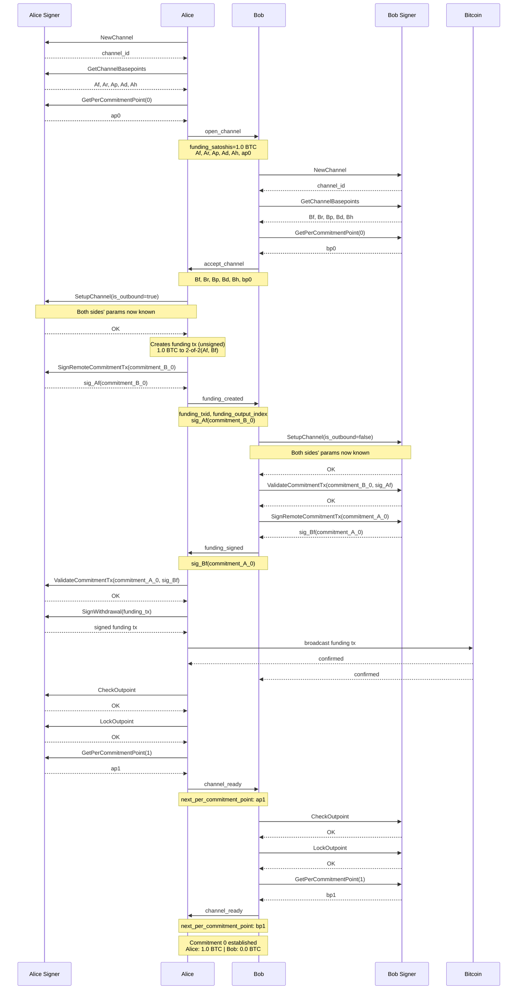
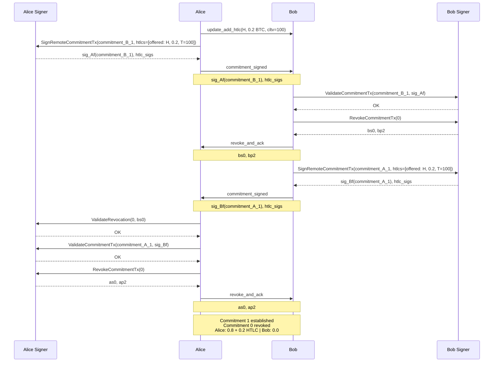
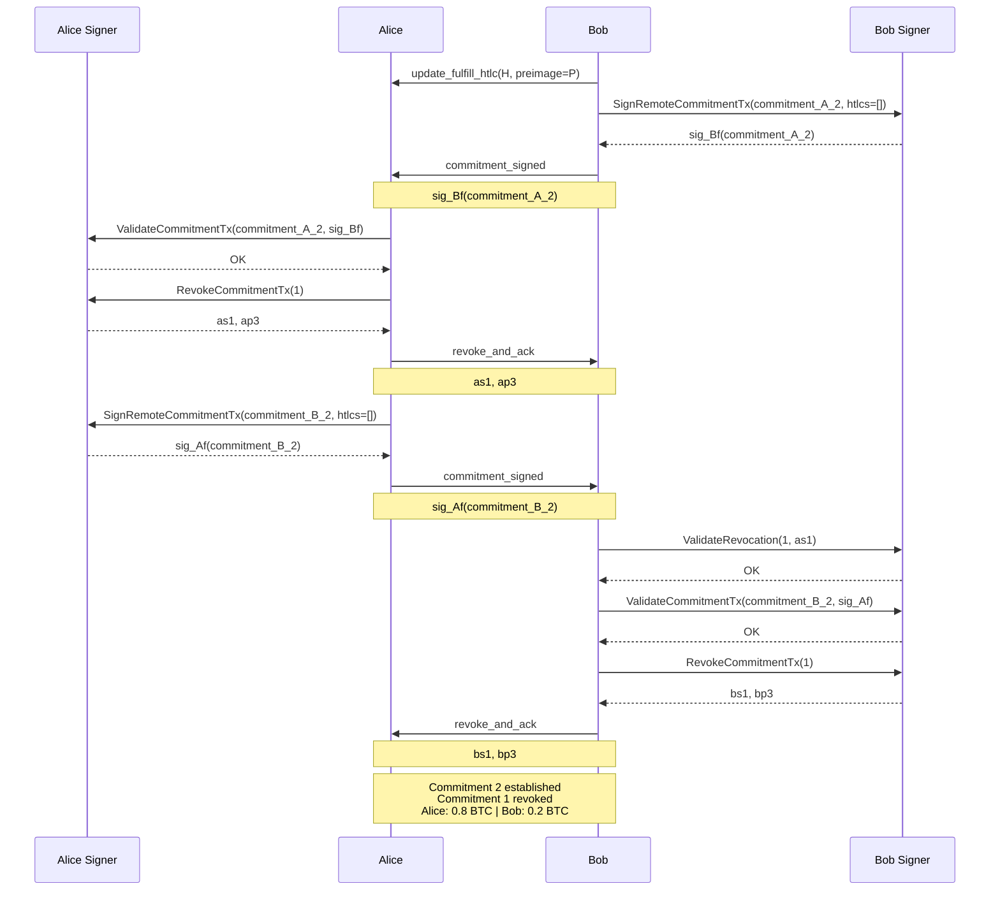
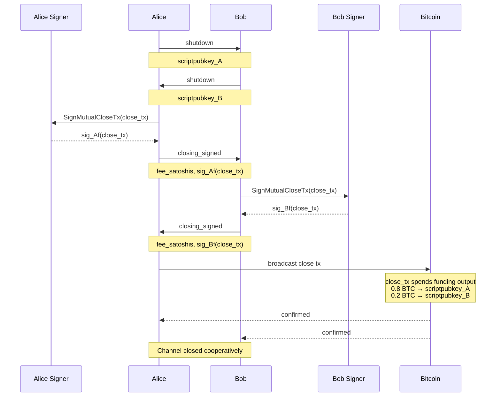

# Scenario 01 — Alice Pays Bob (VLS Signer — Current/Separate Calls)

Same scenario as `../reference/01-alice-pays-bob.md`, but showing VLS signer calls for both Alice and Bob. This is the **current** version reflecting how VLS works today — each API call is separate (no batching).

For notation (`Af`, `Ar`, `ap0`, `rp(...)`, etc.) see [Key Derivation](../reference/lightning-key-derivation.md#notation-legend).

---

## Commitment 0

Alice funds a 1.0 BTC channel.

### Signer Calls Summary

**Alice (funder) — 9 separate calls:**

| # | Call | When | Purpose |
|---|------|------|---------|
| 1 | NewChannel | Before open_channel | Register new channel with signer |
| 2 | GetChannelBasepoints | Before open_channel | Get funding key and basepoints |
| 3 | GetPerCommitmentPoint(0) | Before open_channel | Get first per-commitment point |
| 4 | SetupChannel(is_outbound=true) | After accept_channel received | Register counterparty params |
| 5 | SignRemoteCommitmentTx(commitment_B_0) | Before funding_created | Sign Bob's commitment |
| 6 | ValidateCommitmentTx(commitment_A_0, sig_Bf) | After funding_signed received | Validate Bob's sig on our commitment |
| 7 | SignWithdrawal(funding_tx) | Before broadcast | Sign the funding tx inputs |
| 8 | CheckOutpoint | After funding confirmed | Verify the funding outpoint |
| 9 | LockOutpoint | After funding confirmed | Lock channel to this outpoint |
| 10 | GetPerCommitmentPoint(1) | After funding confirmed | Get ap1 for channel_ready |

**Bob (non-funder) — 8 separate calls:**

| # | Call | When | Purpose |
|---|------|------|---------|
| 1 | NewChannel | After open_channel received | Register new channel with signer |
| 2 | GetChannelBasepoints | After open_channel received | Get funding key and basepoints |
| 3 | GetPerCommitmentPoint(0) | After open_channel received | Get first per-commitment point |
| 4 | SetupChannel(is_outbound=false) | After funding_created received | Register counterparty params |
| 5 | ValidateCommitmentTx(commitment_B_0, sig_Af) | After funding_created received | Validate Alice's sig on our commitment |
| 6 | SignRemoteCommitmentTx(commitment_A_0) | After funding_created received | Sign Alice's commitment |
| 7 | CheckOutpoint | After funding confirmed | Verify the funding outpoint |
| 8 | LockOutpoint | After funding confirmed | Lock channel to this outpoint |
| 9 | GetPerCommitmentPoint(1) | After funding confirmed | Get bp1 for channel_ready |

---

## Commitment 1 — HTLC Add

Alice sends 0.2 BTC to Bob via HTLC. Payment hash H, CLTV timeout T=100.

### Signer Calls — Commitment 1

**Alice (initiator) — 4 separate calls:**

| # | Call | When | Purpose |
|---|------|------|---------|
| 1 | SignRemoteCommitmentTx(commitment_B_1) | Before commitment_signed sent | Sign Bob's new commitment with HTLC |
| 2 | ValidateRevocation(0, bs0) | After revoke_and_ack received | Verify Bob revoked commitment 0 |
| 3 | ValidateCommitmentTx(commitment_A_1, sig_Bf) | After commitment_signed received | Validate our new commitment with HTLC |
| 4 | RevokeCommitmentTx(0) | Before revoke_and_ack sent | Get as0 to revoke our commitment 0 |

**Bob (responder) — 3 separate calls:**

| # | Call | When | Purpose |
|---|------|------|---------|
| 1 | ValidateCommitmentTx(commitment_B_1, sig_Af) | After commitment_signed received | Validate our new commitment with HTLC |
| 2 | RevokeCommitmentTx(0) | Before revoke_and_ack sent | Get bs0 to revoke our commitment 0 |
| 3 | SignRemoteCommitmentTx(commitment_A_1) | Before commitment_signed sent | Sign Alice's new commitment with HTLC |

---

## Commitment 2 — HTLC Settlement

Bob reveals the preimage, claiming the 0.2 BTC. HTLC removed from both commitments.

### Signer Calls — Commitment 2

**Bob (initiator) — 4 separate calls:**

| # | Call | When | Purpose |
|---|------|------|---------|
| 1 | SignRemoteCommitmentTx(commitment_A_2) | Before commitment_signed sent | Sign Alice's new commitment, HTLC removed |
| 2 | ValidateRevocation(1, as1) | After revoke_and_ack received | Verify Alice revoked commitment 1 |
| 3 | ValidateCommitmentTx(commitment_B_2, sig_Af) | After commitment_signed received | Validate our new commitment, HTLC removed |
| 4 | RevokeCommitmentTx(1) | Before revoke_and_ack sent | Get bs1 to revoke our commitment 1 |

**Alice (responder) — 3 separate calls:**

| # | Call | When | Purpose |
|---|------|------|---------|
| 1 | ValidateCommitmentTx(commitment_A_2, sig_Bf) | After commitment_signed received | Validate our new commitment, HTLC removed |
| 2 | RevokeCommitmentTx(1) | Before revoke_and_ack sent | Get as1 to revoke our commitment 1 |
| 3 | SignRemoteCommitmentTx(commitment_B_2) | Before commitment_signed sent | Sign Bob's new commitment, HTLC removed |

---

## Cooperative Close

Both sides agree to close the channel. No more HTLCs pending.

### Signer Calls — Cooperative Close

**Alice — 1 call:**

| # | Call | When | Purpose |
|---|------|------|---------|
| 1 | SignMutualCloseTx(close_tx) | Before closing_signed sent | Sign the cooperative close transaction |

**Bob — 1 call:**

| # | Call | When | Purpose |
|---|------|------|---------|
| 1 | SignMutualCloseTx(close_tx) | Before closing_signed sent | Sign the cooperative close transaction |
