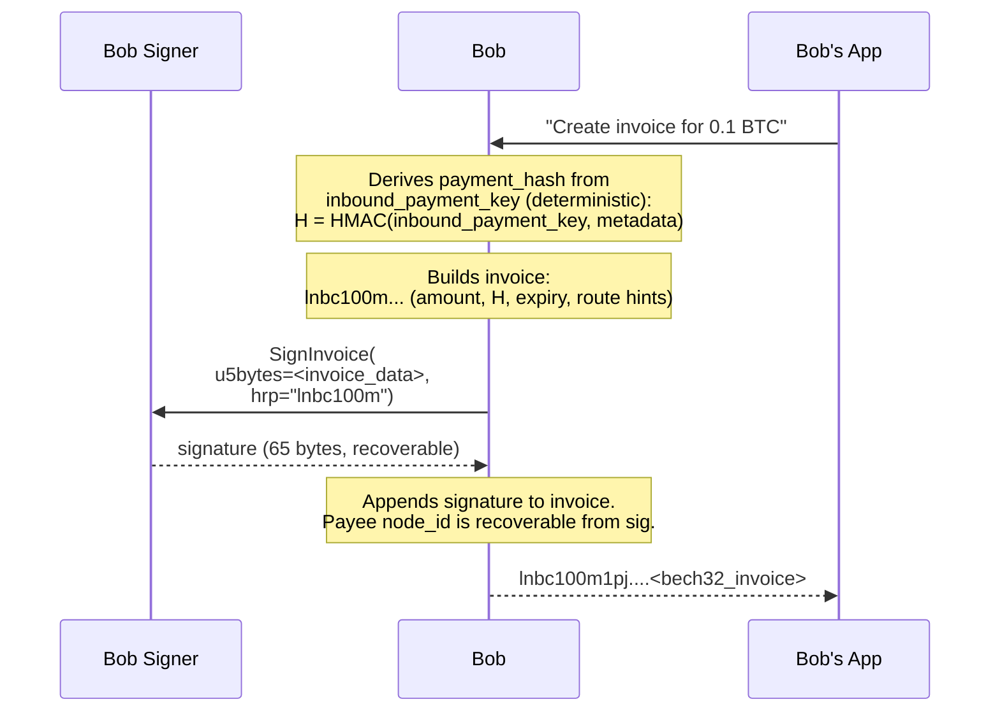
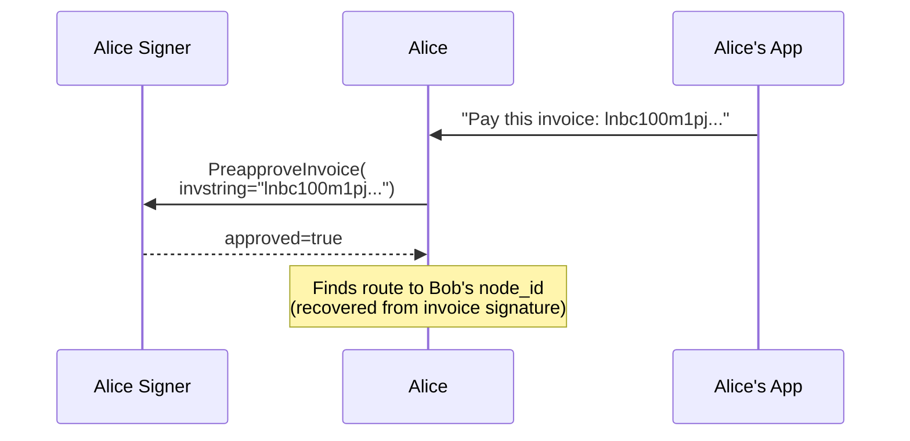
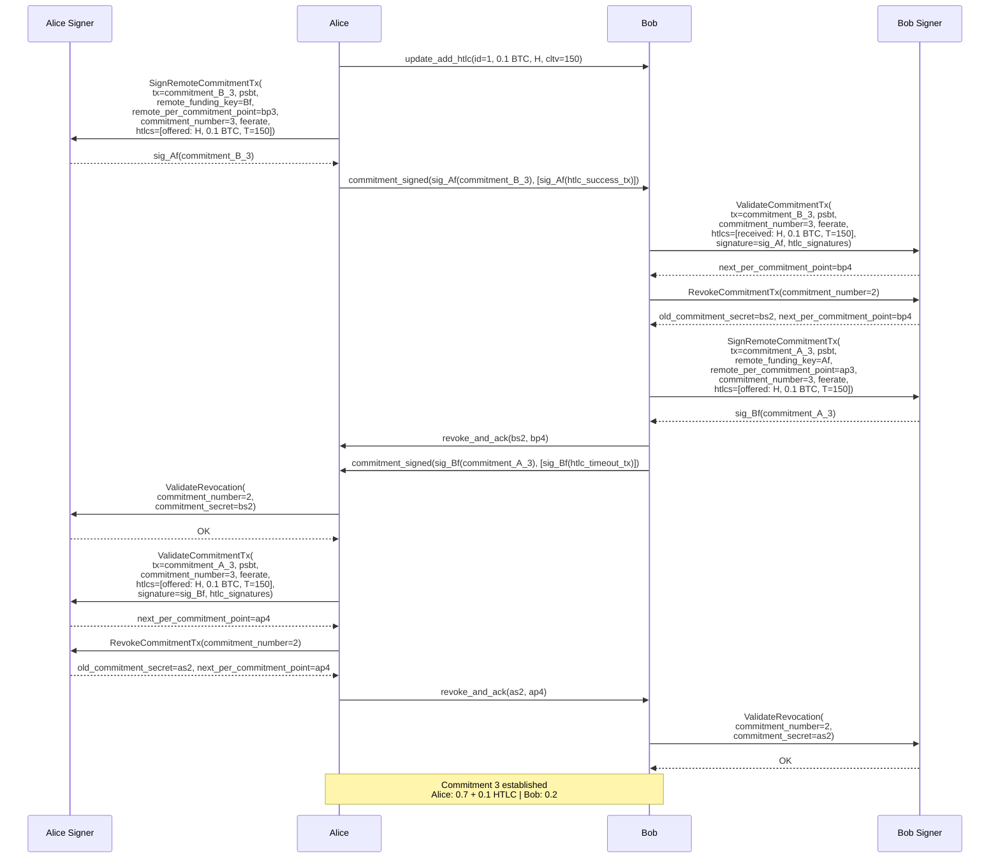
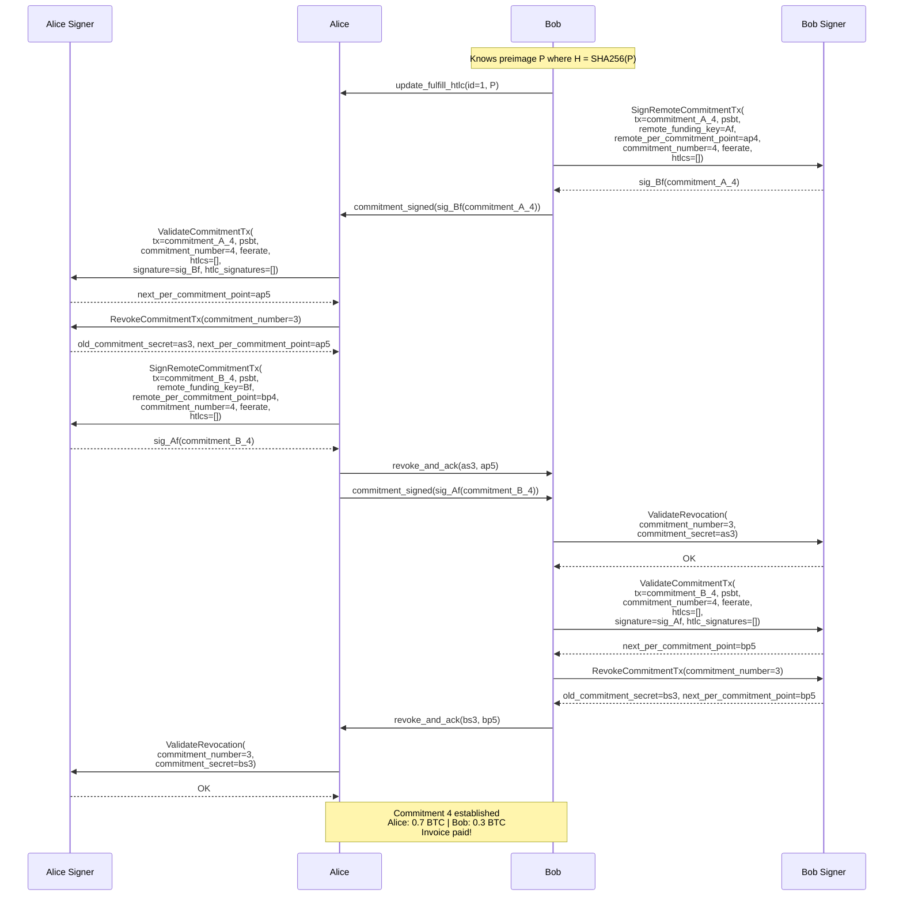

# Scenario 02 — Alice Pays Bob's Invoice (VLS Signer — Current/Separate Calls)

Alice and Bob already have an open channel (established in [Scenario 01](01-alice-pays-bob.md)). Bob creates a BOLT11 invoice, Alice pays it. This scenario shows the VLS calls involved in **invoice creation**, **payment preapproval**, and **HTLC settlement** — focusing on how the signer participates at each stage.

For notation (`Af`, `Ar`, `ap0`, `rp(...)`, etc.) see [Key Derivation](../reference/lightning-key-derivation.md#notation-legend).

### Source References

Wire message definitions — `vls-protocol/src/msgs.rs`:

| Call | Message struct | Line |
|------|---------------|------|
| SignInvoice | `SignInvoice` | [msgs.rs:?] |
| PreapproveInvoice | `PreapproveInvoice` | [msgs.rs:?] |
| SignRemoteCommitmentTx | `SignRemoteCommitmentTx` | [msgs.rs:353](../validating-lightning-signer/vls-protocol/src/msgs.rs#L353) |
| ValidateCommitmentTx | `ValidateCommitmentTx` | [msgs.rs:566](../validating-lightning-signer/vls-protocol/src/msgs.rs#L566) |
| RevokeCommitmentTx | `RevokeCommitmentTx` | [msgs.rs:644](../validating-lightning-signer/vls-protocol/src/msgs.rs#L644) |
| ValidateRevocation | `ValidateRevocation` | [msgs.rs:587](../validating-lightning-signer/vls-protocol/src/msgs.rs#L587) |

---

## Prerequisites

- Channel from Scenario 01 is open and at Commitment 2 (Alice: 0.8 BTC, Bob: 0.2 BTC)
- Bob wants to receive 0.1 BTC from Alice

---

## Phase 1 — Bob Creates Invoice

Bob's node creates a BOLT11 invoice and asks the signer to sign it.

### What the signer does on `SignInvoice`

The signer signs the invoice using `node_secret` (`m/0'`). The signature allows any payer to recover `node_id` (Bob's public key) from the invoice — this is how the payer knows where to route the payment.

**The signer could also:**
- Record the `payment_hash` from the invoice (for later verification when an HTLC arrives)
- Check invoice amount against policy limits
- Check that the invoice hasn't already expired

**Currently:** The signer signs without policy checks on invoice creation. It trusts the node to create valid invoices.

### VLS Calls — Invoice Creation

| # | Call | Input | Output | Policy checks |
|---|------|-------|--------|---------------|
| 1 | SignInvoice | `u5bytes` (base32 invoice data), `hrp` ("lnbc100m") | 65-byte recoverable ECDSA signature | None currently |

---

## Phase 2 — Alice Receives Invoice and Preapproves Payment

Alice receives the invoice out-of-band (QR code, message, etc.) and her node asks the signer to preapprove the payment before routing.

### What the signer does on `PreapproveInvoice`

The signer parses the invoice and checks:

| Check | Policy rule | What it prevents |
|-------|-------------|------------------|
| Invoice not expired | `policy-invoice-not-expired` (rule 59) | Paying a stale invoice that can't be settled |
| Amount within limits | `policy-commitment-payment-invoiced` (rule 58) | Overpaying or exceeding velocity limits |
| Destination allowed | (allowlist, if configured) | Payments to unknown/banned nodes |

If the signer rejects, the node must not initiate the HTLC. This is the signer's opportunity to prevent the payment **before** any channel state changes.

### VLS Calls — Payment Preapproval

| # | Call | Input | Output | Policy checks |
|---|------|-------|--------|---------------|
| 1 | PreapproveInvoice | `invstring` (full BOLT11 string) | `approved` (bool) | Invoice expiry, amount limits, velocity, destination |

---

## Phase 3 — HTLC Add (Commitment 3)

Alice sends the payment as an HTLC. This is structurally identical to Commitment 1 in Scenario 01, with different balances.

Starting state: Alice 0.8 BTC, Bob 0.2 BTC (Commitment 2)

### Signer Calls — Commitment 3 (HTLC Add)

**Alice (sender) — 4 calls:**

| # | Call | Returns |
|---|------|---------|
| 1 | SignRemoteCommitmentTx | sig_Af(commitment_B_3) |
| 2 | ValidateRevocation | — (stores bs2) |
| 3 | ValidateCommitmentTx | next_pcp=ap4 |
| 4 | RevokeCommitmentTx | as2, next_pcp=ap4 |

**Bob (receiver) — 4 calls:**

| # | Call | Returns |
|---|------|---------|
| 1 | ValidateCommitmentTx | next_pcp=bp4 |
| 2 | RevokeCommitmentTx | bs2, next_pcp=bp4 |
| 3 | SignRemoteCommitmentTx | sig_Bf(commitment_A_3) |
| 4 | ValidateRevocation | — (stores as2) |

---

## Phase 4 — HTLC Settlement (Commitment 4)

Bob knows the preimage P (he generated H = SHA256(P) when creating the invoice). He reveals it to settle the HTLC.

### Signer Calls — Commitment 4 (HTLC Settlement)

**Bob (initiator) — 4 calls:**

| # | Call | Returns |
|---|------|---------|
| 1 | SignRemoteCommitmentTx | sig_Bf(commitment_A_4) |
| 2 | ValidateRevocation | — (stores as3) |
| 3 | ValidateCommitmentTx | next_pcp=bp5 |
| 4 | RevokeCommitmentTx | bs3, next_pcp=bp5 |

**Alice (responder) — 4 calls:**

| # | Call | Returns |
|---|------|---------|
| 1 | ValidateCommitmentTx | next_pcp=ap5 |
| 2 | RevokeCommitmentTx | as3, next_pcp=ap5 |
| 3 | SignRemoteCommitmentTx | sig_Af(commitment_B_4) |
| 4 | ValidateRevocation | — (stores bs3) |

---

## Full Scenario Summary

### Total VLS calls (both sides)

| Phase | Alice's signer | Bob's signer |
|-------|---------------|--------------|
| 1. Invoice creation | — | 1 (SignInvoice) |
| 2. Payment preapproval | 1 (PreapproveInvoice) | — |
| 3. HTLC add (commitment 3) | 4 | 4 |
| 4. HTLC settle (commitment 4) | 4 | 4 |
| **Total** | **9** | **9** |

### What each signer verified

**Bob's signer:**
- Signed the invoice (proving Bob's node_id, enabling payment routing)
- Validated 2 new commitments (3 and 4) — checked signatures, amounts, HTLC correctness
- Revoked 2 old commitments — released secrets for penalty enforcement
- Stored 2 revocation secrets from Alice — can punish if she broadcasts old state

**Alice's signer:**
- Preapproved the payment — checked invoice validity, amount, destination, velocity
- Signed 2 counterparty commitments — produced signatures for Bob's new states
- Validated 2 new commitments — checked Bob's signatures on her states
- Revoked 2 old commitments — released secrets
- Stored 2 revocation secrets from Bob

---

## Policy Gap: Payment Hash Verification

When Bob's signer receives `ValidateCommitmentTx` with an incoming HTLC (Phase 3), it sees the `payment_hash` H. Since the signer holds the `inbound_payment_key` (derived from seed at `m/5'`), it **could** check:

> "Did I generate this payment_hash via `SignInvoice`?"

This check is documented as **Rule 37** (`policy-commitment-htlc-offered-hash-matches`) but is **not yet implemented**. If it were, the signer could reject HTLCs for invoices it never signed — preventing the node from accepting fabricated payments.

| What the signer knows | Available at |
|------------------------|-------------|
| `inbound_payment_key` | Always (derived from seed) |
| Payment hashes it signed | `SignInvoice` time |
| Incoming HTLC payment hash | `ValidateCommitmentTx` time |

The verification would connect these two moments: record H at SignInvoice, verify H at ValidateCommitmentTx.
