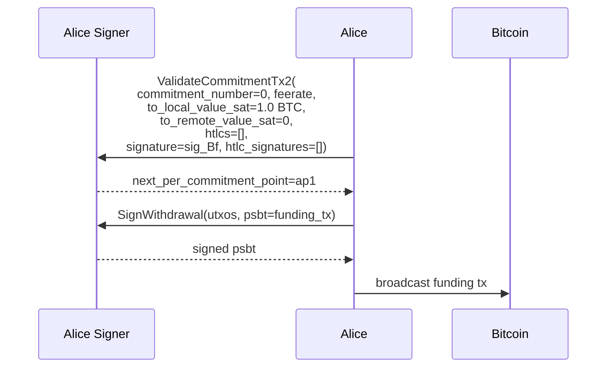
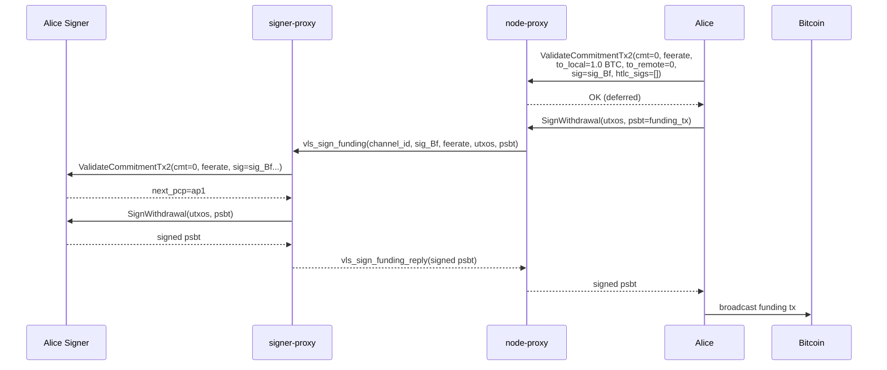

# A03 — Alice Validates Her Commitment and Signs the Funding Tx

Part of [Scenario 01 — Alice Pays Bob](01-alice-pays-bob.md). Follows [B02](01-alice-pays-bob-01-open-channel-B02.md).

**Scope:** From Alice receiving `funding_signed` until the funding transaction is broadcast.

---

## Lightning Context

Alice receives `funding_signed` from Bob containing:
- `sig_Bf(commitment_A_0)` — Bob's signature on Alice's first commitment

Alice now has her escape hatch: if anything goes wrong, she can broadcast `commitment_A_0` signed by both parties. It's now safe to:
1. Validate her commitment using Bob's signature
2. Sign the funding transaction (putting 1.0 BTC on-chain into the 2-of-2 multisig)
3. Broadcast the funding tx

## VLS Calls (Current — 2 separate round-trips)

### Call Details

| # | Call | Input | Output | Reply used by LDK? |
|---|------|-------|--------|---------------------|
| 1 | ValidateCommitmentTx2 | `commitment_number=0`, `feerate`, `to_local=1.0 BTC`, `to_remote=0`, `htlcs=[]`, `signature=sig_Bf`, `htlc_signatures=[]` | `next_per_commitment_point=ap1` | No — discarded at [lib.rs:402](../validating-lightning-signer/vls-protocol-client/src/lib.rs#L402) |
| 2 | SignWithdrawal | `utxos`: funding inputs, `psbt`: unsigned funding tx | signed `psbt` (with witnesses) | Yes — broadcast to Bitcoin network |

### What the signer does internally

**ValidateCommitmentTx2** ([handler.rs:1415](../validating-lightning-signer/vls-protocol-signer/src/handler.rs#L1415)):
- Builds `commitment_A_0` internally from stored channel params
- Verifies Bob's signature (`sig_Bf`) is valid
- Activates the initial commitment state
- Returns `next_per_commitment_point` (ap1) — discarded by LDK

**SignWithdrawal** ([handler.rs:773](../validating-lightning-signer/vls-protocol-signer/src/handler.rs#L773)):
- Validates the funding tx outputs (must include the expected 2-of-2 multisig output)
- Validates the funding amount matches `channel_value`
- Signs each input with the appropriate wallet key
- Returns the signed PSBT with witness data

---

## Proxy Optimization (v2 — 1 round-trip)

Same pattern as [A02](01-alice-pays-bob-01-open-channel-A02.md): ValidateCommitmentTx2 reply is discarded, SignWithdrawal reply is needed.

1. Node sends `ValidateCommitmentTx2` → proxy returns success immediately (deferred)
2. Node sends `SignWithdrawal` → proxy sends both bundled to signer-proxy
3. Signer processes both, returns signed psbt
4. Proxy returns signed psbt to node

### `vls_sign_funding` — proxy-to-proxy message

Combines ValidateCommitmentTx2 + SignWithdrawal. The signer-proxy already has channel params from [A02](01-alice-pays-bob-01-open-channel-A02.md)'s SetupChannel, so ValidateCommitmentTx2 values are mostly derivable. The truly new data is:

| Parameter | Type | Description |
|-----------|------|-------------|
| `channel_id` | u64 | Channel identifier |
| `counterparty_signature` | Signature (64 B) | sig_Bf — from `funding_signed` |
| `feerate` | u32 | Commitment tx feerate (signer-proxy may already have from A02) |
| `utxos` | Array\<Utxo\> | Funding inputs for SignWithdrawal |
| `psbt` | bytes | Unsigned funding transaction |

Implicit (derivable from stored channel state): `commitment_number=0`, `to_local=channel_value-push_value`, `to_remote=push_value`, `htlcs=[]`.

Reply: `vls_sign_funding_reply`

| Return field | Type | Description |
|--------------|------|-------------|
| `signed_psbt` | bytes | Funding tx with witness data, ready to broadcast |

### Why deferred ack is safe

1. **ValidateCommitmentTx2 reply is discarded** — LDK doesn't use the returned `next_per_commitment_point` from this code path ([lib.rs:402](../validating-lightning-signer/vls-protocol-client/src/lib.rs#L402)).

2. **Validation failure = channel abort.** If `sig_Bf` is invalid, the signer rejects ValidateCommitmentTx2. The error surfaces when the proxy reports `vls_sign_funding_reply` failure — Alice doesn't broadcast. No funds at risk since the funding tx isn't signed yet.

### What crosses the slow link

| | Current (2 round-trips) | v2 Proxy (1 round-trip) |
|---|---|---|
| node-proxy → signer-proxy | 2 separate messages | 1 `vls_sign_funding` (variable — depends on funding tx size) |
| signer-proxy → node-proxy | 2 separate replies | 1 `vls_sign_funding_reply` (variable — signed psbt) |
| Latency | 2 × RTT | 1 × RTT |

Note: This is the only proxy message where the payload size is significant (PSBT can be hundreds of bytes to kilobytes depending on the number of inputs). The latency saving still dominates for high-RTT links.

### Open question: `utxos` format and key derivation

The `utxos` array carries `keyindex` — the HD derivation path index — so the signer knows which private key to use for each input. This exists because the signer is chain-blind: the node generated wallet addresses from the xpub independently, and the signer was never in the loop.

**Design constraint: no data duplication on the proxy link.** The current VLS wire format sends `txid`, `outnum`, `amount`, and `script` in both the PSBT and the `utxos` array. This redundancy is unacceptable for the proxy-to-proxy protocol. The proxy message should send the PSBT once, and only add per-input **signing metadata** that isn't already in the PSBT:

| Per-input metadata | Why needed |
|--------------------|-----------|
| `keyindex` | Derivation path — signer needs this to derive the private key |
| `is_p2sh` | Signing format (native vs wrapped segwit) |
| `close_info` | Only for channel-close outputs (None for wallet UTXOs) |

Fields like `txid`, `outnum`, `amount`, `script` are already in the PSBT and must NOT be duplicated. The signer-proxy can reconstruct the full VLS `Utxo` struct from the PSBT + the signing metadata before dispatching to the signer.

For now, `vls_sign_funding` passes the `utxos` and `psbt` as-is from the VLS wire format. A future revision should define a cleaner proxy-native format that eliminates this duplication.

---

## What happens next

After broadcast, both sides wait for confirmation. Then:
- Alice: CheckOutpoint + LockOutpoint + GetPerCommitmentPoint(1) → sends `channel_ready(ap1)` → [A04](01-alice-pays-bob-01-open-channel-A04.md)
- Bob: CheckOutpoint + LockOutpoint + GetPerCommitmentPoint(1) → sends `channel_ready(bp1)` → [B03](01-alice-pays-bob-01-open-channel-B03.md)
