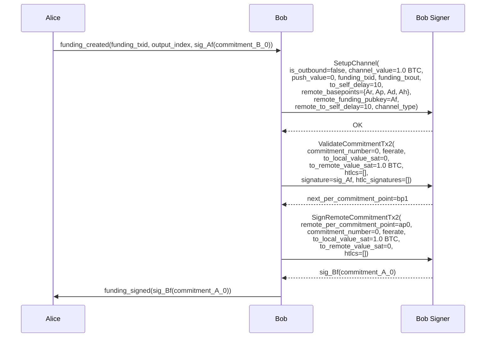
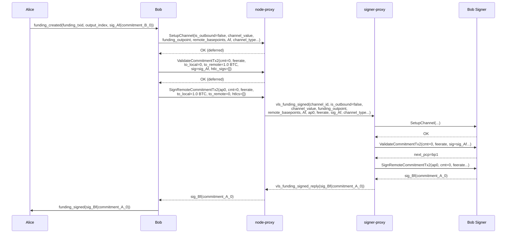

# B02 — Bob Validates His Commitment and Signs Alice's

Part of [Scenario 01 — Alice Pays Bob](01-alice-pays-bob.md). Follows [A02](01-alice-pays-bob-01-open-channel-A02.md).

**Scope:** From Bob receiving `funding_created` until `funding_signed` is sent to Alice.

---

## Lightning Context

Bob receives `funding_created` from Alice containing:
- `funding_txid` and `output_index` — identifies the funding outpoint
- `sig_Af(commitment_B_0)` — Alice's signature on Bob's first commitment

Bob now needs to:
1. Set up the channel in his signer (register Alice's keys, funding outpoint)
2. Validate his own commitment (`commitment_B_0`) using Alice's signature
3. Sign Alice's commitment (`commitment_A_0`) so she has her escape hatch
4. Send `funding_signed(sig_Bf(commitment_A_0))` to Alice

## VLS Calls (Current — 3 separate round-trips)

### Call Details

| # | Call | Input | Output | Reply used by LDK? |
|---|------|-------|--------|---------------------|
| 1 | SetupChannel | `is_outbound=false`, `channel_value`, `push_value`, `funding_txid`, `funding_txout`, `to_self_delay`, `remote_basepoints`, `remote_funding_pubkey=Af`, `remote_to_self_delay`, `channel_type` | OK (empty) | No — discarded at [lib.rs:454](../validating-lightning-signer/vls-protocol-client/src/lib.rs#L454) |
| 2 | ValidateCommitmentTx2 | `commitment_number=0`, `feerate`, `to_local=0`, `to_remote=1.0 BTC`, `htlcs=[]`, `signature=sig_Af`, `htlc_signatures=[]` | `next_per_commitment_point=bp1` | No — discarded at [lib.rs:402](../validating-lightning-signer/vls-protocol-client/src/lib.rs#L402) |
| 3 | SignRemoteCommitmentTx2 | `remote_per_commitment_point=ap0`, `commitment_number=0`, `feerate`, `to_local=1.0 BTC`, `to_remote=0`, `htlcs=[]` | `signature`, `htlc_signatures` | Yes — included in `funding_signed` |

### What the signer does internally

**SetupChannel** — same as [A02](01-alice-pays-bob-01-open-channel-A02.md) but with `is_outbound=false`. Stores Alice's basepoints and the funding outpoint.

**ValidateCommitmentTx2** ([handler.rs:1415](../validating-lightning-signer/vls-protocol-signer/src/handler.rs#L1415)):
- Builds `commitment_B_0` internally from stored channel params + provided values
- Verifies Alice's signature (`sig_Af`) is valid for this commitment
- Activates the initial commitment state (`activate_initial_commitment`)
- Returns `next_per_commitment_point` (bp1) — but LDK discards it

**SignRemoteCommitmentTx2** ([handler.rs:1308](../validating-lightning-signer/vls-protocol-signer/src/handler.rs#L1308)):
- Builds `commitment_A_0` internally (Alice's commitment, from Bob's perspective as countersigner)
- Validates against policy
- Signs with Bob's funding key (`Bf`)
- Returns the signature

---

## Proxy Optimization (v2 — 1 round-trip)

Both SetupChannel and ValidateCommitmentTx2 have their replies discarded by LDK. Only SignRemoteCommitmentTx2's reply is needed (the signature for `funding_signed`). This makes all three deferrable until the flush point:

1. Node sends `SetupChannel` → proxy returns OK immediately (deferred)
2. Node sends `ValidateCommitmentTx2` → proxy returns success immediately (deferred)
3. Node sends `SignRemoteCommitmentTx2` → proxy now sends all three bundled to signer-proxy
4. Signer processes all three, returns signature
5. Proxy returns signature to node

### `vls_funding_signed` — proxy-to-proxy message

Combines SetupChannel + ValidateCommitmentTx2 + SignRemoteCommitmentTx2. For commitment 0, most values are derivable from channel params:

| Parameter | Type | Description |
|-----------|------|-------------|
| `channel_id` | u64 | Channel identifier |
| `is_outbound` | bool | false (Bob is acceptor) |
| `channel_value` | u64 | Funding amount in satoshis |
| `push_value` | u64 | Push amount (0) |
| `funding_txid` | Txid (32 B) | Funding transaction hash |
| `funding_txout` | u16 | Funding output index |
| `to_self_delay` | u16 | Bob's to_self_delay |
| `remote_basepoints` | 4 × PubKey (132 B) | Ar, Ap, Ad, Ah |
| `remote_funding_pubkey` | PubKey (33 B) | Af |
| `remote_to_self_delay` | u16 | Alice's to_self_delay |
| `remote_per_commitment_point` | PubKey (33 B) | ap0 — for signing commitment_A_0 |
| `feerate` | u32 | Commitment tx feerate |
| `counterparty_signature` | Signature (64 B) | sig_Af(commitment_B_0) — for validation |
| `channel_type` | bytes | Channel type flags |

Implicit for commitment 0: `commitment_number=0`, `htlcs=[]`, values derived from `channel_value`/`push_value`.

Reply: `vls_funding_signed_reply`

| Return field | Type | Description |
|--------------|------|-------------|
| `signature` | Signature (64 B) | sig_Bf(commitment_A_0) |

### Why deferred ack is safe for all three

1. **SetupChannel** — reply is empty (`SetupChannelReply {}`), discarded by LDK.

2. **ValidateCommitmentTx2** — reply contains `next_per_commitment_point=bp1`, but LDK discards it ([lib.rs:402](../validating-lightning-signer/vls-protocol-client/src/lib.rs#L402)). The node gets bp1 later via a separate `GetPerCommitmentPoint(1)` call at `channel_ready` time.

3. **SignRemoteCommitmentTx2** — the flush point. Reply is needed (the signature). If SetupChannel or ValidateCommitmentTx2 failed on the signer, the error is reported here with attribution: "call #1 (SetupChannel) failed" or "call #2 (Validate) failed — signature forged".

### What crosses the slow link

| | Current (3 round-trips) | v2 Proxy (1 round-trip) |
|---|---|---|
| node-proxy → signer-proxy | 3 separate messages | 1 `vls_funding_signed` (~370 B) |
| signer-proxy → node-proxy | 3 separate replies | 1 `vls_funding_signed_reply` (64 B) |
| Latency | 3 × RTT | 1 × RTT |

---

## Comparison with A02

| | A02 (Alice) | B02 (Bob) |
|---|---|---|
| VLS calls | SetupChannel + SignRemoteCommitmentTx2 (2) | SetupChannel + ValidateCommitmentTx2 + SignRemoteCommitmentTx2 (3) |
| Extra call | — | ValidateCommitmentTx2 (Bob validates his commitment using sig_Af) |
| Why | Alice hasn't received a signature yet (no commitment to validate) | Bob received sig_Af in `funding_created` — must validate before signing |
| Proxy message | `vls_funding_created` | `vls_funding_signed` |
| Extra parameter | — | `counterparty_signature` (sig_Af) |

---

## Next

After `funding_signed` is sent, Alice validates her commitment and signs the funding tx → [A03](01-alice-pays-bob-01-open-channel-A03.md).
