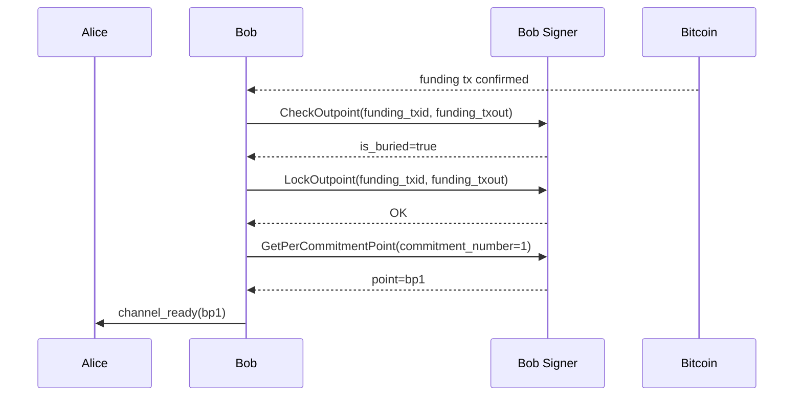
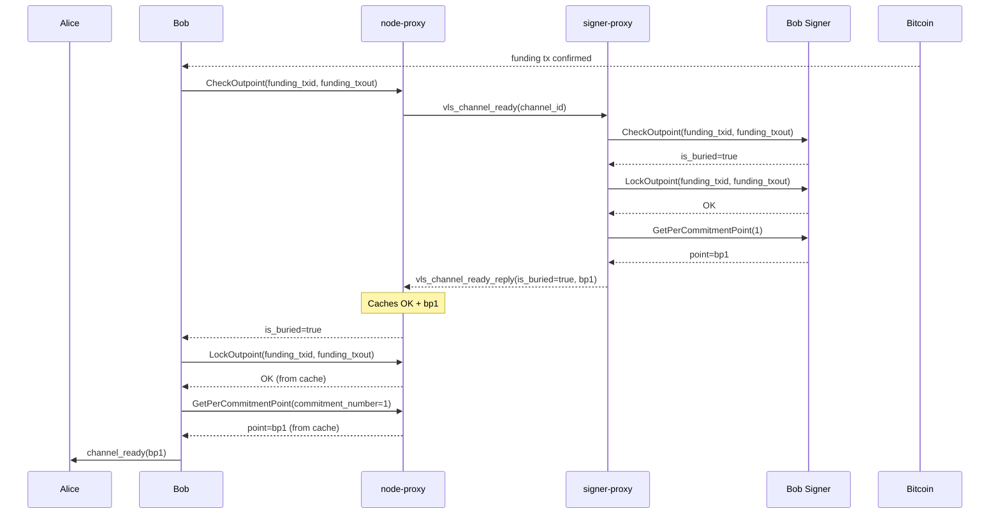

# B03 — Bob Confirms Funding and Sends Channel Ready

Part of [Scenario 01 — Alice Pays Bob](01-alice-pays-bob.md). Follows [A04](01-alice-pays-bob-01-open-channel-A04.md).

**Scope:** From funding tx confirmation until Bob sends `channel_ready` to Alice.

---

## Lightning Context

The funding transaction has been confirmed. Bob performs the same post-confirmation sequence as Alice ([A04](01-alice-pays-bob-01-open-channel-A04.md)):
1. Confirms the funding outpoint is buried
2. Locks the outpoint in the signer
3. Gets his next per-commitment point (`bp1`)
4. Sends `channel_ready(bp1)` to Alice

After both sides exchange `channel_ready`, commitment 0 is established and the channel is open.

## VLS Calls (Current — 3 separate round-trips)

### Call Details

| # | Call | Input | Output | Reply used by LDK? |
|---|------|-------|--------|---------------------|
| 1 | CheckOutpoint | `funding_txid`, `funding_txout` | `is_buried=true` | Yes — gate for proceeding |
| 2 | LockOutpoint | `funding_txid`, `funding_txout` | OK (empty) | No — discarded |
| 3 | GetPerCommitmentPoint | `commitment_number=1` | `point` (bp1) | Yes — included in `channel_ready` |

---

## Proxy Optimization (v2 — 1 round-trip)

Identical to [A04](01-alice-pays-bob-01-open-channel-A04.md). Same `vls_channel_ready` message, same speculative prefetch mechanism.

### `vls_channel_ready` — proxy-to-proxy message

| Parameter | Type | Description |
|-----------|------|-------------|
| `channel_id` | u64 | Channel identifier |

The signer-proxy already has `funding_txid/txout` from B02's SetupChannel.

Reply: `vls_channel_ready_reply`

| Return field | Type | Description |
|--------------|------|-------------|
| `is_buried` | bool | Whether funding is confirmed (currently always true) |
| `per_commitment_point_1` | PubKey (33 B) | bp1 — for `channel_ready` message |

### What crosses the slow link

| | Current (3 round-trips) | v2 Proxy (1 round-trip) |
|---|---|---|
| node-proxy → signer-proxy | 3 separate messages | 1 `vls_channel_ready` (8 B) |
| signer-proxy → node-proxy | 3 separate replies | 1 `vls_channel_ready_reply` (34 B) |
| Latency | 3 × RTT | 1 × RTT |

---

## Symmetry with A04

Structurally identical to A04 — same `vls_channel_ready` message, same mechanism. The v4 push model (signer-proxy notifies on confirmation) applies equally to Bob's side.

---

## Channel open complete

After both `channel_ready` messages are exchanged:
- Commitment 0 is established
- Alice: 1.0 BTC | Bob: 0.0 BTC
- The channel is ready for payments

Next: Alice sends a payment → [A05](01-alice-pays-bob-A05.md) (commitment 1 — HTLC add).
