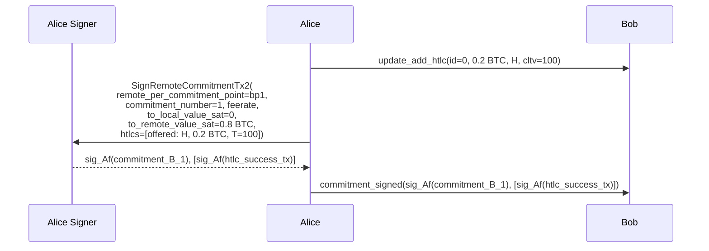
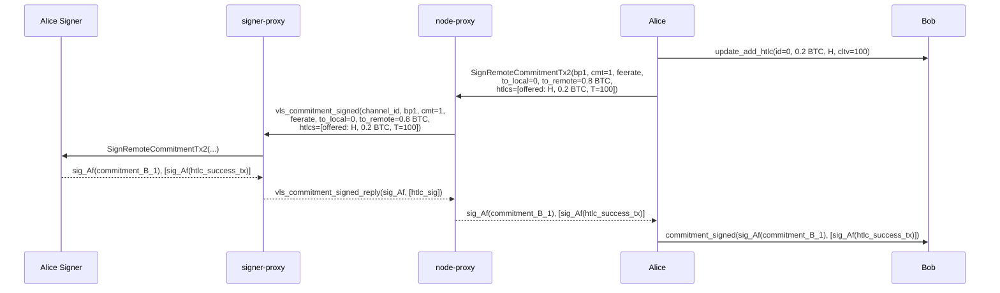

# HTLC Add A01 — Alice Signs Bob's New Commitment

Part of [Scenario 01 — Alice Pays Bob](01-alice-pays-bob.md). Follows channel open ([open-channel-B03](01-alice-pays-bob-open-channel-B03.md)).

**Scope:** From Alice deciding to send a payment until `commitment_signed` is sent to Bob.

---

## Lightning Context

Alice wants to pay Bob 0.2 BTC. She:
1. Sends `update_add_htlc(id=0, 0.2 BTC, H, cltv=100)` to Bob — no signer involved, just state bookkeeping
2. Builds Bob's new commitment (`commitment_B_1`) including the HTLC
3. Signs it and sends `commitment_signed` to Bob

The commitment state moves from:
- commitment 0: Alice 1.0 BTC | Bob 0.0
- commitment 1: Alice 0.8 BTC + 0.2 HTLC(H) | Bob 0.0

## VLS Call (Current — 1 round-trip)

### Call Details

| # | Call | Input | Output | Reply used by LDK? |
|---|------|-------|--------|---------------------|
| 1 | SignRemoteCommitmentTx2 | `remote_per_commitment_point=bp1`, `commitment_number=1`, `feerate`, `to_local_value_sat=0`, `to_remote_value_sat=0.8 BTC`, `htlcs=[offered: H, 0.2 BTC, T=100]` | `signature`, `htlc_signatures[]` | Yes — both go into `commitment_signed` |

### What the signer does internally

**SignRemoteCommitmentTx2** ([handler.rs:1308](../validating-lightning-signer/vls-protocol-signer/src/handler.rs#L1308)):
- Builds `commitment_B_1` internally from stored channel params + provided values
- Builds HTLC success transaction(s) for offered HTLCs
- Validates against policy:
  - Payment velocity / amount limits (rule 56/86)
  - HTLC count and value limits
  - Feerate bounds
- Signs commitment + each HTLC tx with Alice's funding key (`Af`)
- Returns commitment signature + array of HTLC signatures

### HTLC in the `htlcs` array

Each HTLC is represented as:

| Field | Value | Description |
|-------|-------|-------------|
| `side` | 0 (local/offered) | Alice is offering this HTLC to Bob |
| `amount` | 20,000,000 sat | 0.2 BTC |
| `payment_hash` | H | SHA256 hash of preimage P |
| `ctlv_expiry` | 100 | Block height timeout |

From the signer's perspective: "offered" because Alice (the signer's owner) is offering it. In Bob's commitment, this becomes a "received" HTLC output that Bob can claim with preimage P.

---

## Proxy Optimization (v2 — 1 round-trip, no saving)

This is a single call with a needed reply — no batching opportunity. The proxy passes it through.

### `vls_commitment_signed` — proxy-to-proxy message

The signer-proxy already has channel state. Parameters that are truly new:

| Parameter | Type | Description |
|-----------|------|-------------|
| `channel_id` | u64 | Channel identifier |
| `remote_per_commitment_point` | PubKey (33 B) | bp1 — Bob's next commitment point |
| `commitment_number` | u64 | 1 |
| `feerate` | u32 | Commitment tx feerate |
| `to_local_value_sat` | u64 | Bob's balance (0) |
| `to_remote_value_sat` | u64 | Alice's non-HTLC balance (0.8 BTC) |
| `htlcs` | Array\<Htlc\> | [offered: H, 0.2 BTC, cltv=100] |

The signer-proxy knows `remote_funding_pubkey` (Bf) from SetupChannel. The `remote_per_commitment_point` (bp1) came from Bob's `channel_ready` — the node-proxy could have cached it if it observed the `channel_ready` Lightning message, but since the proxy only sees VLS calls, it must be provided here.

Reply: `vls_commitment_signed_reply`

| Return field | Type | Description |
|--------------|------|-------------|
| `signature` | Signature (64 B) | sig_Af(commitment_B_1) |
| `htlc_signatures` | Array\<Signature\> | [sig_Af(htlc_success_tx)] — one per HTLC |

### No latency saving — but data reduction possible

This step is 1 RTT regardless. The proxy value here is:
- **Semantic naming**: `vls_commitment_signed` is self-documenting
- **Data reduction**: the signer-proxy could derive some fields from stored state (e.g., verify `to_local + to_remote + htlc_amounts = channel_value`)
- **Policy layer** (v3): the signer-proxy can evaluate the HTLC against `kind:30078` UsageProfile quota before forwarding to the signer

---

## Next

After `commitment_signed` is sent, Bob processes it → [htlc-add-B01](01-alice-pays-bob-02-htlc-add-B01.md).
