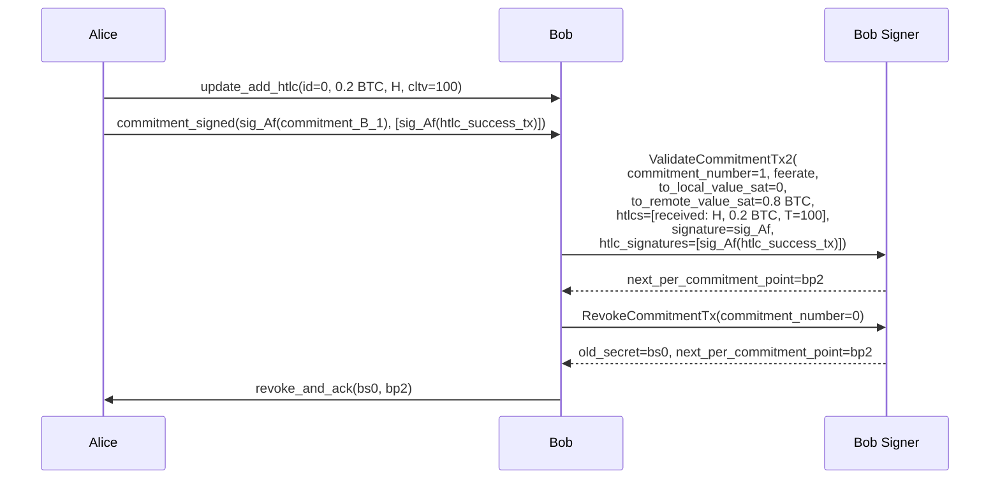
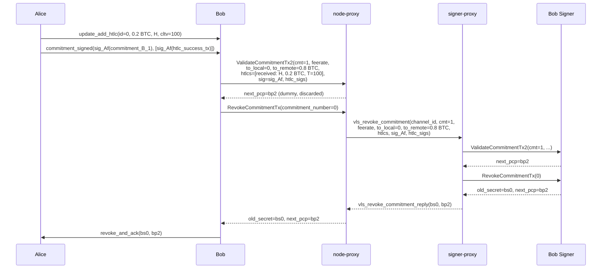

# HTLC Add B01 — Bob Validates and Revokes

Part of [Scenario 01 — Alice Pays Bob](01-alice-pays-bob.md). Follows [htlc-add-A01](01-alice-pays-bob-02-htlc-add-A01.md).

**Scope:** From Bob receiving `commitment_signed` until `revoke_and_ack` is sent to Alice.

---

## Lightning Context

Bob receives `update_add_htlc` followed by `commitment_signed(sig_Af(commitment_B_1), [sig_Af(htlc_success_tx)])` from Alice. He now:
1. Validates his new commitment (`commitment_B_1`) using Alice's signature
2. Revokes his old commitment (`commitment_B_0`) — releases the secret `bs0`
3. Sends `revoke_and_ack(bs0, bp2)` to Alice

Bob also needs to sign Alice's new commitment (`commitment_A_1`) and send `commitment_signed` — this is a mirror of [A01](01-alice-pays-bob-02-htlc-add-A01.md) using `vls_commitment_signed` and can happen in parallel. Since `update_add_htlc` already provides all the HTLC details and Bob already has `ap1` (from Alice's `channel_ready`), the SignRemoteCommitmentTx2 call could even be issued before `commitment_signed` arrives.

The commitment state moves from:
- commitment 0: Alice 1.0 BTC | Bob 0.0 (Bob's side now revoked)
- commitment 1: Alice 0.8 BTC + 0.2 HTLC(H) | Bob 0.0

## VLS Calls (Current — 2 separate round-trips)

### Call Details

| # | Call | Input | Output | Reply used by LDK? |
|---|------|-------|--------|---------------------|
| 1 | ValidateCommitmentTx2 | `commitment_number=1`, `feerate`, `to_local=0`, `to_remote=0.8 BTC`, `htlcs=[received: H, 0.2 BTC, T=100]`, `signature=sig_Af`, `htlc_signatures=[sig_Af(htlc_success_tx)]` | `next_per_commitment_point=bp2` | No — discarded at [lib.rs:402](../validating-lightning-signer/vls-protocol-client/src/lib.rs#L402) |
| 2 | RevokeCommitmentTx | `commitment_number=0` | `old_secret=bs0`, `next_per_commitment_point=bp2` | Yes — both go into `revoke_and_ack` |

### What the signer does internally

**ValidateCommitmentTx2** ([handler.rs:1472](../validating-lightning-signer/vls-protocol-signer/src/handler.rs#L1472)):
- Builds `commitment_B_1` internally from stored channel params + provided values
- Verifies Alice's signature (`sig_Af`) is valid for this commitment
- Verifies HTLC signatures match the HTLC success transactions
- Returns `next_per_commitment_point` (bp2) — but LDK discards it
- Note: does NOT revoke the old commitment (protocol >= 5)

**RevokeCommitmentTx** ([handler.rs:1526](../validating-lightning-signer/vls-protocol-signer/src/handler.rs#L1526)):
- Reveals the per-commitment secret for commitment 0 (`bs0`)
- Advances the commitment counter
- Returns `old_secret=bs0` + `next_per_commitment_point=bp2`
- After this, commitment_B_0 is permanently revoked — if Bob ever broadcasts it, Alice can sweep all funds using bs0

### HTLC side encoding

The `side` field is always from the **signer's owner's** perspective:
- side = 0 (LOCAL): signer's owner offered this HTLC
- side = 1 (REMOTE): signer's owner received this HTLC (= counterparty offered)

For Bob's signer, the HTLC has `side=1` (remote/received) — Bob received this HTLC from Alice. The handler internally flips offered/received when signing the counterparty's commitment ([handler.rs:1336](../validating-lightning-signer/vls-protocol-signer/src/handler.rs#L1336): "Flip offered and received").

### HTLC signatures: success vs timeout

The countersigner produces signatures for the 2nd-level HTLC transactions:
- **A01** (Alice signs Bob's commitment_B_1): signs `htlc_success_tx` — Bob uses this + preimage to claim
- **B01** (Bob signs Alice's commitment_A_1): signs `htlc_timeout_tx` — Alice uses this + CLTV expiry to reclaim

---

## Proxy Optimization (v2 — 1 round-trip)

ValidateCommitmentTx2's reply is discarded by LDK. RevokeCommitmentTx's reply is needed. The proxy defers Validate and flushes both when Revoke arrives.

### `vls_revoke_commitment` — proxy-to-proxy message

Triggered when node-proxy sees ValidateCommitmentTx2. The proxy defers it (returns dummy `next_pcp`, discarded by LDK), then when RevokeCommitmentTx arrives, flushes both.

| Parameter | Type | Description |
|-----------|------|-------------|
| `channel_id` | u64 | Channel identifier |
| `commitment_number` | u64 | 1 — the new commitment being validated |
| `feerate` | u32 | Commitment tx feerate |
| `to_local_value_sat` | u64 | Bob's balance (0) |
| `to_remote_value_sat` | u64 | Alice's non-HTLC balance (0.8 BTC) |
| `htlcs` | Array\<Htlc\> | [received: H, 0.2 BTC, cltv=100] |
| `counterparty_signature` | Signature (64 B) | sig_Af(commitment_B_1) |
| `counterparty_htlc_signatures` | Array\<Signature\> | [sig_Af(htlc_success_tx)] |

The revoke `commitment_number` is implicitly `commitment_number - 1` (always revoke the previous).

Reply: `vls_revoke_commitment_reply`

| Return field | Type | Description |
|--------------|------|-------------|
| `old_commitment_secret` | Secret (32 B) | bs0 — revocation secret for commitment 0 |
| `next_per_commitment_point` | PubKey (33 B) | bp2 — for `revoke_and_ack` |

### Bob's `commitment_signed` — parallel, mirror of A01

Bob also sends `commitment_signed(sig_Bf(commitment_A_1), [sig_Bf(htlc_timeout_tx)])` to Alice. This uses the same `vls_commitment_signed` message documented in [A01](01-alice-pays-bob-02-htlc-add-A01.md) — a single SignRemoteCommitmentTx2 call, 1 RTT. It happens in parallel with Alice processing `revoke_and_ack`.

Since SignRemoteCommitmentTx2 only needs `ap1` (from `channel_ready`) and the HTLC details (from `update_add_htlc`), it has no dependency on `commitment_signed` arriving — the node could issue it as soon as `update_add_htlc` is received.

### What crosses the slow link (revoke phase only)

| | Current (2 round-trips) | v2 Proxy (1 round-trip) |
|---|---|---|
| node-proxy → signer-proxy | 2 separate messages | 1 `vls_revoke_commitment` |
| signer-proxy → node-proxy | 2 separate replies | 1 `vls_revoke_commitment_reply` (65 B) |
| Latency | 2 × RTT | 1 × RTT |

---

## Open Discussion: HTLC data in parallel messages

When `vls_revoke_commitment` and `vls_commitment_signed` are sent in parallel (or in unpredictable order), the HTLC arrays may differ between them:

- **`vls_revoke_commitment`** validates Bob's commitment — contains HTLCs as committed by Alice's `commitment_signed`
- **`vls_commitment_signed`** signs Alice's commitment — may contain additional or different HTLCs (e.g., Bob added/fulfilled HTLCs between receiving and sending `commitment_signed`)

In this scenario they happen to be identical, but in general they are **not the same transaction state**. This means:

1. **Option 1 (duplicate HTLCs in each message)** is the straightforward choice — each message is self-contained, no ordering dependency, works regardless of which fires first
2. **Option 2 (combined message)** would require the proxy to know both HTLC sets upfront, which may not be available at the same time
3. The cost of duplication is modest (~44 bytes per HTLC × N) compared to the signatures and points already in the messages

**Recommendation:** Option 1 — send HTLCs independently in each message. No shared state, no ordering assumptions.

---

## Next

After Bob sends `revoke_and_ack`, Alice validates the revocation → [htlc-add-A02](01-alice-pays-bob-02-htlc-add-A02.md).
