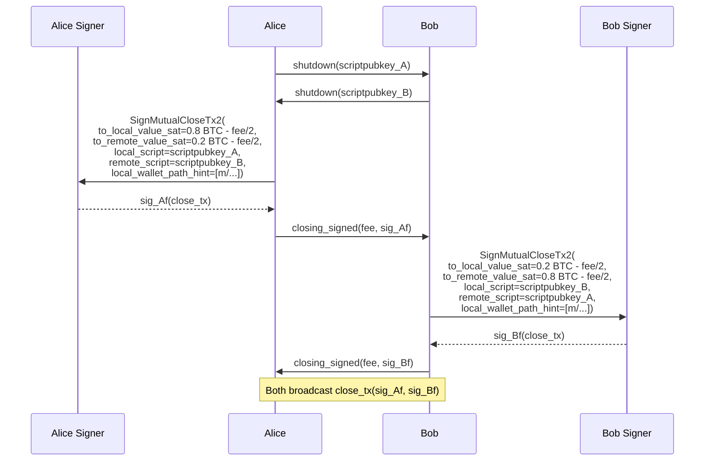
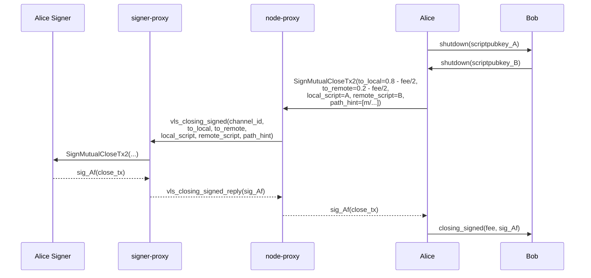

# Cooperative Close A01 — Alice and Bob Close the Channel

Part of [Scenario 01 — Alice Pays Bob](01-alice-pays-bob.md). Follows HTLC settlement (section 03 note in [A02](01-alice-pays-bob-02-htlc-add-A02.md)).

**Scope:** From `shutdown` exchange until the closing transaction is broadcast.

---

## Lightning Context

After the HTLC is settled, the channel state is:
- Alice: 0.8 BTC | Bob: 0.2 BTC

Alice initiates a cooperative close:
1. Alice sends `shutdown(scriptpubkey_A)` to Bob — no signer involved
2. Bob sends `shutdown(scriptpubkey_B)` to Alice — no signer involved
3. Alice proposes a fee, signs the closing tx, sends `closing_signed(fee, sig_Af)`
4. Bob accepts, signs the closing tx, sends `closing_signed(fee, sig_Bf)`
5. Both sides broadcast the closing transaction

The closing transaction:
- Spends the 2-of-2 funding output (Af + Bf)
- Output 1: Alice's balance minus fee share → `scriptpubkey_A`
- Output 2: Bob's balance minus fee share → `scriptpubkey_B`
- No timelocks, no HTLCs — a simple spend

## VLS Call (Current — 1 round-trip per side)

Each side calls `SignMutualCloseTx2` once to sign the closing transaction.

### Call Details

| # | Call | Input | Output | Reply used by LDK? |
|---|------|-------|--------|---------------------|
| 1 | SignMutualCloseTx2 | `to_local_value_sat`, `to_remote_value_sat`, `local_script`, `remote_script`, `local_wallet_path_hint` | `signature` | Yes — goes into `closing_signed` |

### What the signer does internally

**SignMutualCloseTx2** ([handler.rs:1402](../validating-lightning-signer/vls-protocol-signer/src/handler.rs#L1402)):
- Builds the closing transaction from provided values + stored funding outpoint
- Validates against policy:
  - Output values are reasonable (no negative, sums correct minus fee)
  - Fee is within acceptable bounds
  - Scripts match expected patterns (wallet address)
- Signs with the funding key (Af or Bf)
- Returns the signature

### Fee negotiation

If the sides disagree on fee, multiple `closing_signed` rounds occur. Each round requires a new `SignMutualCloseTx2` call with updated `to_local_value_sat` / `to_remote_value_sat` (reflecting the new fee split). The proxy message is the same each time.

### `local_wallet_path_hint`

The BIP derivation path for the local wallet key (e.g., `m/84'/0'/0'/0/5`). This tells the signer which key controls the local output, so it can verify the `local_script` matches a key it owns. Same concept as the `keyindex` in [open-channel-A03](01-alice-pays-bob-01-open-channel-A03.md).

---

## Proxy Optimization (v2 — 1 round-trip, no saving)

Single call with a needed reply — no batching opportunity. The proxy passes it through.

### `vls_closing_signed` — proxy-to-proxy message

| Parameter | Type | Description |
|-----------|------|-------------|
| `channel_id` | u64 | Channel identifier |
| `to_local_value_sat` | u64 | Signer's owner balance after fee |
| `to_remote_value_sat` | u64 | Counterparty balance after fee |
| `local_script` | bytes | Scriptpubkey for local output |
| `remote_script` | bytes | Scriptpubkey for remote output |
| `local_wallet_path_hint` | Array\<u32\> | BIP derivation path for local wallet key |

Reply: `vls_closing_signed_reply`

| Return field | Type | Description |
|--------------|------|-------------|
| `signature` | Signature (64 B) | Signature on the closing transaction |

### What the signer-proxy already knows

The signer-proxy has from SetupChannel:
- `funding_txid`, `funding_txout` — the input to spend
- `channel_value` — total channel capacity

It could verify `to_local + to_remote + fee = channel_value` before forwarding.

---

## Scenario Complete

The full Alice-pays-Bob scenario uses four proxy messages:

| Message | Section | Purpose | RTTs |
|---------|---------|---------|------|
| `vls_commitment_signed` | 02-A01 | Sign counterparty's new commitment | 1 |
| `vls_revoke_commitment` | 02-B01 | Validate + revoke → revoke_and_ack | 1 |
| `vls_validate_revocation` | 02-A02 | Validate counterparty's revocation | 1 |
| `vls_closing_signed` | 04-A01 | Sign cooperative close transaction | 1 |

Plus the channel open messages (section 01):

| Message | Section | Purpose | RTTs |
|---------|---------|---------|------|
| `vls_create_channel` | 01-A01 | Create channel + get keys | 1 |
| `vls_funding_created` | 01-A02 | Setup + sign remote commitment | 1 |
| `vls_funding_signed` | 01-B02 | Setup + validate + sign remote commitment | 1 |
| `vls_sign_funding` | 01-A03 | Validate + sign funding tx | 1 |
| `vls_channel_ready` | 01-A04 | Confirm + lock + get next point | 1 |
