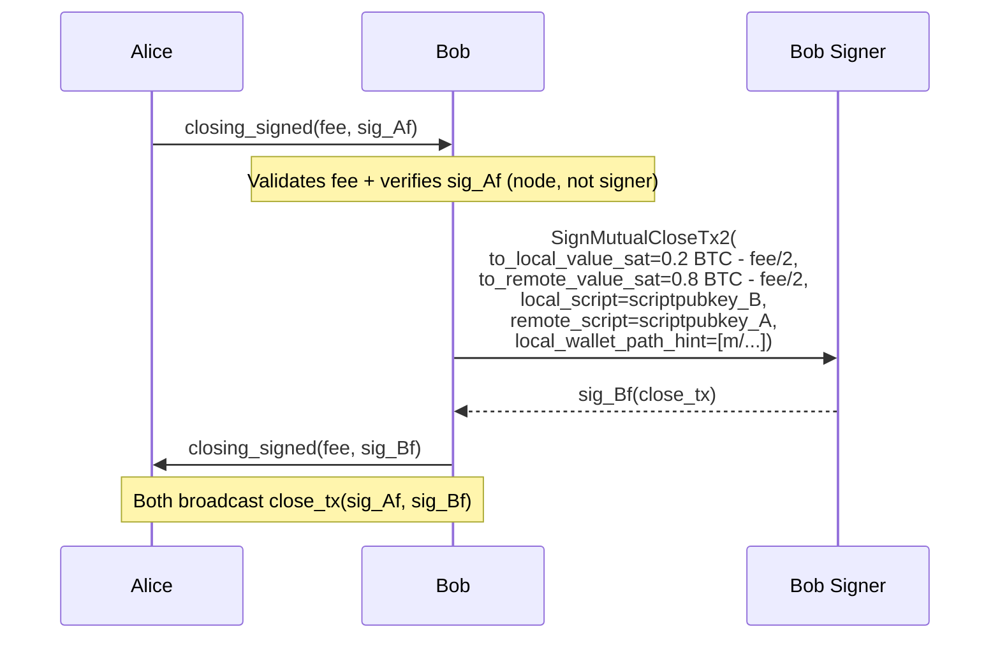
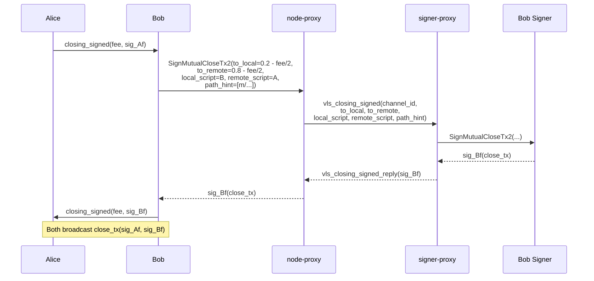

# Cooperative Close B01 — Bob Signs and Broadcasts

Part of [Scenario 01 — Alice Pays Bob](01-alice-pays-bob.md). Follows [close-A01](01-alice-pays-bob-04-close-A01.md).

**Scope:** From Bob receiving Alice's `closing_signed` until the closing transaction is broadcast.

---

## Lightning Context

Bob receives `closing_signed(fee, sig_Af)` from Alice. He now:
1. Validates the fee is acceptable
2. Verifies Alice's signature (`sig_Af`) on the closing transaction — done by the node, not the signer
3. Signs the closing transaction with his funding key (`Bf`)
4. Sends `closing_signed(fee, sig_Bf)` to Alice
5. Broadcasts the closing transaction (has both sig_Af + sig_Bf)

After broadcast, both sides monitor for confirmation and the channel is closed.

## VLS Call (Current — 1 round-trip)

### Call Details

| # | Call | Input | Output | Reply used by LDK? |
|---|------|-------|--------|---------------------|
| 1 | SignMutualCloseTx2 | `to_local_value_sat=0.2 BTC - fee/2`, `to_remote_value_sat=0.8 BTC - fee/2`, `local_script=scriptpubkey_B`, `remote_script=scriptpubkey_A`, `local_wallet_path_hint` | `signature` | Yes — goes into `closing_signed` |

---

## Proxy Optimization (v2 — 1 round-trip, no saving)

Same `vls_closing_signed` message as [A01](01-alice-pays-bob-04-close-A01.md). Single call, needed reply, no batching.

---

## Channel Closed

After confirmation, the channel is fully settled:
- Alice received 0.8 BTC (minus her fee share) to `scriptpubkey_A`
- Bob received 0.2 BTC (minus his fee share) to `scriptpubkey_B`

Scenario 01 complete.
