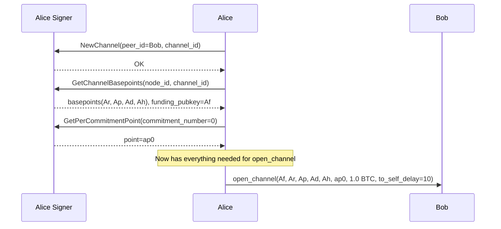
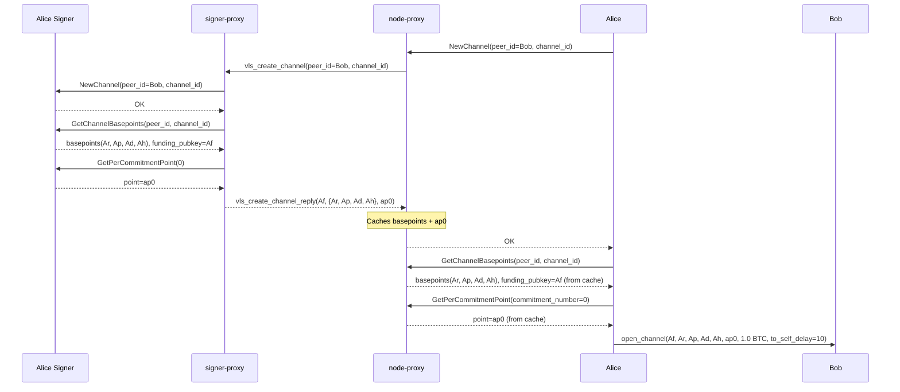

# A01 — Alice Opens Channel: Initial Signer Setup

Part of [Scenario 01 — Alice Pays Bob](01-alice-pays-bob.md).

**Scope:** From Alice deciding to open a channel until `open_channel` is sent to Bob over the wire.

---

## Lightning Context

Before Alice can send `open_channel`, she needs:
- A funding pubkey (`Af`) for the 2-of-2 multisig
- Channel basepoints (`Ar`, `Ap`, `Ad`, `Ah`) for deriving commitment keys
- Her first per-commitment point (`ap0`) for Bob to build her initial commitment

All of these are generated by the signer — the node never has access to the underlying private keys.

## VLS Calls (Current — 3 separate round-trips)

### Call Details

| # | Call | Input | Output | Reply used by LDK? |
|---|------|-------|--------|---------------------|
| 1 | NewChannel | `peer_id`: counterparty pubkey (placeholder `[0;33]` in practice), `channel_id`: unique channel identifier | OK | No — discarded at [lib.rs:710](../validating-lightning-signer/vls-protocol-client/src/lib.rs#L710) |
| 2 | GetChannelBasepoints | `node_id`: peer_id (same placeholder), `channel_id` | `funding_pubkey` (Af), `basepoints` (Ar, Ap, Ad, Ah) | Yes — stored as `ChannelPublicKeys` |
| 3 | GetPerCommitmentPoint | `commitment_number=0` (wire: `INITIAL_COMMITMENT_NUMBER - 0`) | `point` (ap0) | Yes — included in `open_channel` |

### What the signer does internally

**NewChannel** ([handler.rs:750](../validating-lightning-signer/vls-protocol-signer/src/handler.rs#L750)):
- Allocates a channel stub in signer storage keyed by `(node_id, channel_id)`
- Derives the channel's key material from the node seed + channel_id
- (internally called `dbid` in VLS source)
- No validation — purely a setup/allocation step

**GetChannelBasepoints** ([handler.rs:757](../validating-lightning-signer/vls-protocol-signer/src/handler.rs#L757)):
- Reads back the derived keys from the channel stub created by NewChannel
- Returns the 5 public keys (funding + 4 basepoints)

**GetPerCommitmentPoint** ([handler.rs:1228](../validating-lightning-signer/vls-protocol-signer/src/handler.rs#L1228)):
- Computes `per_commitment_point(0)` from the channel's per-commitment seed
- In protocol v6, returns only the point (no secret)

---

## Proxy Optimization (v2 — 1 round-trip)

The node expects an OK reply from NewChannel before it issues GetChannelBasepoints (synchronous request/response). The node-proxy cannot simply buffer all three calls — it will only ever see one at a time.

The mechanism is **speculative prefetch**:

1. Node sends `NewChannel` to node-proxy
2. Node-proxy recognizes this as a channel-open trigger — it knows `GetChannelBasepoints` and `GetPerCommitmentPoint(0)` will follow immediately
3. Node-proxy sends `vls_create_channel(peer_id, channel_id)` to signer-proxy
4. Signer-proxy expands this into the three VLS calls, processes them sequentially, returns the results
5. Node-proxy **caches** the basepoints and per-commitment point
6. Node-proxy returns OK to the node
7. When the node asks for GetChannelBasepoints → node-proxy answers from cache (instant)
8. When the node asks for GetPerCommitmentPoint(0) → node-proxy answers from cache (instant)

### `vls_create_channel` — proxy-to-proxy message

| Parameter | Type | Description |
|-----------|------|-------------|
| `peer_id` | PubKey (33 B) | Counterparty node pubkey |
| `channel_id` | u64 | Unique channel identifier |

`commitment_number=0` is implicit — opening a channel always starts at commitment 0.

The signer-proxy expands `vls_create_channel` into:
1. `NewChannel(peer_id, channel_id)` → OK
2. `GetChannelBasepoints(peer_id, channel_id)` → basepoints + funding_pubkey
3. `GetPerCommitmentPoint(commitment_number=0)` → point

Reply: `vls_create_channel_reply(funding_pubkey, basepoints, per_commitment_point_0)`

| Return field | Type | Description |
|--------------|------|-------------|
| `funding_pubkey` | PubKey (33 B) | Af — for 2-of-2 multisig |
| `basepoints` | 4 × PubKey (132 B) | Ar, Ap, Ad, Ah |
| `per_commitment_point_0` | PubKey (33 B) | ap0 — first commitment point |

### Why this works

1. **NewChannel is the trigger.** The node-proxy knows that after NewChannel, the node will always ask for GetChannelBasepoints (same `channel_id`) and GetPerCommitmentPoint(0). The inputs are fully predictable — `channel_id` is in the NewChannel message, `commitment_number=0` is fixed for channel open.

2. **One RTT covers all three calls.** The node waits for OK from NewChannel — this single wait is the cost of the entire batch. Once OK returns, the cache is already populated, so GetChannelBasepoints and GetPerCommitmentPoint(0) are answered instantly (zero additional RTT).

3. **Sequential ordering preserved on the signer.** The signer-proxy dispatches NewChannel first (creating the channel stub), then GetChannelBasepoints and GetPerCommitmentPoint — the signer sees the same order it would have seen with separate calls.

### What crosses the slow link

| | Current (3 round-trips) | v2 Proxy (1 round-trip) |
|---|---|---|
| node-proxy → signer-proxy | 3 separate messages | 1 `vls_create_channel` (41 B) |
| signer-proxy → node-proxy | 3 separate replies | 1 `vls_create_channel_reply` (198 B) |
| Latency | 3 × RTT | 1 × RTT |

The savings are in **latency** and **protocol simplicity**. Three sequential round-trips become one semantic message. The node sees near-zero latency on calls 2 and 3 (served from cache).

---

## Further Optimization

The `vls_create_channel` message already fuses three calls and strips redundant fields. One further opportunity:

- **Prefetch `GetPerCommitmentPoint(1)`.** The signer-proxy knows that `channel_ready` (after funding confirms) will need `ap1`. It could speculatively request both point 0 and point 1 in the same signer session, and include `ap1` in the reply. This front-loads a future round-trip at no extra latency cost.

---

## Next

After `open_channel` is sent, Bob processes it → [B01](01-alice-pays-bob-B01.md).
