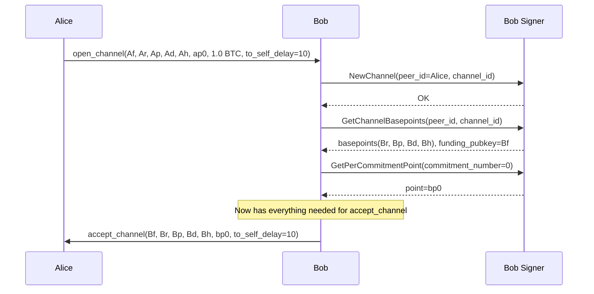
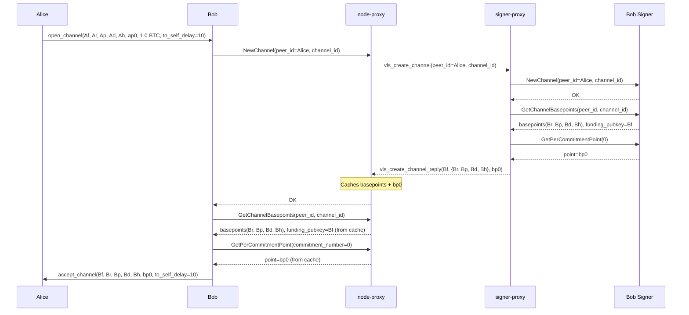

# B01 — Bob Accepts Channel: Initial Signer Setup

Part of [Scenario 01 — Alice Pays Bob](01-alice-pays-bob.md). Follows [A01](01-alice-pays-bob-A01.md).

**Scope:** From Bob receiving `open_channel` until `accept_channel` is sent back to Alice.

---

## Lightning Context

Bob receives `open_channel` from Alice containing:
- Alice's funding pubkey (`Af`) and basepoints (`Ar`, `Ap`, `Ad`, `Ah`)
- Alice's first per-commitment point (`ap0`)
- Channel parameters (1.0 BTC, `to_self_delay=10`)

Before Bob can reply with `accept_channel`, he needs his own set of keys:
- A funding pubkey (`Bf`) for the 2-of-2 multisig
- Channel basepoints (`Br`, `Bp`, `Bd`, `Bh`)
- His first per-commitment point (`bp0`)

This is structurally identical to [A01](01-alice-pays-bob-A01.md) — same three VLS calls, same proxy optimization.

## VLS Calls (Current — 3 separate round-trips)

### Call Details

| # | Call | Input | Output | Reply used by LDK? |
|---|------|-------|--------|---------------------|
| 1 | NewChannel | `peer_id`: Alice's pubkey (placeholder `[0;33]`), `channel_id` | OK | No — discarded |
| 2 | GetChannelBasepoints | `peer_id`, `channel_id` | `funding_pubkey` (Bf), `basepoints` (Br, Bp, Bd, Bh) | Yes — stored as `ChannelPublicKeys` |
| 3 | GetPerCommitmentPoint | `commitment_number=0` | `point` (bp0) | Yes — included in `accept_channel` |

---

## Proxy Optimization (v2 — 1 round-trip)

Same mechanism as [A01](01-alice-pays-bob-A01.md): node-proxy sees `NewChannel`, sends `vls_accept_channel` speculatively, caches the reply.

### `vls_create_channel` — proxy-to-proxy message (same as A01)

The node-proxy only sees VLS calls, not Lightning wire messages. Although Bob's node has Alice's basepoints (from `open_channel`), that data doesn't appear until `SetupChannel` — the proxy can't include it here.

| Parameter | Type | Description |
|-----------|------|-------------|
| `peer_id` | PubKey (33 B) | Counterparty node pubkey (Alice) |
| `channel_id` | u64 | Unique channel identifier |

Reply: `vls_create_channel_reply`

| Return field | Type | Description |
|--------------|------|-------------|
| `funding_pubkey` | PubKey (33 B) | Bf — Bob's funding key for 2-of-2 multisig |
| `basepoints` | 4 × PubKey (132 B) | Br, Bp, Bd, Bh — Bob's basepoints |
| `per_commitment_point_0` | PubKey (33 B) | bp0 — Bob's first commitment point |

### What crosses the slow link

| | Current (3 round-trips) | v2 Proxy (1 round-trip) |
|---|---|---|
| node-proxy → signer-proxy | 3 separate messages | 1 `vls_create_channel` (41 B) |
| signer-proxy → node-proxy | 3 separate replies | 1 `vls_create_channel_reply` (198 B) |
| Latency | 3 × RTT | 1 × RTT |

---

## Symmetry with A01

A01 and B01 are structurally identical — same `vls_create_channel` message, same parameters, same reply. The proxy cannot distinguish opener from acceptor at this point because `NewChannel` doesn't carry that information. The counterparty's keys (which Bob's node already has from `open_channel`) only become visible to the proxy in the next step when `SetupChannel` is called.

---

## Next

After `accept_channel` is sent, Alice processes it and prepares the funding transaction → [A02](01-alice-pays-bob-A02.md).
