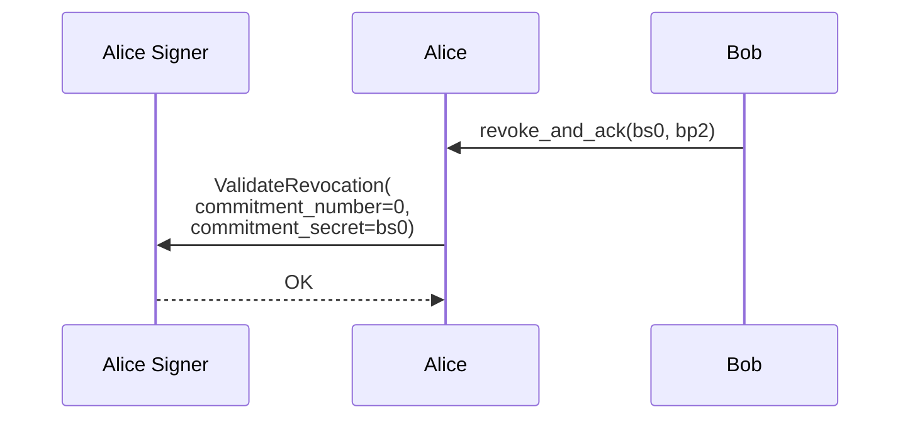
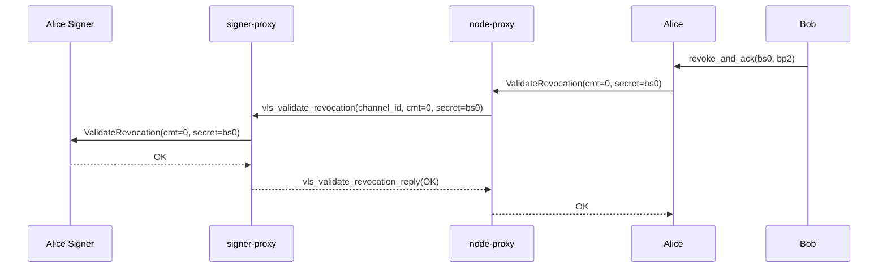

# HTLC Add A02 — Alice Validates Bob's Revocation

Part of [Scenario 01 — Alice Pays Bob](01-alice-pays-bob.md). Follows [htlc-add-B01](01-alice-pays-bob-htlc-add-B01.md).

**Scope:** Alice receives Bob's `revoke_and_ack` and validates his revocation secret.

---

## Lightning Context

Alice receives `revoke_and_ack(bs0, bp2)` from Bob. She now:
1. Validates Bob's revocation secret (`bs0`) — stores it for penalty enforcement
2. Done — no wire message to send in response

After this, Alice holds `bs0`. If Bob ever broadcasts his revoked commitment_B_0, Alice can use `bs0` to sweep all channel funds (penalty transaction).

Alice also receives Bob's `commitment_signed` (mirror of [A01](01-alice-pays-bob-htlc-add-A01.md)) and processes it exactly as Bob did in [B01](01-alice-pays-bob-htlc-add-B01.md) — validate + revoke → send `revoke_and_ack(as0, ap2)`. That uses `vls_revoke_commitment` and happens in parallel with this step.

## VLS Call (Current — 1 round-trip)

### Call Details

| # | Call | Input | Output | Reply used by LDK? |
|---|------|-------|--------|---------------------|
| 1 | ValidateRevocation | `commitment_number=0`, `commitment_secret=bs0` | OK | No — empty reply |

### What the signer does internally

**ValidateRevocation** ([handler.rs](../validating-lightning-signer/vls-protocol-signer/src/handler.rs)):
- Verifies `bs0` is the correct per-commitment secret for Bob's commitment 0
- Derives Bob's revocation pubkey from bs0 and verifies it matches the expected value
- Stores bs0 — enables penalty transaction if Bob broadcasts revoked commitment_B_0

---

## Proxy Optimization (v2 — 1 round-trip, no saving)

Single call with an empty reply — no batching opportunity. The proxy passes it through.

### `vls_validate_revocation` — proxy-to-proxy message

| Parameter | Type | Description |
|-----------|------|-------------|
| `channel_id` | u64 | Channel identifier |
| `commitment_number` | u64 | 0 — the commitment being revoked |
| `commitment_secret` | Secret (32 B) | bs0 — Bob's revocation secret |

Reply: `vls_validate_revocation_reply`

| Return field | Type | Description |
|--------------|------|-------------|
| (empty) | — | Success/failure only |

### No latency saving — but security-critical

This is 1 RTT regardless. The proxy value here is:
- **Semantic naming**: `vls_validate_revocation` is self-documenting
- **Policy layer** (v3): the signer-proxy can log/audit revocation secrets received

### Cost per state change

Each commitment state change (HTLC add, settle, etc.) requires **3 RTTs** total:
1. `vls_commitment_signed` — request: sign counterparty's new commitment
2. `vls_revoke_commitment` — accept: validate new commitment + revoke old → `revoke_and_ack`
3. `vls_validate_revocation` — verify: validate counterparty's revocation secret

These are independent messages that travel separately. No bundling — the protocol doesn't assume ordering between them.

The mirror direction (counterparty signing our commitment) is another 3 RTTs happening in parallel.

---

## Next

Bob also validates Alice's revocation (after Alice sends her `revoke_and_ack`) → [htlc-add-B02](01-alice-pays-bob-htlc-add-B02.md).

After both sides validate revocations, commitment 1 is fully established:
- Alice: 0.8 BTC + 0.2 HTLC(H) | Bob: 0.0
- Commitment 0 revoked on both signers
