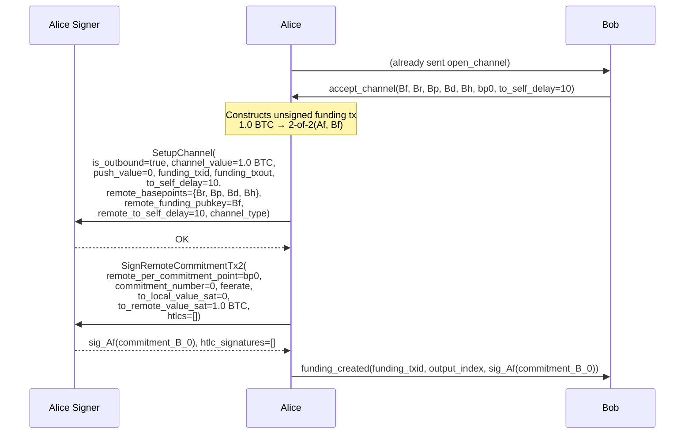
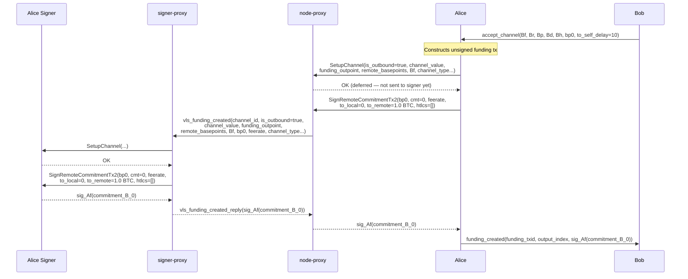

# A02 — Alice Sets Up Channel and Signs Bob's First Commitment

Part of [Scenario 01 — Alice Pays Bob](01-alice-pays-bob.md). Follows [B01](01-alice-pays-bob-open-channel-B01.md).

**Scope:** From Alice receiving `accept_channel` until `funding_created` is sent to Bob.

---

## Lightning Context

Alice receives `accept_channel` from Bob containing:
- Bob's funding pubkey (`Bf`) and basepoints (`Br`, `Bp`, `Bd`, `Bh`)
- Bob's first per-commitment point (`bp0`)
- Bob's `to_self_delay` (10 blocks)

Alice now has everything needed to:
1. Construct the funding transaction (1.0 BTC to 2-of-2 multisig `Af, Bf`)
2. Build Bob's initial commitment (`commitment_B_0`) and sign it
3. Send `funding_created(funding_txid, output_index, sig_Af(commitment_B_0))` to Bob

## VLS Calls (Current — 2 separate round-trips)

### Call Details

| # | Call | Input | Output | Reply used by LDK? |
|---|------|-------|--------|---------------------|
| 1 | SetupChannel | `is_outbound`, `channel_value`, `push_value`, `funding_txid`, `funding_txout`, `to_self_delay`, `remote_basepoints`, `remote_funding_pubkey`, `remote_to_self_delay`, `channel_type` | OK (empty) | No — discarded at [lib.rs:454](../validating-lightning-signer/vls-protocol-client/src/lib.rs#L454) |
| 2 | SignRemoteCommitmentTx2 | `remote_per_commitment_point`=bp0, `commitment_number`=0, `feerate`, `to_local_value_sat`=0, `to_remote_value_sat`=1.0 BTC, `htlcs`=[] | `signature`, `htlc_signatures` | Yes — included in `funding_created` |

### What the signer does internally

**SetupChannel** ([handler.rs:1203](../validating-lightning-signer/vls-protocol-signer/src/handler.rs#L1203)):
- Stores the counterparty's basepoints and funding pubkey
- Records funding outpoint, channel value, to_self_delay values
- After this call, the signer knows everything about the channel structure

**SignRemoteCommitmentTx2** ([handler.rs:1308](../validating-lightning-signer/vls-protocol-signer/src/handler.rs#L1308)):
- Builds `commitment_B_0` internally from the stored channel params + provided values
- Validates against policy (amounts, feerate bounds)
- Signs with Alice's funding key (`Af`)
- Returns the signature (+ htlc_signatures, empty for commitment 0)

---

## Proxy Optimization (v2 — 1 round-trip)

The node-proxy cannot predict `SignRemoteCommitmentTx2`'s parameters when `SetupChannel` arrives (it doesn't know `bp0` or `feerate` — those came from `accept_channel` which the proxy never saw). So speculative prefetch doesn't work here.

Instead, the mechanism is **deferred ack**:

1. Node sends `SetupChannel` to node-proxy
2. Node-proxy returns OK immediately — reply is empty and discarded by LDK, safe to defer
3. Node constructs the funding tx, builds commitment parameters
4. Node sends `SignRemoteCommitmentTx2` to node-proxy
5. Node-proxy now sends `vls_funding_created` (combining both calls) to signer-proxy
6. Signer-proxy processes SetupChannel + SignRemoteCommitmentTx2, returns signature
7. Node-proxy returns signature to node

### `vls_funding_created` — proxy-to-proxy message

Combines SetupChannel + SignRemoteCommitmentTx2. Most SignRemoteCommitmentTx2 fields are derivable from SetupChannel params for commitment 0:
- `to_local_value_sat` = `push_value` (0)
- `to_remote_value_sat` = `channel_value - push_value` (1.0 BTC)
- `commitment_number` = 0 (implicit — it's the first commitment)
- `htlcs` = [] (implicit — no HTLCs at channel open)

Only two fields from SignRemoteCommitmentTx2 are truly new:

| Parameter | Type | Description |
|-----------|------|-------------|
| `channel_id` | u64 | Channel identifier (proxy already knows from A01) |
| `is_outbound` | bool | true for Alice (funder) |
| `channel_value` | u64 | Funding amount in satoshis |
| `push_value` | u64 | Push amount (0 here) |
| `funding_txid` | Txid (32 B) | Funding transaction hash |
| `funding_txout` | u16 | Funding output index |
| `to_self_delay` | u16 | Local to_self_delay |
| `remote_basepoints` | 4 × PubKey (132 B) | Br, Bp, Bd, Bh |
| `remote_funding_pubkey` | PubKey (33 B) | Bf |
| `remote_to_self_delay` | u16 | Bob's to_self_delay |
| `remote_per_commitment_point` | PubKey (33 B) | bp0 — not in SetupChannel, from accept_channel |
| `feerate` | u32 | Commitment tx feerate — not in SetupChannel |
| `channel_type` | bytes | Channel type flags |

Reply: `vls_funding_created_reply`

| Return field | Type | Description |
|--------------|------|-------------|
| `signature` | Signature (64 B) | sig_Af(commitment_B_0) |

### Why deferred ack is safe here

1. **SetupChannel reply is empty.** `SetupChannelReply {}` — no data to return. LDK discards it ([lib.rs:454](../validating-lightning-signer/vls-protocol-client/src/lib.rs#L454)).

2. **SetupChannel cannot meaningfully fail.** It's registering channel parameters that the signer has no reason to reject (the node already validated them during `accept_channel` processing). If it somehow does fail, the error surfaces when the node-proxy gets the `vls_funding_created_reply` — the proxy reports the SetupChannel failure at that point.

3. **No state leaks.** The node doesn't observe any signer state change from SetupChannel — it immediately moves on to building the commitment tx and calling Sign.

### What crosses the slow link

| | Current (2 round-trips) | v2 Proxy (1 round-trip) |
|---|---|---|
| node-proxy → signer-proxy | 2 separate messages (~300 B + ~100 B) | 1 `vls_funding_created` (~300 B) |
| signer-proxy → node-proxy | 2 separate replies (0 B + 64 B) | 1 `vls_funding_created_reply` (64 B) |
| Latency | 2 × RTT | 1 × RTT |

---

## Next

After `funding_created` is sent, Bob processes it → [B02](01-alice-pays-bob-open-channel-B02.md).
