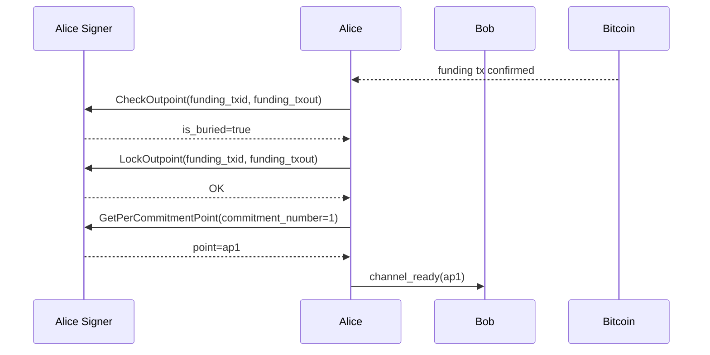
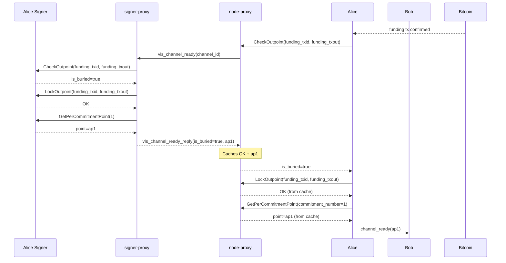

# A04 — Alice Confirms Funding and Sends Channel Ready

Part of [Scenario 01 — Alice Pays Bob](01-alice-pays-bob.md). Follows [A03](01-alice-pays-bob-open-channel-A03.md).

**Scope:** From funding tx confirmation until Alice sends `channel_ready` to Bob.

---

## Lightning Context

The funding transaction has been confirmed on-chain. Alice now:
1. Confirms the funding outpoint is buried (deep enough in the chain)
2. Locks the outpoint in the signer (prevents double-spend of the funding)
3. Gets her next per-commitment point (`ap1`) for commitment state 1
4. Sends `channel_ready(ap1)` to Bob — the channel is open

## VLS Calls (Current — 3 separate round-trips)

### Call Details

| # | Call | Input | Output | Reply used by LDK? |
|---|------|-------|--------|---------------------|
| 1 | CheckOutpoint | `funding_txid`, `funding_txout` | `is_buried=true` | Yes — gate for proceeding |
| 2 | LockOutpoint | `funding_txid`, `funding_txout` | OK (empty) | No — discarded |
| 3 | GetPerCommitmentPoint | `commitment_number=1` | `point` (ap1) | Yes — included in `channel_ready` |

### What the signer does internally

**CheckOutpoint** ([handler.rs:1251](../validating-lightning-signer/vls-protocol-signer/src/handler.rs#L1251)):
- Placeholder implementation — `warn!("null placeholder...")`, always returns `is_buried=true`
- Intended future behavior: verify the funding tx has sufficient confirmations via chain attestation

**LockOutpoint** ([handler.rs:1258](../validating-lightning-signer/vls-protocol-signer/src/handler.rs#L1258)):
- Placeholder implementation — marks the funding outpoint as locked
- Intended future behavior: prevent the signer from signing a second channel with the same funding outpoint

**GetPerCommitmentPoint** ([handler.rs:1228](../validating-lightning-signer/vls-protocol-signer/src/handler.rs#L1228)):
- Derives `per_commitment_point(1)` from the channel's per-commitment seed
- This is the point Bob needs to construct Alice's next commitment transaction

### Note on placeholders

CheckOutpoint and LockOutpoint are currently null implementations in VLS. They exist in the protocol for future chain-awareness (v4 TXOO attestations). In the current architecture they always succeed. The proxy could potentially skip them, but we preserve them for forward compatibility.

### Future: signer-initiated channel_ready (v4)

If the signer-proxy ingests chain attestations (v4), this entire step becomes **push instead of pull**:

- Signer-proxy observes funding tx confirmation via TXOO attestation
- Signer-proxy locks the outpoint, computes `ap1`
- Signer-proxy notifies node-proxy: "channel ready, here's ap1"
- Node-proxy delivers ap1 to the node

Zero round-trips. The node never asks — the signer-proxy already has `funding_txid` (from SetupChannel), chain confirmation (from TXOO), and the per-commitment seed (to derive ap1). All three current calls become unnecessary when the signer is chain-aware.

This requires a new message direction: signer-proxy → node-proxy (notification). The current v2 protocol is strictly request/response from the node side.

---

## Proxy Optimization (v2 — 1 round-trip)

Same pattern as [A01](01-alice-pays-bob-open-channel-A01.md): the node-proxy sees CheckOutpoint and knows LockOutpoint + GetPerCommitmentPoint(1) always follow for this channel. Speculative prefetch:

1. Node sends `CheckOutpoint` → proxy recognizes the post-confirmation trigger
2. Proxy sends `vls_channel_ready(channel_id)` to signer-proxy (all three calls)
3. Signer-proxy processes all three, returns results
4. Proxy caches LockOutpoint OK and ap1, returns `is_buried=true` to node
5. Node asks for LockOutpoint → answered from cache (instant)
6. Node asks for GetPerCommitmentPoint(1) → answered from cache (instant)

### `vls_channel_ready` — proxy-to-proxy message

The signer-proxy already knows `funding_txid` and `funding_txout` (from A02's SetupChannel). Minimal new data needed:

| Parameter | Type | Description |
|-----------|------|-------------|
| `channel_id` | u64 | Channel identifier |

That's it. The `funding_txid/txout` and `commitment_number=1` are all derivable from stored channel state. The signer-proxy knows which channel is being confirmed.

Reply: `vls_channel_ready_reply`

| Return field | Type | Description |
|--------------|------|-------------|
| `is_buried` | bool | Whether funding is confirmed (currently always true) |
| `per_commitment_point_1` | PubKey (33 B) | ap1 — for `channel_ready` message |

### Why this works

1. **CheckOutpoint is the trigger.** After funding confirmation, the node always calls CheckOutpoint → LockOutpoint → GetPerCommitmentPoint(1) in sequence. The proxy recognizes CheckOutpoint on a known channel as the post-confirmation pattern.

2. **All parameters are derivable.** The signer-proxy already has `funding_txid/txout` from SetupChannel. `commitment_number=1` is always the next point after channel open. No new data needs to cross the wire beyond `channel_id`.

3. **LockOutpoint reply is empty.** Discarded by the node — safe to serve from cache.

### What crosses the slow link

| | Current (3 round-trips) | v2 Proxy (1 round-trip) |
|---|---|---|
| node-proxy → signer-proxy | 3 separate messages | 1 `vls_channel_ready` (8 B) |
| signer-proxy → node-proxy | 3 separate replies | 1 `vls_channel_ready_reply` (34 B) |
| Latency | 3 × RTT | 1 × RTT |

Smallest proxy message in the entire flow — just a channel_id.

---

## Next

Bob does the same post-confirmation sequence → [B03](01-alice-pays-bob-open-channel-B03.md).

After both sides exchange `channel_ready`, commitment 0 is established and the channel is open for payments.
