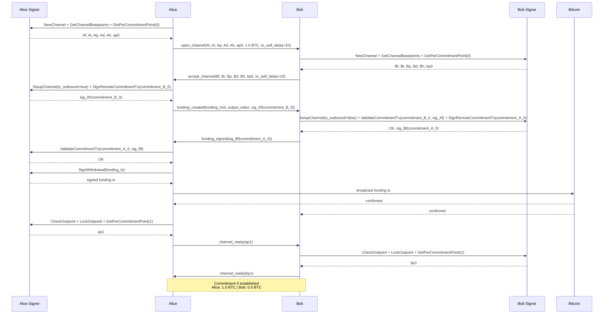
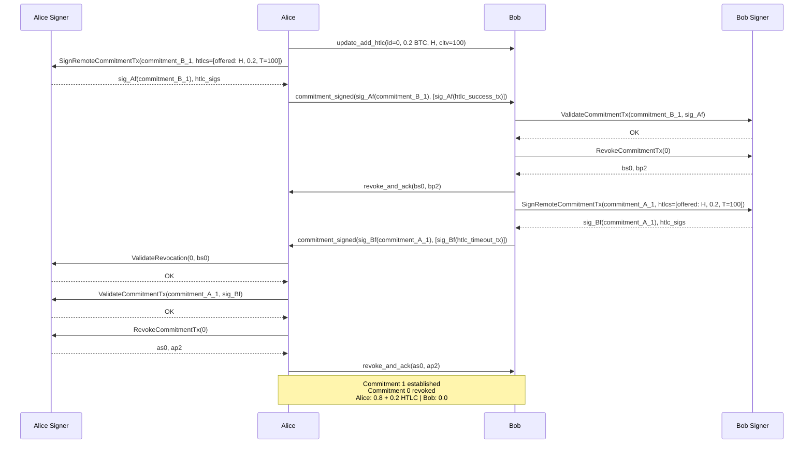
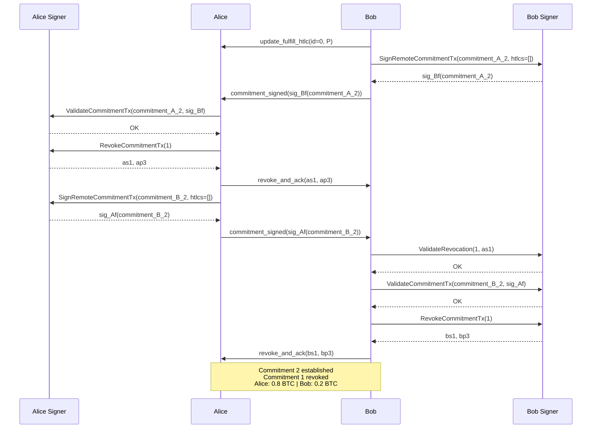
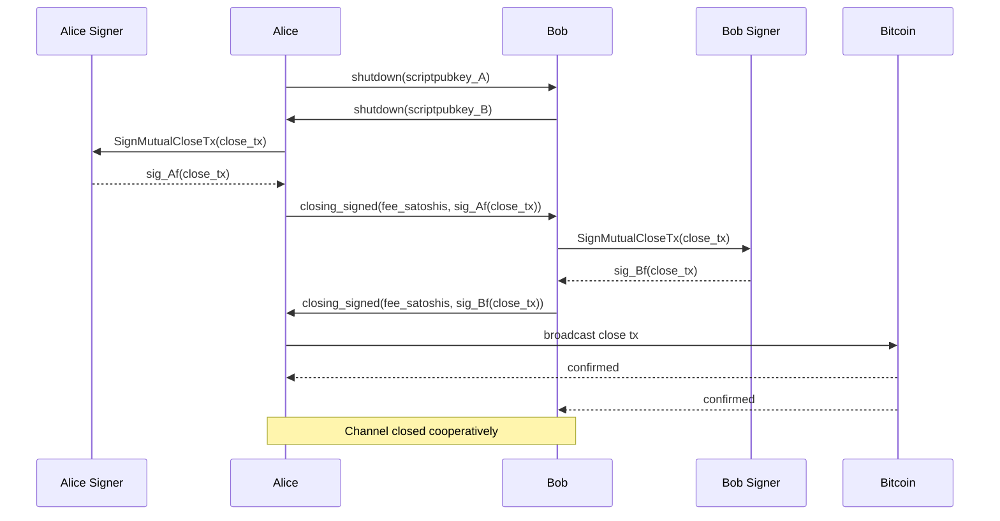

# Scenario 01 — Alice Pays Bob (VLS Signer — Future/Batched)

Same scenario as `../reference/01-alice-pays-bob.md`, but showing VLS signer calls for both Alice and Bob. This is the **future/optimized** version where calls are batched where possible.

For notation (`Af`, `Ar`, `ap0`, `rp(...)`, etc.) see [Key Derivation](../reference/lightning-key-derivation.md#notation-legend).

---

## Commitment 0

Alice funds a 1.0 BTC channel.

### Signer Calls Summary

**Alice (funder) — 5 batched calls:**

| Call | When | Purpose |
|------|------|---------|
| NewChannel + GetChannelBasepoints + GetPerCommitmentPoint(0) | Before open_channel sent | Get keys, register channel |
| SetupChannel + SignRemoteCommitmentTx(commitment_B_0) | After accept_channel received | Register counterparty params, sign Bob's commitment |
| ValidateCommitmentTx(commitment_A_0, sig_Bf) | After funding_signed received | Validate Bob's sig on our commitment |
| SignWithdrawal(funding_tx) | Before broadcast | Sign the funding tx inputs |
| CheckOutpoint + LockOutpoint + GetPerCommitmentPoint(1) | After funding tx confirmed | Lock channel, get ap1 for channel_ready |

**Bob (non-funder) — 3 batched calls:**

| Call | When | Purpose |
|------|------|---------|
| NewChannel + GetChannelBasepoints + GetPerCommitmentPoint(0) | After open_channel received | Get keys, register channel |
| SetupChannel + ValidateCommitmentTx(commitment_B_0, sig_Af) + SignRemoteCommitmentTx(commitment_A_0) | After funding_created received | Register params, validate Alice's sig, sign her commitment |
| CheckOutpoint + LockOutpoint + GetPerCommitmentPoint(1) | After funding tx confirmed | Lock channel, get bp1 for channel_ready |

Note: SetupChannel requires both sides' parameters (funding_pubkey, basepoints, to_self_delay). It cannot be called until after accept_channel/funding_created — when both sides' channel parameters are known.

---

## Commitment 1 — HTLC Add

Alice sends 0.2 BTC to Bob via HTLC. Payment hash H, CLTV timeout T=100.

### Signer Calls — Commitment 1

**Alice (initiator) — 4 calls:**

| Call | When | Purpose |
|------|------|---------|
| SignRemoteCommitmentTx(commitment_B_1) | After update_add_htlc, before commitment_signed | Sign Bob's new commitment with HTLC |
| ValidateRevocation(0, bs0) | After revoke_and_ack received | Verify Bob revoked commitment 0 |
| ValidateCommitmentTx(commitment_A_1, sig_Bf) | After commitment_signed received | Validate our new commitment with HTLC |
| RevokeCommitmentTx(0) | Before revoke_and_ack sent | Get as0 to revoke our commitment 0 |

**Bob (responder) — 3 calls:**

| Call | When | Purpose |
|------|------|---------|
| ValidateCommitmentTx(commitment_B_1, sig_Af) | After commitment_signed received | Validate our new commitment with HTLC |
| RevokeCommitmentTx(0) | Before revoke_and_ack sent | Get bs0 to revoke our commitment 0 |
| SignRemoteCommitmentTx(commitment_A_1) | Before commitment_signed sent | Sign Alice's new commitment with HTLC |

---

## Commitment 2 — HTLC Settlement

Bob reveals the preimage, claiming the 0.2 BTC. HTLC removed from both commitments.

### Signer Calls — Commitment 2

**Bob (initiator) — 4 calls:**

| Call | When | Purpose |
|------|------|---------|
| SignRemoteCommitmentTx(commitment_A_2) | After update_fulfill_htlc, before commitment_signed | Sign Alice's new commitment, HTLC removed |
| ValidateRevocation(1, as1) | After revoke_and_ack received | Verify Alice revoked commitment 1 |
| ValidateCommitmentTx(commitment_B_2, sig_Af) | After commitment_signed received | Validate our new commitment, HTLC removed |
| RevokeCommitmentTx(1) | Before revoke_and_ack sent | Get bs1 to revoke our commitment 1 |

**Alice (responder) — 3 calls:**

| Call | When | Purpose |
|------|------|---------|
| ValidateCommitmentTx(commitment_A_2, sig_Bf) | After commitment_signed received | Validate our new commitment, HTLC removed |
| RevokeCommitmentTx(1) | Before revoke_and_ack sent | Get as1 to revoke our commitment 1 |
| SignRemoteCommitmentTx(commitment_B_2) | Before commitment_signed sent | Sign Bob's new commitment, HTLC removed |

---

## Cooperative Close

Both sides agree to close the channel. No more HTLCs pending.

### Signer Calls — Cooperative Close

**Alice — 1 call:**

| Call | When | Purpose |
|------|------|---------|
| SignMutualCloseTx(close_tx) | Before closing_signed sent | Sign the cooperative close transaction |

**Bob — 1 call:**

| Call | When | Purpose |
|------|------|---------|
| SignMutualCloseTx(close_tx) | Before closing_signed sent | Sign the cooperative close transaction |
