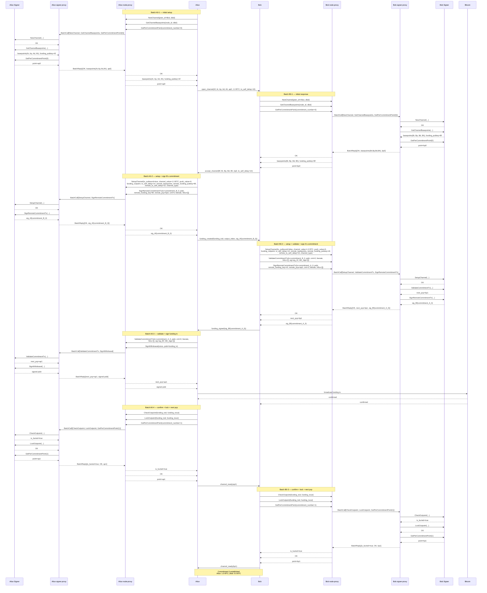
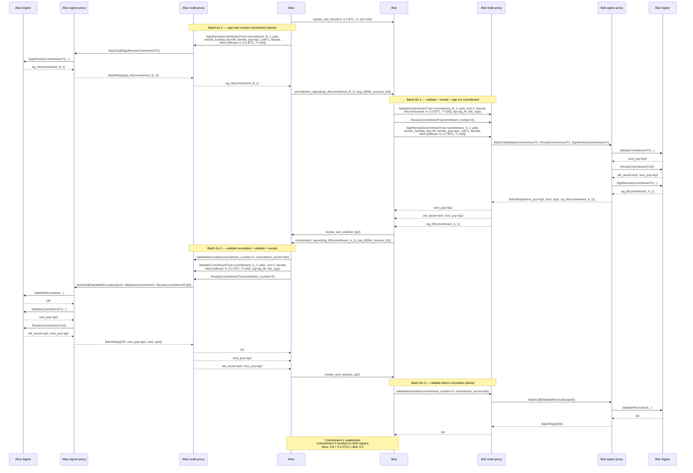
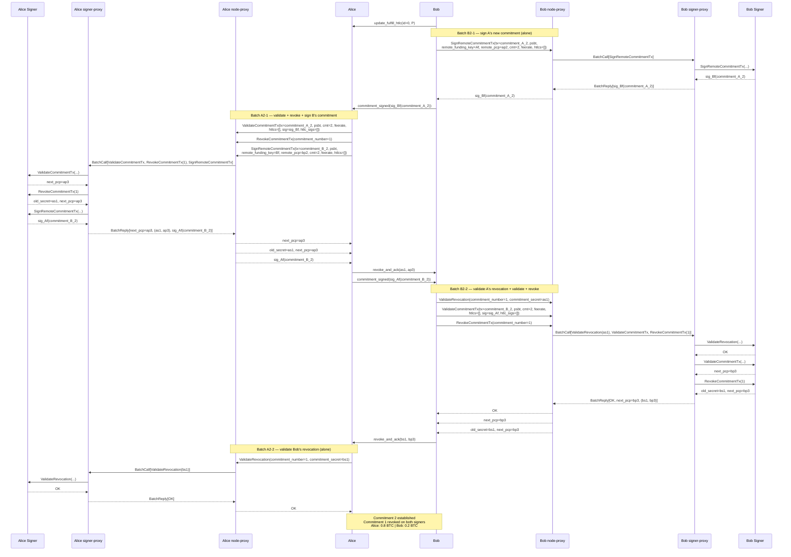
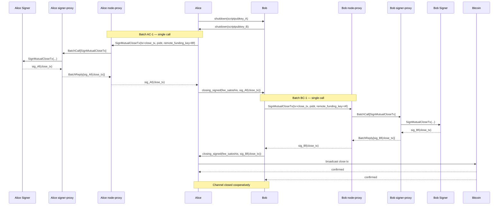

# Scenario 01 — Alice Pays Bob (Future — v2 two-proxy batching)

Same scenario as [`../current/01-alice-pays-bob.md`](../current/01-alice-pays-bob.md), but introduces **two proxy layers** between each node and its signer, with **call compression** on the link between them.

## What changed from v1

| | v1 | v2 |
|---|---|---|
| Proxies per side | 1 (inline passthrough) | 2 — node-proxy + signer-proxy |
| Proxy↔proxy traffic | n/a | Batched: many VLS calls in one round-trip |
| Node interface | unchanged from `current/` | unchanged from `current/` |
| Signer interface | unchanged from `current/` | unchanged from `current/` |
| Goal | Establish the seam | **Compress the number of calls on the cross-trust-boundary link** |

The motivation: the node-proxy → signer-proxy link is the expensive one — it crosses a trust boundary (potentially the internal relay, vsock-to-host-to-relay, or a network hop). The signer-proxy → signer link is local and cheap (vsock or in-process). So we batch where it matters most: between the two proxies.

The node still issues individual VLS calls. The signer still receives individual VLS calls. The compression happens entirely between the proxies.

## Roadmap context

| Version | What the proxy pair adds |
|---------|--------------------------|
| **v1** | Single inline passthrough proxy (the structural seam) |
| **v2** | **Two proxies with batched calls between them — this document** |
| **v3** | Signer-proxy ingests NWC/NNC events for `kind:30078` UsageProfile enforcement |
| **v4** | Signer-proxy ingests TXOO chain attestations alongside VLS calls |
| **v5** | Proxy-to-proxy link runs over the internal Nostr relay (matches [`design.drawio`](./design.drawio)) |

For notation (`Af`, `Ar`, `ap0`, `rp(...)`, etc.) see [Key Derivation](../reference/lightning-key-derivation.md#notation-legend).

Parameters verified against VLS source at commit `75e3a46b`. Diagrams assume **protocol version 6** (current default, `DEFAULT_MAX_PROTOCOL_VERSION`) — separate `RevokeCommitmentTx`, `GetPerCommitmentPoint` returns point only.

## Architecture — v2 two-proxy batching

```
   Alice  ────→  ProxyA1       ════→       ProxyA2  ────→  Alice Signer
                 (node-proxy   batched      (signer-proxy
                  buffer +     VLS calls)    dispatcher)
                  batcher)

   Bob    ────→  ProxyB1       ════→       ProxyB2  ────→  Bob Signer
```

- **Node-proxy** (ProxyA1 / ProxyB1) — receives individual VLS calls from the node, buffers callable batches, sends one compressed message to the signer-proxy.
- **Signer-proxy** (ProxyA2 / ProxyB2) — receives the batched message, unpacks, dispatches each call to the signer sequentially (signer protocol unchanged), collects responses, returns them as one batched reply.
- **Proxy-to-proxy protocol** — adds two message kinds on top of VLS:
  - `BatchCall([req_1, req_2, ...])` — node-proxy → signer-proxy
  - `BatchReply([resp_1, resp_2, ...])` — signer-proxy → node-proxy

### How calls become batches

The node-proxy buffers calls and decides when to flush. Two natural triggers:

1. **Sequential-dependency boundary** — if the node issues a call whose params depend on a return value the proxy hasn't received yet, the current batch must flush first.
2. **Time / count budget** — small latency window (e.g. 1–5 ms) or max calls per batch. If no new call arrives in the window, flush.

In this scenario the dependency boundaries are obvious (e.g., `SetupChannel` must complete before `SignRemoteCommitmentTx` can be issued, because the signer needs to know the channel exists). Each block of independent calls between dependency boundaries becomes one batch.

> **Diagram convention.** Standard Mermaid arrows are used throughout (`->>` for requests, `-->>` for replies). The batched cross-proxy hop is identified by its label content (`BatchCall[...]` / `BatchReply[...]`) and the `Note over ProxyX1, ProxyX2:` annotation that wraps each batch. The signer-proxy → signer arrows remain ordinary one-call-per-arrow.

## Source References

Wire message definitions — `vls-protocol/src/msgs.rs`:

| Call | Message struct | Line |
|------|---------------|------|
| NewChannel | `NewChannel` | [msgs.rs:487](../validating-lightning-signer/vls-protocol/src/msgs.rs#L487) |
| GetChannelBasepoints | `GetChannelBasepoints` | [msgs.rs:231](../validating-lightning-signer/vls-protocol/src/msgs.rs#L231) |
| GetPerCommitmentPoint | `GetPerCommitmentPoint` | [msgs.rs:337](../validating-lightning-signer/vls-protocol/src/msgs.rs#L337) |
| SetupChannel | `SetupChannel` | [msgs.rs:500](../validating-lightning-signer/vls-protocol/src/msgs.rs#L500) |
| SignRemoteCommitmentTx | `SignRemoteCommitmentTx` | [msgs.rs:353](../validating-lightning-signer/vls-protocol/src/msgs.rs#L353) |
| ValidateCommitmentTx | `ValidateCommitmentTx` | [msgs.rs:566](../validating-lightning-signer/vls-protocol/src/msgs.rs#L566) |
| RevokeCommitmentTx | `RevokeCommitmentTx` | [msgs.rs:644](../validating-lightning-signer/vls-protocol/src/msgs.rs#L644) |
| ValidateRevocation | `ValidateRevocation` | [msgs.rs:587](../validating-lightning-signer/vls-protocol/src/msgs.rs#L587) |
| SignWithdrawal | `SignWithdrawal` | [msgs.rs:186](../validating-lightning-signer/vls-protocol/src/msgs.rs#L186) |
| CheckOutpoint | `CheckOutpoint` | [msgs.rs:524](../validating-lightning-signer/vls-protocol/src/msgs.rs#L524) |
| LockOutpoint | `LockOutpoint` | [msgs.rs:600](../validating-lightning-signer/vls-protocol/src/msgs.rs#L600) |
| SignMutualCloseTx | `SignMutualCloseTx` | [msgs.rs:392](../validating-lightning-signer/vls-protocol/src/msgs.rs#L392) |

---

## Commitment 0

Alice funds a 1.0 BTC channel. Each side has two proxy layers; batches are formed at the node-proxy and dispatched at the signer-proxy.



### Batches Summary — Commitment 0

> Compression: Alice's signer-proxy boundary sees **4 round-trips** instead of 10 individual calls. Bob sees **3 round-trips** instead of 9.

**Alice (funder) — 4 batches (was 10 individual calls):**

| # | Batch | Calls inside | Returns |
|---|-------|--------------|---------|
| A0-1 | Initial setup | NewChannel, GetChannelBasepoints, GetPerCommitmentPoint(0) | OK, basepoints(Ar,Ap,Ad,Ah)+Af, ap0 |
| A0-2 | Setup + sign B's commitment | SetupChannel, SignRemoteCommitmentTx | OK, sig_Af(commitment_B_0) |
| A0-3 | Validate A's commitment + sign funding | ValidateCommitmentTx, SignWithdrawal | next_pcp=ap1, signed psbt |
| A0-4 | Confirm + lock + next pcp | CheckOutpoint, LockOutpoint, GetPerCommitmentPoint(1) | is_buried=true, OK, ap1 |

**Bob (non-funder) — 3 batches (was 9 individual calls):**

| # | Batch | Calls inside | Returns |
|---|-------|--------------|---------|
| B0-1 | Initial response | NewChannel, GetChannelBasepoints, GetPerCommitmentPoint(0) | OK, basepoints(Br,Bp,Bd,Bh)+Bf, bp0 |
| B0-2 | Setup + validate + sign A's commitment | SetupChannel, ValidateCommitmentTx, SignRemoteCommitmentTx | OK, next_pcp=bp1, sig_Bf(commitment_A_0) |
| B0-3 | Confirm + lock + next pcp | CheckOutpoint, LockOutpoint, GetPerCommitmentPoint(1) | is_buried=true, OK, bp1 |

---

## Commitment 1 — HTLC Add

Alice sends 0.2 BTC to Bob via HTLC. Payment hash H, CLTV timeout T=100.

**Correction vs `current/`:** the missing `ValidateRevocation` call on Bob's side (for Alice's `as0`) is included.



### Batches Summary — Commitment 1

> Compression: each side does **2 round-trips** to the signer-proxy instead of 4 individual calls.

**Alice (initiator) — 2 batches (was 4 individual calls):**

| # | Batch | Calls inside | Returns |
|---|-------|--------------|---------|
| A1-1 | Sign B's new commitment | SignRemoteCommitmentTx | sig_Af(commitment_B_1) |
| A1-2 | Validate revocation + validate own + revoke old | ValidateRevocation(bs0), ValidateCommitmentTx, RevokeCommitmentTx(0) | OK, next_pcp=ap2, (as0, ap2) |

**Bob (responder) — 2 batches (was 4 individual calls):**

| # | Batch | Calls inside | Returns |
|---|-------|--------------|---------|
| B1-1 | Validate + revoke + sign A's commitment | ValidateCommitmentTx, RevokeCommitmentTx(0), SignRemoteCommitmentTx | next_pcp=bp2, (bs0, bp2), sig_Bf(commitment_A_1) |
| B1-2 | Validate Alice's revocation | **ValidateRevocation(as0)** — restored from `current/` omission | OK |

Note: The HTLC is "offered" from the signer's perspective when signing the remote commitment (we are offering it to them) and "received" when validating our own commitment (we received it from them). Same HTLC, different viewpoint — this is because each commitment is built from the holder's perspective.

---

## Commitment 2 — HTLC Settlement

Bob reveals the preimage, claiming the 0.2 BTC. HTLC removed from both commitments.

**Correction vs `current/`:** the missing `ValidateRevocation` call on Alice's side (for Bob's `bs1`) is included — symmetric to Commitment 1.



### Batches Summary — Commitment 2

> Compression: each side does **2 round-trips** to the signer-proxy instead of 4 individual calls.

**Bob (initiator) — 2 batches (was 4 individual calls):**

| # | Batch | Calls inside | Returns |
|---|-------|--------------|---------|
| B2-1 | Sign A's new commitment | SignRemoteCommitmentTx | sig_Bf(commitment_A_2) |
| B2-2 | Validate Alice's revocation + validate + revoke | ValidateRevocation(as1), ValidateCommitmentTx, RevokeCommitmentTx(1) | OK, next_pcp=bp3, (bs1, bp3) |

**Alice (responder) — 2 batches (was 4 individual calls):**

| # | Batch | Calls inside | Returns |
|---|-------|--------------|---------|
| A2-1 | Validate + revoke + sign B's commitment | ValidateCommitmentTx, RevokeCommitmentTx(1), SignRemoteCommitmentTx | next_pcp=ap3, (as1, ap3), sig_Af(commitment_B_2) |
| A2-2 | Validate Bob's revocation | **ValidateRevocation(bs1)** — restored from `current/` omission | OK |

---

## Cooperative Close

Both sides agree to close the channel. No batching opportunity — each side issues exactly one call.



### Batches Summary — Cooperative Close

| Side | Batch | Calls inside | Returns |
|------|-------|--------------|---------|
| Alice | AC-1 | SignMutualCloseTx | sig_Af(close_tx) |
| Bob | BC-1 | SignMutualCloseTx | sig_Bf(close_tx) |

A single-call batch still pays one cross-proxy round-trip; v2 cannot compress what is already singular.

---

## Compression score

End-to-end count of cross-proxy round-trips, current vs v2:

| Phase | Alice (current) | Alice (v2) | Bob (current) | Bob (v2) |
|-------|----------------|------------|---------------|----------|
| Commitment 0 | 10 | **4** | 9 | **3** |
| Commitment 1 | 4 | **2** | 4 (with fix) | **2** |
| Commitment 2 | 4 | **2** | 4 (with fix) | **2** |
| Cooperative Close | 1 | **1** | 1 | **1** |
| **Total** | **19** | **9** | **18** | **8** |

A roughly **2.1×** reduction in cross-proxy round-trips, achieved without changing the node code or the signer code — only the proxy pair speaks the new batched protocol. On a relay-mediated transport where each round-trip is ~50ms, that is the difference between ~1.9s and ~0.85s of end-to-end signer dialogue for the full channel lifecycle.

---

## Why batches end where they do

The batches in this scenario are bounded by **protocol moments**, not by time. Specifically:

- **Network round-trip with the peer** — Alice cannot continue past `open_channel` until `accept_channel` arrives. That gives the node-proxy a natural place to flush.
- **Bitcoin event** — `CheckOutpoint` can only meaningfully be called after the funding tx confirms. That's a flush point.
- **Counterparty message arrival** — receiving `commitment_signed` or `revoke_and_ack` unlocks the next group of VLS calls. Each peer-message reception is a natural batch start.

Within a protocol moment, the node typically issues a small group of calls that are mutually independent (or only locally sequential at the signer). The node-proxy buffers until either:
1. The next call would depend on a return value not yet available, **or**
2. The node makes no further calls within a short idle window (the natural end of the protocol moment).

For Lightning, this gives clean, predictable batch boundaries. A purely time-based buffer would also work but is less precise.

---

## What v2 leaves for v3 and beyond

- **v3 (NWC mirror).** The signer-proxy starts receiving extra non-VLS messages — NIP-47 NWC envelopes and `kind:30078` UsageProfile grants — alongside `BatchCall` messages. It forwards the policy events into the signer for cryptographic enforcement of per-controller budgets. The node-proxy and node remain unchanged.
- **v4 (TXOO injection).** The signer-proxy additionally polls txood (or receives polled attestations) and emits `TipInfo` / `AddBlock` to the signer on a schedule independent of the node-proxy's batches.
- **v5 (relay transport).** The proxy-to-proxy hops in these diagrams stop being a direct link and become Nostr events traversing the internal relay. NIP-44 encryption + the operator's NIP-AB allowlist do the integrity/access work that today's link-local trust takes for granted. The `BatchCall` / `BatchReply` payloads ride inside Nostr events; nothing about the batching changes.

Each step extends one of the two proxies; the node, the signer, and the BOLT-level VLS protocol stay stable.
