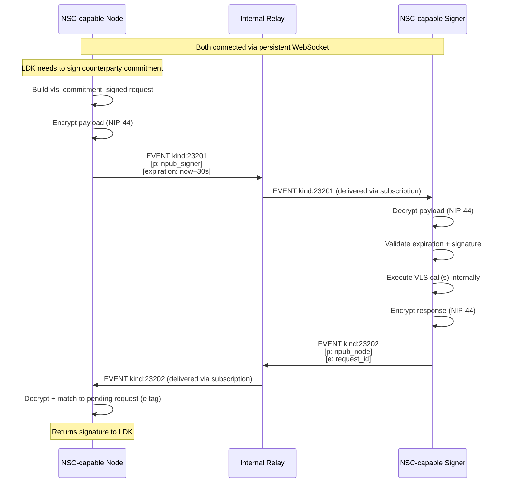

# Nostr Signer Connect (NSC)

NSC allows an **NSC-capable node** to connect to an **NSC-capable signer** using the VLS protocol, transported over Nostr. Modeled after [NWC (Nostr Wallet Connect, NIP-47)](https://github.com/nostr-protocol/nips/blob/master/47.md).

The formal NIP specification is at [`/nips/XY.md`](../../nips/XY.md). This document provides additional architectural context specific to the VLS deployment.

## Analogy to NWC

| | NWC | NSC |
|---|---|---|
| What connects | NWC-capable app → NWC-capable wallet | NSC-capable node → NSC-capable signer |
| What travels | Wallet operations (pay_invoice, get_balance, ...) | VLS operations (sign commitment, revoke, ...) |
| Transport | Nostr events via relay | Nostr events via relay |
| Who initiates | App (client) | Node (client) |
| Who responds | Wallet (service) | Signer (service) |

Just as NWC lets any NWC-capable app talk to any NWC-capable wallet without knowing its internals, NSC lets any NSC-capable node talk to any NSC-capable signer. The node doesn't care whether the signer runs in an enclave, on a hardware device, or in a cloud TEE — it just sends VLS requests over Nostr and gets signatures back.

## Motivation

Using Nostr as the transport between node and signer gives us:
- **Relay-mediated delivery** — no direct connection needed between node and signer
- **Offline tolerance** — relay queues messages if either side is temporarily unavailable
- **Encryption** — NIP-44 provides authenticated encryption on the relay
- **Access control** — NIP-AB restricts who can publish to the internal relay
- **Unified bus** — same relay carries NWC (wallet operations), NNC (node control), policy events, and now VLS protocol messages

## Architecture

```
                    Internal Nostr Relay
                    (NIP-AB access control)
                           │
              ┌────────────┼────────────┐
              │            │            │
      NSC-capable      (other       NSC-capable
         node           svcs)         signer
       npub_node                   npub_signer
```

The node and signer each have a dedicated Nostr keypair for their NSC connection. They communicate exclusively through the internal relay. The relay never faces the public internet.

### What makes a node "NSC-capable"?

The node includes an NSC client that:
- Translates VLS API calls into NSC request events
- Publishes them to the relay
- Waits for response events from the signer
- Returns the signer's reply to the node's VLS client interface

This is analogous to how an NWC-capable app includes an NWC client, or how an NNC-capable dashboard includes an NNC client.

### What makes a signer "NSC-capable"?

The signer includes an NSC service that:
- Subscribes to request events on the relay
- Decrypts and executes VLS operations
- Publishes response events with the results

This is analogous to how an NWC-capable wallet includes an NWC service, or how an NNC-capable node includes an NNC service.

---

## Protocol Overview

NSC is one of three Nostr-based Lightning protocols, all sharing the same architectural pattern:

| Aspect | NWC (NIP-47) | NNC (NIP-XX) | NSC |
|--------|-------------|-------------|-----|
| Purpose | Wallet operations | Node administration | VLS signing operations |
| Connects | App → Wallet | Client → Node | Node → Signer |
| Request kind | 23194 | 23198 | **23201** |
| Response kind | 23195 | 23199 | **23202** |
| Notification kind | 23196/23197 | 23200 | **23203** |
| Encryption | NIP-44 | NIP-44 | NIP-44 |
| Correlation | `e` tag on response | `e` tag on response | `e` tag on response |
| Pairing | `nostr+walletconnect://` | `nostr+nodecontrol://` | `nostr+signerconnect://` |
| Info event | kind 13194 | kind 13198 | kind **13200** |
| Access control | kind 30078 UsageProfile | kind 30078 UsageProfile | NIP-AB (relay-level) |

### How they relate

```
  Owner/App                Node                    Signer
     │                      │                        │
     │── NWC (pay, recv) ──→│                        │
     │── NNC (channels) ───→│                        │
     │                      │── NSC (sign, revoke) ─→│
     │                      │                        │
```

- **NWC**: App asks the node to move money (pay_invoice, get_balance, make_invoice)
- **NNC**: Owner/admin asks the node to manage itself (open_channel, set_fees, list_peers)
- **NSC**: Node asks the signer to produce signatures (sign commitment, revoke, validate)

All three can run on the same internal relay. They use separate event kinds so each service subscribes only to its own traffic.

### Why new event kinds for NSC?

NWC and NNC kinds are semantically "control a node" — a client asking a service to perform operations. NSC is structurally similar but the trust direction is inverted: the node is the *client* asking the signer to do work. Separate kinds allow:
- Relay filters to distinguish traffic types
- Each service to subscribe only to its relevant events
- Independent access control policies per protocol

---

## Connection String (Pairing)

```
nostr+signerconnect://<signer_pubkey>?relay=<relay_url>&secret=<node_secret>
```

| Component | Description |
|-----------|-------------|
| `signer_pubkey` | 32-byte hex pubkey of the NSC-capable signer (unique per connection) |
| `relay` | WebSocket URL of the internal relay (e.g., `ws://relay.internal:7777`) |
| `secret` | 32-byte hex — the node's private key for this connection |

The signer generates this URI during provisioning. It is delivered to the node out-of-band (config file, provisioning system, operator copy-paste). The `secret` serves as both the node's Nostr signing key and the ECDH input for NIP-44 encryption.

### Pairing flow

1. **Operator provisions signer** — signer generates a fresh keypair (`nsec_signer` / `npub_signer`)
2. **Signer generates connection URI** — includes `npub_signer`, the relay URL, and a fresh random `secret` for the node
3. **Operator delivers URI to node** — via config file or provisioning API
4. **Node derives its identity** — `nsec_node = secret`, `npub_node = pubkey(secret)`
5. **Both connect to relay** — subscribe to their respective event filters

For TEE-based signers, step 1 includes hardware attestation — the signer proves its identity and code measurement before receiving the seed. See [Signer Provisioning](signer-provisioning.md) for the full attestation-based flow.

---

## Event Structure

### Request Event (kind 23201) — node → signer

```json
{
  "kind": 23201,
  "pubkey": "<npub_node>",
  "created_at": 1700000000,
  "tags": [
    ["p", "<npub_signer>"],
    ["expiration", "<unix_timestamp>"]
  ],
  "content": "<nip44_encrypted_payload>",
  "id": "<sha256>",
  "sig": "<schnorr_sig_by_nsec_node>"
}
```

### Response Event (kind 23202) — signer → node

```json
{
  "kind": 23202,
  "pubkey": "<npub_signer>",
  "created_at": 1700000001,
  "tags": [
    ["p", "<npub_node>"],
    ["e", "<request_event_id>"]
  ],
  "content": "<nip44_encrypted_payload>",
  "id": "<sha256>",
  "sig": "<schnorr_sig_by_nsec_signer>"
}
```

### Correlation

The response includes an **`e` tag** referencing the request event's `id`. This is how the node matches responses to pending requests.

### Expiration

The `expiration` tag on requests prevents replay of stale signing requests. The signer MUST reject events whose expiration has passed. Recommended expiration: `created_at + 30 seconds` for signing operations.

---

## Encrypted Payload Format

The `content` field is NIP-44 encrypted JSON. The conversation key is derived once from the ECDH of both parties' keys and reused for all messages.

### Request payload

```json
{
  "method": "vls_commitment_signed",
  "params": {
    "channel_id": 42,
    "remote_per_commitment_point": "03abc...",
    "commitment_number": 1,
    "feerate": 5000,
    "to_local_value_sat": 0,
    "to_remote_value_sat": 80000000,
    "htlcs": [
      {
        "side": 0,
        "amount_sat": 20000000,
        "payment_hash": "deadbeef...",
        "cltv_expiry": 100
      }
    ]
  }
}
```

### Response payload (success)

```json
{
  "result_type": "vls_commitment_signed",
  "result": {
    "signature": "3045...",
    "htlc_signatures": ["3044..."]
  }
}
```

### Response payload (error)

```json
{
  "result_type": "vls_commitment_signed",
  "error": {
    "code": "POLICY_VIOLATION",
    "message": "HTLC amount exceeds UsageProfile quota"
  }
}
```

### Error codes

| Code | Description |
|------|-------------|
| `POLICY_VIOLATION` | Request rejected by signer policy rules |
| `INVALID_STATE` | Channel not found or in unexpected state |
| `INVALID_PARAMS` | Malformed or missing parameters |
| `SIGNATURE_INVALID` | Counterparty signature verification failed |
| `RATE_LIMITED` | Too many requests |
| `INTERNAL` | Signer internal error |

---

## Methods

The VLS protocol operations travel as NSC methods. These can be either raw VLS calls (one method per VLS message) or compressed calls (multiple VLS operations per method, as defined in the [v2 optimization](01-alice-pays-bob.md)):

### Channel open (section 01)

| Method | Params | Result |
|--------|--------|--------|
| `vls_create_channel` | `peer_id`, `channel_value`, `push_value`, `is_outbound` | `basepoints`, `funding_pubkey`, `per_commitment_point_0`, `per_commitment_point_1` |
| `vls_funding_created` | `channel_id`, `is_outbound`, `channel_value`, `push_value`, `funding_txid`, `funding_txout`, `to_self_delay`, `remote_basepoints`, `remote_funding_pubkey`, `remote_to_self_delay`, `channel_type`, `remote_per_commitment_point`, `commitment_number`, `feerate`, `to_local_value_sat`, `to_remote_value_sat`, `htlcs` | `signature` |
| `vls_funding_signed` | (same as funding_created + `counterparty_signature`, `counterparty_htlc_signatures`) | `signature`, `per_commitment_point_2` |
| `vls_confirm_counterparty_sig` | `channel_id`, `commitment_number`, `feerate`, `to_local_value_sat`, `to_remote_value_sat`, `htlcs`, `counterparty_signature`, `counterparty_htlc_signatures` | `per_commitment_point_2` |
| `vls_sign_withdrawal` | `utxos`, `psbt` | `signed_psbt` |
| `vls_channel_ready` | `channel_id`, `funding_txid`, `funding_txout` | `is_buried` |

### Commitment updates (section 02)

| Method | Params | Result |
|--------|--------|--------|
| `vls_commitment_signed` | `channel_id`, `remote_per_commitment_point`, `commitment_number`, `feerate`, `to_local_value_sat`, `to_remote_value_sat`, `htlcs` | `signature`, `htlc_signatures` |
| `vls_revoke_commitment` | `channel_id`, `commitment_number`, `feerate`, `to_local_value_sat`, `to_remote_value_sat`, `htlcs`, `counterparty_signature`, `counterparty_htlc_signatures` | `old_commitment_secret`, `next_per_commitment_point` |
| `vls_validate_revocation` | `channel_id`, `commitment_number`, `commitment_secret` | (empty — success/error only) |

### Cooperative close (section 04)

| Method | Params | Result |
|--------|--------|--------|
| `vls_closing_signed` | `channel_id`, `to_local_value_sat`, `to_remote_value_sat`, `local_script`, `remote_script`, `local_wallet_path_hint` | `signature` |

---

## Info Event (Capabilities)

The signer publishes a replaceable info event (kind 13200) advertising its capabilities:

```json
{
  "kind": 13200,
  "pubkey": "<npub_signer>",
  "tags": [
    ["encryption", "nip44_v2"]
  ],
  "content": "vls_create_channel vls_funding_created vls_funding_signed vls_confirm_counterparty_sig vls_sign_withdrawal vls_channel_ready vls_commitment_signed vls_revoke_commitment vls_validate_revocation vls_closing_signed"
}
```

The node can fetch this on startup to verify the signer supports the expected methods.

---

## Subscriptions

### Node subscribes to:

```json
{
  "kinds": [23202, 23203],
  "#p": ["<npub_node>"]
}
```

This delivers all responses and notifications addressed to the node.

### Signer subscribes to:

```json
{
  "kinds": [23201],
  "#p": ["<npub_signer>"]
}
```

This delivers all requests addressed to the signer.

---

## Notifications (kind 23203)

The signer can send unsolicited notifications to the node:

| Notification | Description |
|-------------|-------------|
| `heartbeat` | Periodic liveness signal with current chain tip |
| `policy_update` | New UsageProfile (kind:30078) has been ingested |
| `signer_error` | Signer encountered an error outside of a request |

```json
{
  "kind": 23203,
  "pubkey": "<npub_signer>",
  "tags": [
    ["p", "<npub_node>"]
  ],
  "content": "<nip44_encrypted>"
}
```

Payload:

```json
{
  "notification_type": "heartbeat",
  "data": {
    "chain_tip_height": 800000,
    "chain_tip_hash": "000000000000..."
  }
}
```

---

## Security Properties

### Encryption

- **NIP-44** — ECDH (secp256k1) + HKDF + ChaCha20-Poly1305 + HMAC-SHA256
- **Conversation key** — derived once from `ECDH(nsec_node, npub_signer)` = `ECDH(nsec_signer, npub_node)`
- **Per-message nonce** — 32 bytes from CSPRNG, ensures unique ciphertext even for identical payloads
- **No forward secrecy** — compromise of either key exposes all past messages (acceptable for internal relay where messages are ephemeral)

### Access Control

- **NIP-AB on the relay** — only `npub_node` and `npub_signer` (plus other authorized services) can publish
- **Internal network only** — relay is never exposed to the public internet
- **Expiration tags** — stale events are rejected, limiting replay window

### Authentication

- **Schnorr signatures** — every event is signed by the author's key, proving origin
- **HMAC in NIP-44** — encrypted content is authenticated, preventing tampering
- **No impersonation** — the relay cannot forge valid events (doesn't know either private key)

### What the relay can see

The relay sees:
- Event metadata (kind, pubkey, created_at, tags)
- That `npub_node` is talking to `npub_signer`
- Timing and frequency of messages

The relay cannot see:
- Message content (method, params, signatures)
- Which channel or HTLC is being processed

---

## Latency Considerations

Lightning requires fast signing responses (peer timeouts are typically 30-60 seconds, but good performance requires sub-second responses). Key latency factors:

| Component | Typical latency |
|-----------|----------------|
| Node → relay (local network) | < 1 ms |
| Relay → signer (local network / vsock) | < 1 ms |
| Signer VLS processing | < 5 ms |
| NIP-44 encrypt/decrypt | < 1 ms |
| **Total per RTT** | **< 10 ms** |

For comparison, the current direct-link approach (vsock or TCP) is ~1-5 ms per RTT. NSC adds ~5 ms overhead from encryption + relay hop — acceptable for an internal relay on the same host or LAN.

### Optimization: WebSocket persistence

Both sides maintain persistent WebSocket connections to the relay. No connection setup per message.

### Optimization: No relay persistence needed

For latency-sensitive signing operations, the relay can be configured as **ephemeral** — no event storage, pure pub/sub routing. Events are delivered to connected subscribers immediately and discarded. This eliminates disk I/O from the critical path.

If the signer is temporarily disconnected, the node will timeout and retry (the Lightning node handles this as a signer timeout). No queuing needed for signing operations.

---

## Comparison with NWC and NNC

| Aspect | NWC | NNC | NSC |
|--------|-----|-----|-----|
| Initiator | User/app (many) | Owner/admin (few) | Node (one) |
| Responder | Wallet/node (one) | Node service (one) | Signer (one) |
| Cardinality | Many-to-one | Few-to-one | One-to-one |
| Latency requirement | Seconds acceptable | Seconds acceptable | Sub-second required |
| Relay type | Public or private | Public or private | Internal only |
| Message frequency | Low (user-initiated) | Low (admin-initiated) | High (per commitment update) |
| Payload size | Small (invoice strings) | Small (channel params) | Medium (signatures + points) |
| Connection lifetime | Long-lived (days/months) | Long-lived (days/months) | Long-lived (lifetime of deployment) |

NSC's one-to-one cardinality means the relay handles minimal fan-out — essentially a point-to-point encrypted channel with store-and-forward capability.

---

## Wire Encoding: JSON vs Binary

The examples above show JSON payloads for clarity. In production, the encrypted content could use either:

**Option A: JSON** (simpler, debuggable)
- Human-readable when decrypted
- Slightly larger payloads (~2-3x vs binary)
- Easier to extend (add fields without version bump)

**Option B: Binary** (compact, fast)
- VLS already uses BOLT-style binary serialization
- Could reuse existing `msgs.rs` serialization for the inner payload
- Smaller NIP-44 ciphertext → less relay bandwidth

**Recommendation:** Start with JSON for development/debugging. The NIP-44 encryption hides payload size from observers anyway, and the overhead on an internal relay is negligible. Binary can be a future optimization if message frequency becomes a concern.

---

## Sequence Diagram — Full Flow



---

## Relay Requirements

The internal relay needs minimal capabilities:

| Requirement | Reason |
|-------------|--------|
| NIP-01 (basic protocol) | Event publishing and subscription |
| NIP-44 support (passthrough) | Relay doesn't decrypt — just passes encrypted content |
| NIP-AB (access control) | Restrict publishing to authorized pubkeys |
| WebSocket server | Both sides connect via persistent WS |
| Low latency routing | Deliver events to subscribers immediately |
| Optional: event expiration | Auto-delete expired events (garbage collection) |

The relay does NOT need:
- Full-text search
- Event storage (can be ephemeral for signing)
- Rate limiting (internal network, trusted publishers)
- Proof of work

A minimal relay implementation (e.g., `strfry`, `nostr-rs-relay` with restricted config) is sufficient.

---

## Relationship to Roadmap

NSC is a transport layer. It carries VLS protocol messages — whether raw (one VLS call per NSC event) or compressed (multiple VLS calls per NSC event, as in the [v2 optimization](01-alice-pays-bob.md)).

| Version | Transport | Payload |
|---------|-----------|---------|
| v1 | Direct (vsock/TCP) | Raw VLS binary messages |
| v2 | Direct (vsock/TCP) | Compressed named messages |
| **v5** | **NSC over internal relay** | Compressed named messages as Nostr events |

Once the relay is in place, v3 and v4 become natural:
- **v3**: The signer already subscribes to the relay — it can now also subscribe to `kind:30078` UsageProfile events published by the owner
- **v4**: The signer subscribes to chain attestation events from txood on the same relay

---

## Multiple Channels / Concurrency

The node may have multiple channels open and multiple signing operations in flight. Each request event has a unique `id`, and each response references it via `e` tag. The node maintains a map of pending request IDs → callbacks.

The signer processes requests sequentially per channel (to maintain state consistency) but can process requests for different channels concurrently. Channel identification is via `channel_id` in the encrypted payload.

---

## Failure Modes

| Failure | Behavior |
|---------|----------|
| Relay down | Both sides lose connection. Node retries. Lightning node sees signer timeout. |
| Signer down | Requests queue on relay (if persistent) or timeout. Node retries on reconnection. |
| Node down | Signer has nothing to do. Lightning node is also down. |
| Expired request | Signer rejects with error. Node retries with fresh event. |
| Invalid signature on event | Relay or recipient rejects event. Logged as potential attack. |
| Decryption failure | Recipient rejects. Configuration mismatch — check pairing. |

---

## Open Questions

1. **Event kind numbers** — 13200/23201/23202/23203 as specified in [NIP-XY](../../nips/XY.md). Need formal NIP number assignment.

2. **Binary vs JSON payloads** — JSON is clearer for spec, binary is more efficient. Does it matter on an internal relay?

3. **Ephemeral vs persistent relay** — For signing operations, ephemeral (pure pub/sub) minimizes latency. But if we want the relay to queue messages during brief disconnections, we need some persistence. Hybrid approach: signing events are ephemeral, policy events (kind:30078) are persistent.

4. **Multiple signers** — If we later support quorum signing (Epic 2), does each signer get its own keypair and connection URI? The node would then publish to multiple `p` tags or maintain multiple connections.

5. **Heartbeat interval** — How often should the signer send heartbeats? Every block (~10 min)? More frequently for monitoring?

6. **Relay authentication** — NIP-AB restricts publishing. Should the relay also authenticate subscribers (prevent unauthorized parties from observing encrypted traffic patterns)?

7. **Raw vs compressed methods** — Should NSC support both raw VLS calls (one method = one VLS message) and compressed calls (one method = multiple VLS messages)? Or mandate compression?
