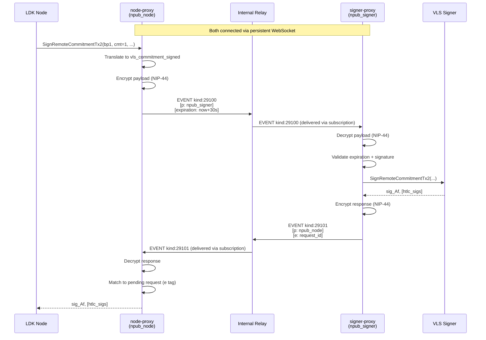

# Nostr Signer Connect (NSC) — Proxy-to-Proxy Transport

This document specifies how the node-proxy and signer-proxy communicate over Nostr, using a protocol modeled after [NWC (Nostr Wallet Connect, NIP-47)](https://github.com/nostr-protocol/nips/blob/master/47.md).

## Motivation

The proxy-to-proxy link is the expensive one — it crosses a trust boundary between the node (DMZ) and the signer (enclave). In v2, we defined [semantic proxy messages](01-alice-pays-bob.md) (`vls_commitment_signed`, `vls_revoke_commitment`, etc.) that compress multiple VLS calls into single round-trips. NSC defines how these messages travel over the wire.

Using Nostr as the transport gives us:
- **Relay-mediated delivery** — no direct connection needed between node and enclave
- **Offline tolerance** — relay queues messages if either side is temporarily unavailable
- **Encryption** — NIP-44 provides authenticated encryption on the relay
- **Access control** — NIP-AB restricts who can publish to the internal relay
- **Unified bus** — same relay carries NWC (wallet operations), NNC (node control), policy events, and now signer protocol messages

## Architecture Context

```
                    Internal Nostr Relay
                    (NIP-AB access control)
                           │
              ┌────────────┼────────────┐
              │            │            │
         node-proxy   (other svcs)  signer-proxy
         npub_node                  npub_signer
              │                         │
         LDK node                  VLS Signer
         (DMZ)                     (Enclave)
```

The node-proxy and signer-proxy each have a dedicated Nostr keypair. They communicate exclusively through the internal relay. The relay never faces the public internet.

---

## Protocol Overview

NSC follows the NWC request/response pattern:

| Aspect | NWC (NIP-47) | NSC |
|--------|-------------|-----|
| Purpose | Wallet operations (pay, balance, etc.) | VLS signing operations |
| Request kind | 23194 | **29100** |
| Response kind | 23195 | **29101** |
| Notification kind | 23196/23197 | **29102** |
| Encryption | NIP-44 | NIP-44 |
| Correlation | `e` tag on response | `e` tag on response |
| Pairing | `nostr+walletconnect://` URI | `nostr+signerconnect://` URI |
| Info event | kind 13194 (replaceable) | kind **39100** (replaceable) |

### Why new event kinds?

NWC kinds (23194/23195) are semantically "wallet connect" — a client asking a service to move money. NSC is structurally similar but semantically different — a node-proxy asking a signer-proxy to produce signatures. Separate kinds allow:
- Relay filters to distinguish traffic types
- Clients to subscribe to only the events they care about
- Clear separation if both NWC and NSC run on the same relay

---

## Connection String (Pairing)

```
nostr+signerconnect://<signer_proxy_pubkey>?relay=<relay_url>&secret=<node_proxy_secret>
```

| Component | Description |
|-----------|-------------|
| `signer_proxy_pubkey` | 32-byte hex pubkey of the signer-proxy (unique per connection) |
| `relay` | WebSocket URL of the internal relay (e.g., `ws://relay.internal:7777`) |
| `secret` | 32-byte hex — the node-proxy's private key for this connection |

The signer-proxy generates this URI during setup. It is delivered to the node-proxy out-of-band (config file, provisioning system, operator copy-paste). The `secret` serves as both the node-proxy's signing key and the ECDH input for NIP-44 encryption.

### Pairing flow

1. **Operator provisions signer-proxy** — generates a fresh keypair (`nsec_signer` / `npub_signer`)
2. **Signer-proxy generates connection URI** — includes `npub_signer`, the relay URL, and a fresh random `secret` for the node-proxy
3. **Operator delivers URI to node-proxy** — via config file or provisioning API
4. **Node-proxy derives its identity** — `nsec_node = secret`, `npub_node = pubkey(secret)`
5. **Both connect to relay** — subscribe to their respective event filters

---

## Event Structure

### Request Event (kind 29100) — node-proxy → signer-proxy

```json
{
  "kind": 29100,
  "pubkey": "<npub_node>",
  "created_at": 1700000000,
  "tags": [
    ["p", "<npub_signer>"],
    ["expiration", "<unix_timestamp>"]
  ],
  "content": "<nip44_encrypted_payload>",
  "id": "<sha256>",
  "sig": "<schnorr_sig_by_nsec_node>"
}
```

### Response Event (kind 29101) — signer-proxy → node-proxy

```json
{
  "kind": 29101,
  "pubkey": "<npub_signer>",
  "created_at": 1700000001,
  "tags": [
    ["p", "<npub_node>"],
    ["e", "<request_event_id>"]
  ],
  "content": "<nip44_encrypted_payload>",
  "id": "<sha256>",
  "sig": "<schnorr_sig_by_nsec_signer>"
}
```

### Correlation

The response includes an **`e` tag** referencing the request event's `id`. This is how the node-proxy matches responses to pending requests.

### Expiration

The `expiration` tag on requests prevents replay of stale signing requests. The signer-proxy MUST reject events whose expiration has passed. Recommended expiration: `created_at + 30 seconds` for signing operations.

---

## Encrypted Payload Format

The `content` field is NIP-44 encrypted JSON. The conversation key is derived once from the ECDH of both parties' keys and reused for all messages.

### Request payload

```json
{
  "method": "vls_commitment_signed",
  "params": {
    "channel_id": 42,
    "remote_per_commitment_point": "03abc...",
    "commitment_number": 1,
    "feerate": 5000,
    "to_local_value_sat": 0,
    "to_remote_value_sat": 80000000,
    "htlcs": [
      {
        "side": 0,
        "amount_sat": 20000000,
        "payment_hash": "deadbeef...",
        "cltv_expiry": 100
      }
    ]
  }
}
```

### Response payload (success)

```json
{
  "result_type": "vls_commitment_signed",
  "result": {
    "signature": "3045...",
    "htlc_signatures": ["3044..."]
  }
}
```

### Response payload (error)

```json
{
  "result_type": "vls_commitment_signed",
  "error": {
    "code": "POLICY_VIOLATION",
    "message": "HTLC amount exceeds UsageProfile quota"
  }
}
```

### Error codes

| Code | Description |
|------|-------------|
| `POLICY_VIOLATION` | Request rejected by signer policy rules |
| `INVALID_STATE` | Channel not found or in unexpected state |
| `INVALID_PARAMS` | Malformed or missing parameters |
| `SIGNATURE_INVALID` | Counterparty signature verification failed |
| `RATE_LIMITED` | Too many requests |
| `INTERNAL` | Signer internal error |

---

## Methods

Each proxy message from the [v2 protocol](01-alice-pays-bob.md) maps to an NSC method:

### Channel open (section 01)

| Method | Params | Result |
|--------|--------|--------|
| `vls_create_channel` | `peer_id`, `channel_value`, `push_value`, `is_outbound` | `basepoints`, `funding_pubkey`, `per_commitment_point_0` |
| `vls_funding_created` | `channel_id`, `is_outbound`, `channel_value`, `push_value`, `funding_txid`, `funding_txout`, `to_self_delay`, `remote_basepoints`, `remote_funding_pubkey`, `remote_to_self_delay`, `channel_type`, `remote_per_commitment_point`, `commitment_number`, `feerate`, `to_local_value_sat`, `to_remote_value_sat`, `htlcs` | `signature` |
| `vls_funding_signed` | (same as funding_created + `counterparty_signature`, `counterparty_htlc_signatures`) | `signature`, `next_per_commitment_point` |
| `vls_sign_funding` | `channel_id`, `counterparty_signature`, `counterparty_htlc_signatures`, `utxos`, `psbt` | `next_per_commitment_point`, `signed_psbt` |
| `vls_channel_ready` | `channel_id`, `funding_txid`, `funding_txout` | `is_buried`, `per_commitment_point_1` |

### Commitment updates (section 02)

| Method | Params | Result |
|--------|--------|--------|
| `vls_commitment_signed` | `channel_id`, `remote_per_commitment_point`, `commitment_number`, `feerate`, `to_local_value_sat`, `to_remote_value_sat`, `htlcs` | `signature`, `htlc_signatures` |
| `vls_revoke_commitment` | `channel_id`, `commitment_number`, `feerate`, `to_local_value_sat`, `to_remote_value_sat`, `htlcs`, `counterparty_signature`, `counterparty_htlc_signatures` | `old_commitment_secret`, `next_per_commitment_point` |
| `vls_validate_revocation` | `channel_id`, `commitment_number`, `commitment_secret` | (empty — success/error only) |

### Cooperative close (section 04)

| Method | Params | Result |
|--------|--------|--------|
| `vls_closing_signed` | `channel_id`, `to_local_value_sat`, `to_remote_value_sat`, `local_script`, `remote_script`, `local_wallet_path_hint` | `signature` |

---

## Info Event (Capabilities)

The signer-proxy publishes a replaceable info event (kind 39100) advertising its capabilities:

```json
{
  "kind": 39100,
  "pubkey": "<npub_signer>",
  "tags": [
    ["encryption", "nip44_v2"]
  ],
  "content": "vls_create_channel vls_funding_created vls_funding_signed vls_sign_funding vls_channel_ready vls_commitment_signed vls_revoke_commitment vls_validate_revocation vls_closing_signed"
}
```

The node-proxy can fetch this on startup to verify the signer-proxy supports the expected methods.

---

## Subscriptions

### Node-proxy subscribes to:

```json
{
  "kinds": [29101, 29102],
  "#p": ["<npub_node>"]
}
```

This delivers all responses and notifications addressed to the node-proxy.

### Signer-proxy subscribes to:

```json
{
  "kinds": [29100],
  "#p": ["<npub_signer>"]
}
```

This delivers all requests addressed to the signer-proxy.

---

## Notifications (kind 29102)

The signer-proxy can send unsolicited notifications to the node-proxy:

| Notification | Description |
|-------------|-------------|
| `heartbeat` | Periodic liveness signal with current chain tip |
| `policy_update` | New UsageProfile (kind:30078) has been ingested |
| `signer_error` | Signer encountered an error outside of a request |

```json
{
  "kind": 29102,
  "pubkey": "<npub_signer>",
  "tags": [
    ["p", "<npub_node>"]
  ],
  "content": "<nip44_encrypted>",
}
```

Payload:

```json
{
  "notification_type": "heartbeat",
  "data": {
    "chain_tip_height": 800000,
    "chain_tip_hash": "000000000000..."
  }
}
```

---

## Security Properties

### Encryption

- **NIP-44** — ECDH (secp256k1) + HKDF + ChaCha20-Poly1305 + HMAC-SHA256
- **Conversation key** — derived once from `ECDH(nsec_node, npub_signer)` = `ECDH(nsec_signer, npub_node)`
- **Per-message nonce** — 32 bytes from CSPRNG, ensures unique ciphertext even for identical payloads
- **No forward secrecy** — compromise of either key exposes all past messages (acceptable for internal relay where messages are ephemeral)

### Access Control

- **NIP-AB on the relay** — only `npub_node` and `npub_signer` (plus other authorized services) can publish
- **Internal network only** — relay is never exposed to the public internet
- **Expiration tags** — stale events are rejected, limiting replay window

### Authentication

- **Schnorr signatures** — every event is signed by the author's key, proving origin
- **HMAC in NIP-44** — encrypted content is authenticated, preventing tampering
- **No impersonation** — the relay cannot forge valid events (doesn't know either private key)

### What the relay can see

The relay sees:
- Event metadata (kind, pubkey, created_at, tags)
- That `npub_node` is talking to `npub_signer`
- Timing and frequency of messages

The relay cannot see:
- Message content (method, params, signatures)
- Which channel or HTLC is being processed

---

## Latency Considerations

Lightning requires fast signing responses (peer timeouts are typically 30-60 seconds, but good performance requires sub-second responses). Key latency factors:

| Component | Typical latency |
|-----------|----------------|
| Node-proxy → relay (local network) | < 1 ms |
| Relay → signer-proxy (local network / vsock) | < 1 ms |
| Signer-proxy → VLS signer (in-process / vsock) | < 5 ms |
| NIP-44 encrypt/decrypt | < 1 ms |
| **Total per RTT** | **< 10 ms** |

For comparison, the current direct-link approach (vsock or TCP) is ~1-5 ms per RTT. NSC adds ~5 ms overhead from encryption + relay hop — acceptable for an internal relay on the same host or LAN.

### Optimization: WebSocket persistence

Both proxies maintain persistent WebSocket connections to the relay. No connection setup per message.

### Optimization: No relay persistence needed

For latency-sensitive signing operations, the relay can be configured as **ephemeral** — no event storage, pure pub/sub routing. Events are delivered to connected subscribers immediately and discarded. This eliminates disk I/O from the critical path.

If the signer-proxy is temporarily disconnected, the node-proxy will timeout and retry (the Lightning node will handle this as a signer timeout). No queuing needed for signing operations.

---

## Comparison with NWC

| Aspect | NWC | NSC |
|--------|-----|-----|
| Initiator | User/app (many) | Node-proxy (one) |
| Responder | Wallet service (one) | Signer-proxy (one) |
| Cardinality | Many-to-one | One-to-one |
| Latency requirement | Seconds acceptable | Sub-second required |
| Relay type | Public or private | Internal only |
| Message frequency | Low (user-initiated) | High (per commitment update) |
| Payload size | Small (invoice strings) | Medium (signatures + points) |
| Connection lifetime | Long-lived (days/months) | Long-lived (lifetime of deployment) |

The one-to-one cardinality means the relay handles minimal fan-out — essentially a point-to-point encrypted channel with store-and-forward capability.

---

## Wire Encoding: JSON vs Binary

The examples above show JSON payloads for clarity. In production, the encrypted content could use either:

**Option A: JSON** (simpler, debuggable)
- Human-readable when decrypted
- Slightly larger payloads (~2-3x vs binary)
- Easier to extend (add fields without version bump)

**Option B: Binary** (compact, fast)
- VLS already uses BOLT-style binary serialization
- Could reuse existing `msgs.rs` serialization for the inner payload
- Smaller NIP-44 ciphertext → less relay bandwidth

**Recommendation:** Start with JSON for development/debugging. The NIP-44 encryption hides payload size from observers anyway, and the overhead on an internal relay is negligible. Binary can be a future optimization if message frequency becomes a concern.

---

## Sequence Diagram — Full Flow



---

## Relay Requirements

The internal relay needs minimal capabilities:

| Requirement | Reason |
|-------------|--------|
| NIP-01 (basic protocol) | Event publishing and subscription |
| NIP-44 support (passthrough) | Relay doesn't decrypt — just passes encrypted content |
| NIP-AB (access control) | Restrict publishing to authorized pubkeys |
| WebSocket server | Both proxies connect via persistent WS |
| Low latency routing | Deliver events to subscribers immediately |
| Optional: event expiration | Auto-delete expired events (garbage collection) |

The relay does NOT need:
- Full-text search
- Event storage (can be ephemeral for signing)
- Rate limiting (internal network, trusted publishers)
- Proof of work

A minimal relay implementation (e.g., `strfry`, `nostr-rs-relay` with restricted config) is sufficient.

---

## Relationship to Roadmap

| Version | Transport | Notes |
|---------|-----------|-------|
| v1 | Direct (vsock/TCP) | Single proxy passthrough — no relay |
| v2 | Direct (vsock/TCP) | Named messages, call compression — no relay yet |
| **v5** | **NSC over internal relay** | **This document** — messages travel as Nostr events |

NSC is specified as v5 because it's a transport concern that's independent of the message semantics (v2) and the policy layer (v3/v4). You could run v2 messages over direct vsock *or* over NSC — the proxy logic doesn't change.

However, once the relay is in place (v5), v3 and v4 become natural:
- **v3**: The signer-proxy already subscribes to the relay — it can now also subscribe to `kind:30078` UsageProfile events published by the owner
- **v4**: The signer-proxy subscribes to chain attestation events from txood on the same relay

---

## Multiple Channels / Concurrency

The node-proxy may have multiple channels open and multiple signing operations in flight. Each request event has a unique `id`, and each response references it via `e` tag. The node-proxy maintains a map of pending request IDs → callbacks.

The signer-proxy processes requests sequentially per channel (to maintain state consistency) but can process requests for different channels concurrently. Channel identification is via `channel_id` in the encrypted payload.

---

## Failure Modes

| Failure | Behavior |
|---------|----------|
| Relay down | Both proxies lose connection. Node-proxy retries. Lightning node sees signer timeout. |
| Signer-proxy down | Requests queue on relay (if persistent) or timeout. Node-proxy retries on reconnection. |
| Node-proxy down | Signer-proxy has nothing to do. Lightning node is also down. |
| Expired request | Signer-proxy rejects with error. Node-proxy retries with fresh event. |
| Invalid signature on event | Relay or recipient rejects event. Logged as potential attack. |
| Decryption failure | Recipient rejects. Configuration mismatch — check pairing. |

---

## Open Questions

1. **Event kind numbers** — 29100/29101/29102/39100 are placeholder. Should we register a NIP or use the existing NIP-47 kinds with a different `method` namespace?

2. **Binary vs JSON payloads** — JSON is clearer for spec, binary is more efficient. Does it matter on an internal relay?

3. **Ephemeral vs persistent relay** — For signing operations, ephemeral (pure pub/sub) minimizes latency. But if we want the relay to queue messages during brief disconnections, we need some persistence. Hybrid approach: signing events are ephemeral, policy events (kind:30078) are persistent.

4. **Multiple signer-proxies** — If we later support quorum signing (Epic 2), does each signer-proxy get its own keypair and connection URI? The node-proxy would then publish to multiple `p` tags or maintain multiple connections.

5. **Heartbeat interval** — How often should the signer-proxy send heartbeats? Every block (~10 min)? More frequently for monitoring?

6. **Relay authentication** — NIP-AB restricts publishing. Should the relay also authenticate subscribers (prevent unauthorized parties from observing encrypted traffic patterns)?
