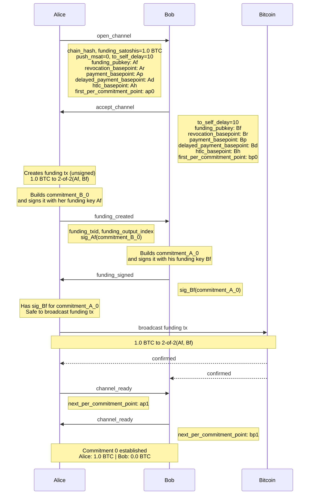
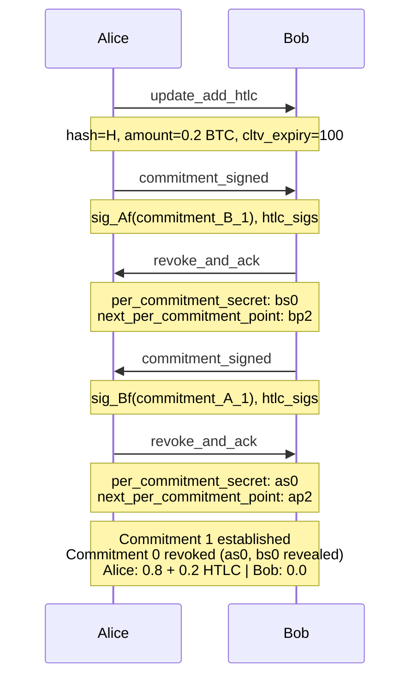
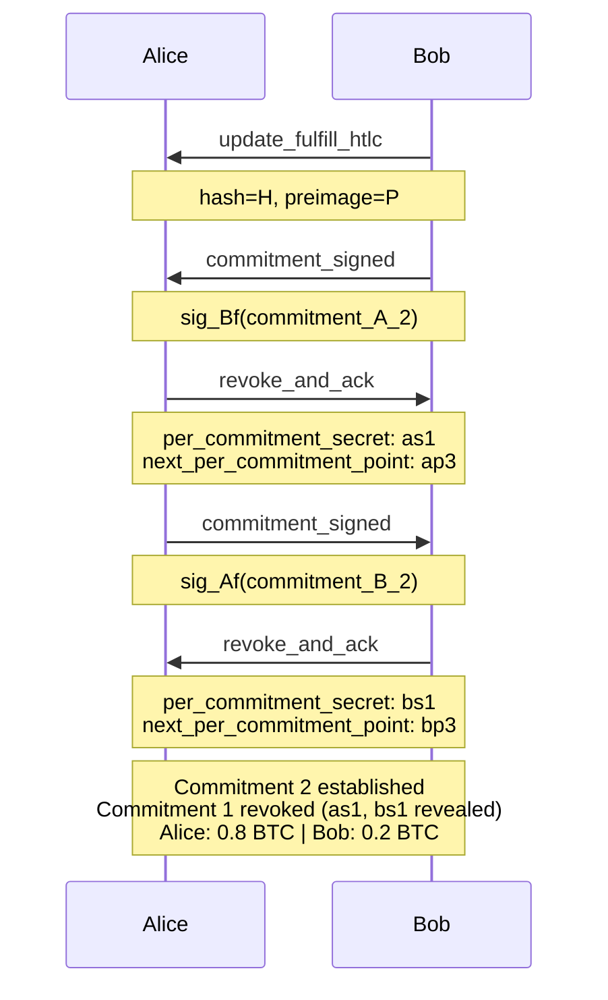

# Lightning Messages — Alice Pays Bob

Sequence diagrams for each state transition in the "Alice pays Bob" drawio diagram. Alice funds the channel with 1.0 BTC, pays Bob 0.2 BTC via HTLC.

See also: [Key Derivation](lightning-key-derivation.md) for how the keys referenced here are calculated.

---

## Commitment 0

Alice funds a 1.0 BTC channel. After this exchange, both sides hold commitment 0.



### Commitment 0 Transactions

After channel open, each side holds:

**commitment_A_0** (Alice holds, signed by Bob with Bf):
```
Input:  funding_outpoint (requires sig_Af + sig_Bf)
Outputs:
  to_local:  1.0 BTC — rp(Br, ap0) | dp(Ad, ap0) + dt=10
  to_remote: 0.0 BTC — Bp (not created, below dust)
```

**commitment_B_0** (Bob holds, signed by Alice with Af):
```
Input:  funding_outpoint (requires sig_Af + sig_Bf)
Outputs:
  to_local:  0.0 BTC — rp(Ar, bp0) | dp(Bd, bp0) + dt=10 (not created, below dust)
  to_remote: 1.0 BTC — Ap
```

---

## Commitment 1 — HTLC Add

Alice sends 0.2 BTC to Bob via HTLC. Payment hash H, CLTV timeout T=100.



### Commitment 1 Transactions

**commitment_A_1** (Alice holds, signed by Bob with Bf):
```
Input:  funding_outpoint (requires sig_Af + sig_Bf)
Outputs:
  to_local:      0.8 BTC — rp(Br, ap1) | dp(Ad, ap1) + dt=10
  htlc_offered:  0.2 BTC — rp(Br, ap1) | sig_Af+sig_Bf (HTLC-timeout, after T=100) | Bh(bp1) + H(P)
  to_remote:     0.0 BTC — Bp (not created, below dust)
```

**commitment_B_1** (Bob holds, signed by Alice with Af):
```
Input:  funding_outpoint (requires sig_Af + sig_Bf)
Outputs:
  to_local:      0.0 BTC — rp(Ar, bp1) | dp(Bd, bp1) + dt=10 (not created, below dust)
  htlc_received: 0.2 BTC — rp(Ar, bp1) | sig_Af+sig_Bf (HTLC-success, with preimage) | Ah(ap1) + T=100
  to_remote:     0.8 BTC — Ap
```

The HTLC output has three spend paths:
1. **Revocation** — counterparty takes all if revoked commitment is broadcast
2. **2nd-stage tx** — requires both signatures, goes to a timeout or success transaction with CSV delay
3. **Direct claim** — preimage (for received) or timeout (for offered)

---

## Commitment 2 — HTLC Settlement

Bob reveals the preimage, claiming the 0.2 BTC.



### Commitment 2 Transactions

**commitment_A_2** (Alice holds, signed by Bob with Bf):
```
Input:  funding_outpoint (requires sig_Af + sig_Bf)
Outputs:
  to_local:  0.8 BTC — rp(Br, ap2) | dp(Ad, ap2) + dt=10
  to_remote: 0.2 BTC — Bp
```

**commitment_B_2** (Bob holds, signed by Alice with Af):
```
Input:  funding_outpoint (requires sig_Af + sig_Bf)
Outputs:
  to_local:  0.2 BTC — rp(Ar, bp2) | dp(Bd, bp2) + dt=10
  to_remote: 0.8 BTC — Ap
```
