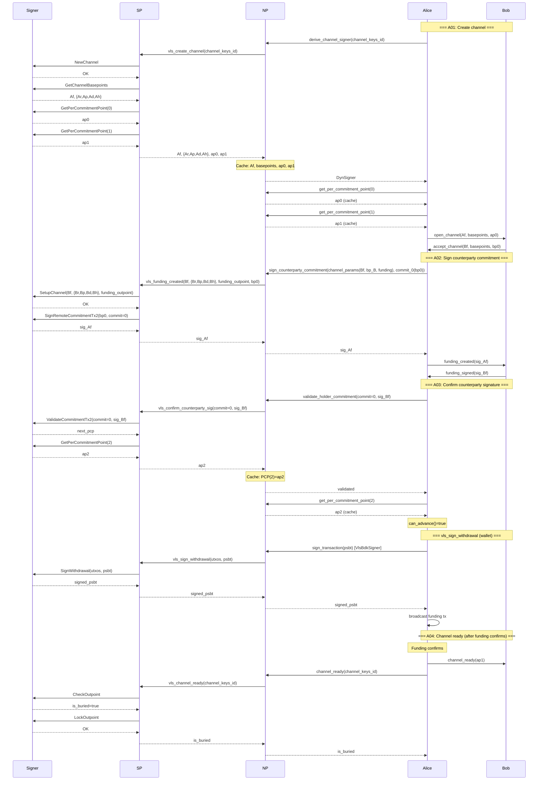
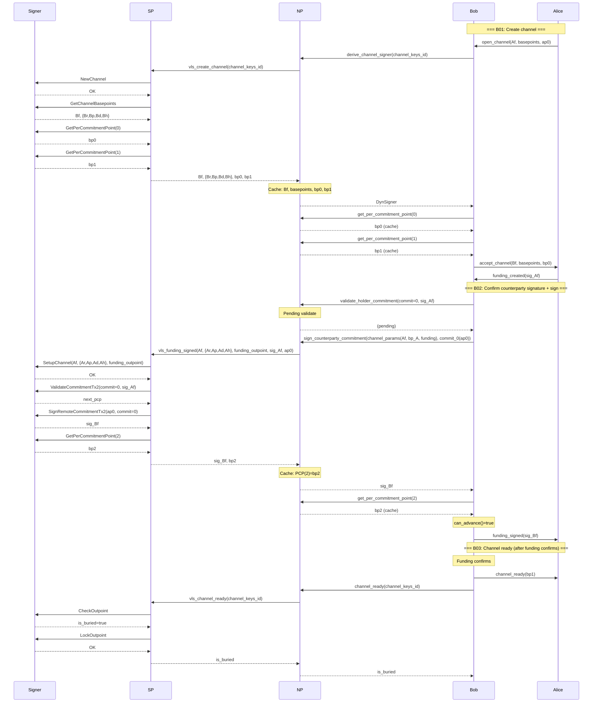

# Open Channel — Design

Compound V2 proxy messages for the LDK-based VLS proxy protocol.

Entities: **Signer** (VLS core), **SP** (signer-proxy / dispatch),
**NP** (node-proxy / client), **Alice** or **Bob** (LDK node).

---

## Alice (A01–A04) — Funder

5 round-trips over the slow link (NP ↔ SP):
4 channel-protocol + 1 wallet (SignWithdrawal).

### RTT Summary — Alice

| Step | Compound message | VLS calls inside | RTTs |
|------|-----------------|------------------|------|
| A01 | `vls_create_channel` | NewChannel + GetBasepoints + PCP(0) + PCP(1) | 1 |
| A02 | `vls_funding_created` | SetupChannel + SignRemoteCommitmentTx2 | 1 |
| A03 | `vls_confirm_counterparty_sig` | ValidateCommitmentTx2 + PCP(2) | 1 |
| — | `vls_sign_withdrawal` | SignWithdrawal via `VlsBdkSigner` | 1 |
| A04 | `vls_channel_ready` | CheckOutpoint + LockOutpoint | 1 |
| | | **Total** | **5** |

---

## Bob (B01–B03) — Acceptor

3 round-trips over the slow link (NP ↔ SP).

### RTT Summary — Bob

| Step | Compound message | VLS calls inside | RTTs |
|------|-----------------|------------------|------|
| B01 | `vls_create_channel` | NewChannel + GetBasepoints + PCP(0) + PCP(1) | 1 |
| B02 | `vls_funding_signed` | SetupChannel + ValidateCommitmentTx2 + SignRemoteCommitmentTx2 + PCP(2) | 1 |
| B03 | `vls_channel_ready` | CheckOutpoint + LockOutpoint | 1 |
| | | **Total** | **3** |
