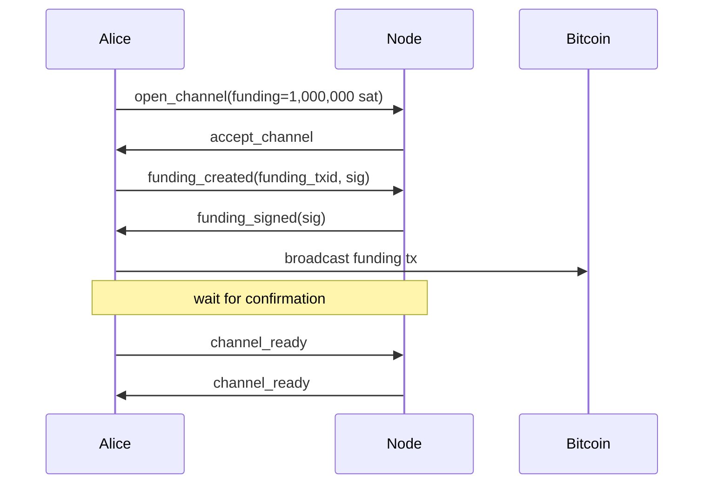
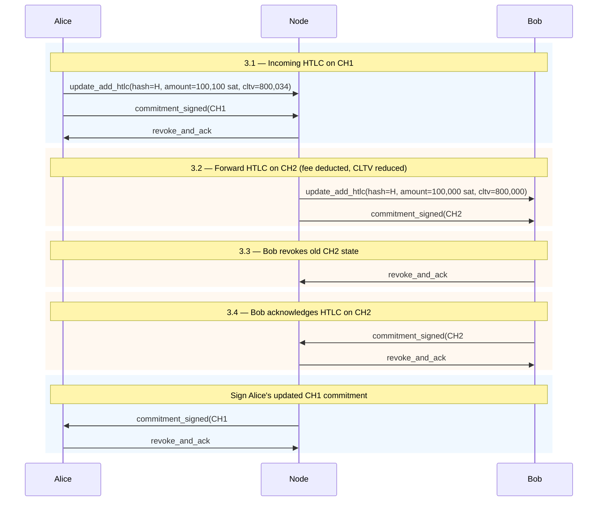
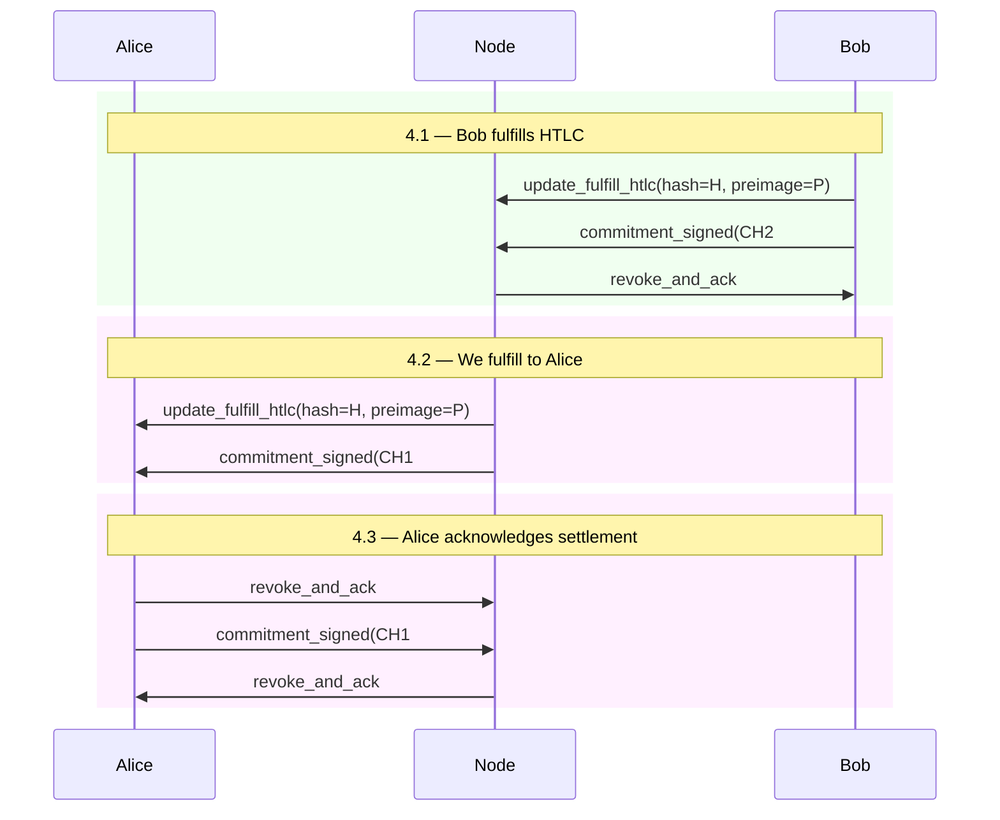
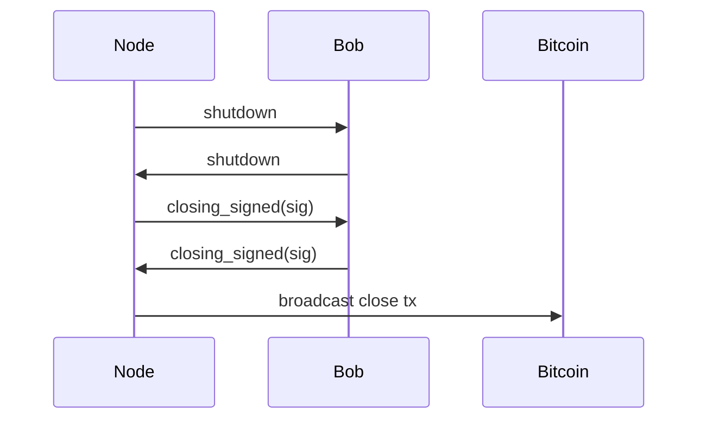
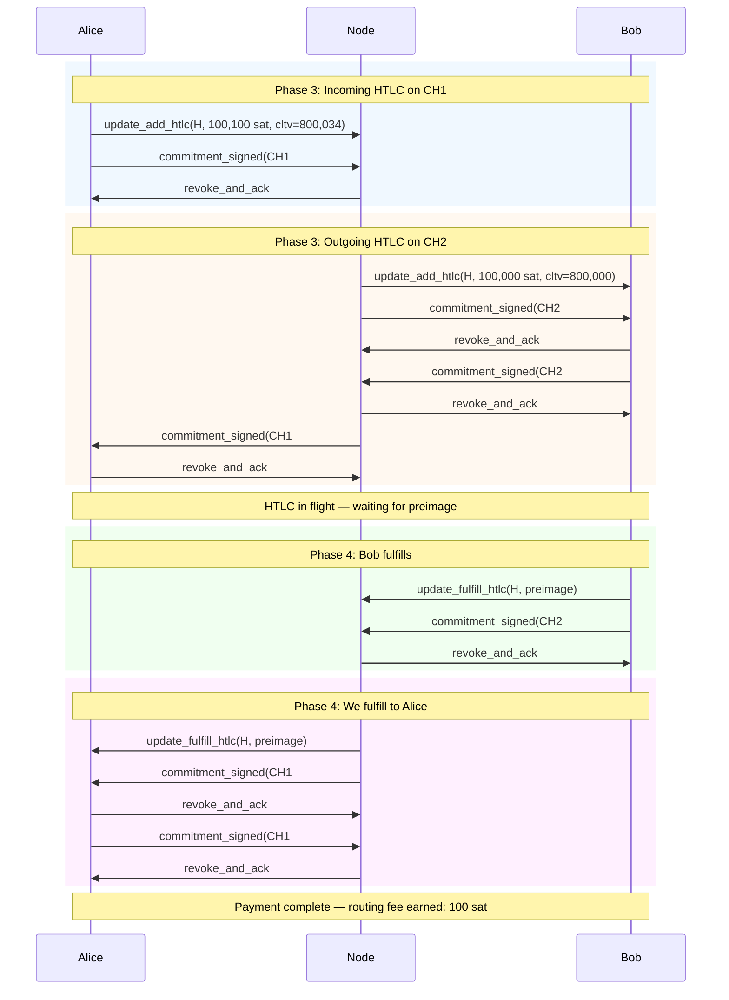

# Lightning Protocol Messages — Routing Node Scenario 1

Lightning wire protocol messages only (peer-to-peer), without VLS signer interactions. Corresponds to the phases in `vls-routing-node-scenario1.md`.

---

## Phase 2: Channel Opening

### Channel 1: Alice funds (inbound, 1,000,000 sat)

### Channel 2: We fund (outbound, 1,000,000 sat)

---

## Phase 3: Receive and Forward HTLC

Alice pays Bob 100,000 sat through us. Routing fee: 100 sat.

---

## Phase 4: HTLC Settlement

Preimage flows back: Bob → Us → Alice.

---

## Phase 6: Cooperative Close

---

## Complete Lifecycle — All Lightning Messages

All peer-to-peer messages for one routed payment, end to end.

