# Routing Node with VLS — Scenario 1 Breakdown

This document breaks down the complete lifecycle of a VLS-backed routing node: opening channels, forwarding payments (HTLCs), earning routing fees, and closing channels. Every interaction between the node and signer is documented in detail.

---

## Table of Contents

1. [Architecture Overview](#architecture-overview)
2. [Key Data Structures](#key-data-structures)
3. [Phase 1: Initialization](#phase-1-initialization)
4. [Phase 2: Open Channels to Peers](#phase-2-open-channels-to-peers)
5. [Phase 3: Receive and Forward an HTLC (Routing)](#phase-3-receive-and-forward-an-htlc-routing)
6. [Phase 4: HTLC Settlement (Preimage Flows Back)](#phase-4-htlc-settlement-preimage-flows-back)
7. [Phase 5: Accumulate Routing Fees](#phase-5-accumulate-routing-fees)
8. [Phase 6: Cooperative Close](#phase-6-cooperative-close)
9. [Signer-Side Validation Deep Dive](#signer-side-validation-deep-dive)
10. [Routing Fee Economics](#routing-fee-economics)
11. [Edge Cases and Error Handling](#edge-cases-and-error-handling)

---

## Architecture Overview

A routing node sits between two or more peers, forwarding payments across channels. The VLS signer holds all private keys and validates every operation.

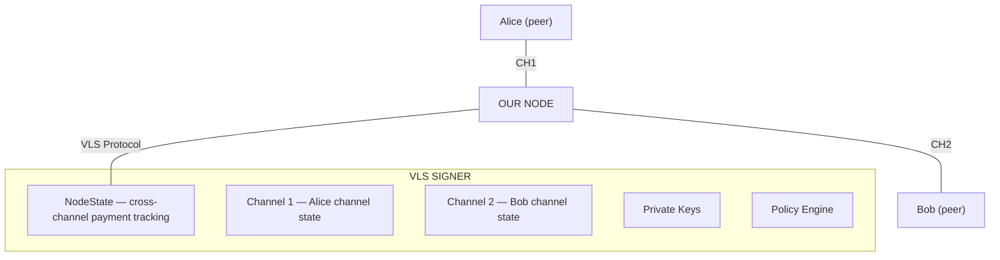
```mermaid
graph TB
    Alice["Alice (peer)"] ---|CH1| Node["OUR NODE"]
    Node ---|CH2| Bob["Bob (peer)"]
    Node ---|VLS Protocol| NS

    subgraph VLS SIGNER
        CH1S["Channel 1 — Alice channel state"]
        CH2S["Channel 2 — Bob channel state"]
        NS["NodeState — cross-channel payment tracking"]
        Keys["Private Keys"]
        Policy["Policy Engine"]
    end
```

**Key property:** The signer manages ALL channels under a single `NodeState`. This is what enables cross-channel HTLC correlation — the signer sees both the incoming HTLC (from Alice) and the outgoing HTLC (to Bob) and validates that the balance is correct.

---

## Key Data Structures

### Inside the Signer

```
Node
├── channels: Map<ChannelId, ChannelSlot>
│   ├── channel_1 (Alice ↔ Us)
│   │   ├── channel_value: 1,000,000 sat
│   │   ├── holder_commitment_info (our current commitment)
│   │   │   ├── offered_htlcs: [...]   ← outgoing to Alice
│   │   │   └── received_htlcs: [...]  ← incoming from Alice
│   │   └── counterparty_commitment_info
│   │       ├── offered_htlcs: [...]   ← Alice's outgoing (= our incoming)
│   │       └── received_htlcs: [...]  ← Alice's incoming (= our outgoing)
│   │
│   └── channel_2 (Bob ↔ Us)
│       ├── channel_value: 1,000,000 sat
│       ├── holder_commitment_info
│       │   ├── offered_htlcs: [...]   ← outgoing to Bob
│       │   └── received_htlcs: [...]  ← incoming from Bob
│       └── counterparty_commitment_info
│
├── state: NodeState
│   ├── payments: Map<PaymentHash, RoutedPayment>
│   │   └── RoutedPayment {
│   │       incoming: Map<ChannelId, amount_sat>   ← per-channel incoming
│   │       outgoing: Map<ChannelId, amount_sat>   ← per-channel outgoing
│   │       incoming_cltv_min: Option<u32>         ← earliest incoming timeout
│   │       outgoing_cltv_max: Option<u32>         ← latest outgoing timeout
│   │       preimage: Option<PaymentPreimage>
│   │   }
│   │
│   ├── invoices: Map<PaymentHash, PaymentState>   ← for our own payments
│   ├── issued_invoices: Map<PaymentHash, ...>     ← invoices we created
│   └── excess_amount: u64                         ← accumulated routing fees
│
└── validator: SimpleValidator
    └── policy: SimplePolicy {
        max_routing_fee_msat: u64,
        max_feerate_percentage: u8,
        cltv_delta: u32,           (default: 34)
        enforce_balance: bool,
    }
```

### HTLC Representation

```
HTLCInfo2 {
    value_sat: u64,           // HTLC amount
    payment_hash: [u8; 32],   // Correlates incoming ↔ outgoing
    cltv_expiry: u32,         // Absolute block height timeout
}
```

The `payment_hash` is the critical correlation key — the same hash appears on both the incoming and outgoing channels for a routed payment.

### Offered vs Received (Signer's Perspective)

| Commitment Type | `offered_htlcs` | `received_htlcs` |
|-----------------|-----------------|-------------------|
| **Holder** (our commitment) | HTLCs we're sending out | HTLCs we're receiving |
| **Counterparty** (their commitment) | HTLCs they're sending to us (our incoming) | HTLCs they're receiving from us (our outgoing) |

---

## Phase 1: Initialization

The routing node starts up and initializes its VLS session.

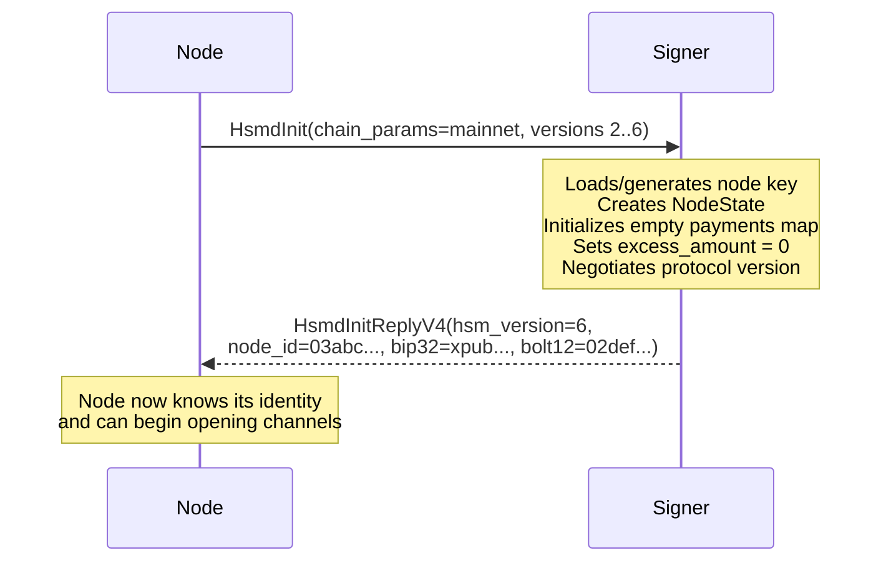
```mermaid
sequenceDiagram
    participant Node
    participant Signer

    Node->>Signer: HsmdInit(chain_params=mainnet, versions 2..6)

    Note over Signer: Loads/generates node key<br/>Creates NodeState<br/>Initializes empty payments map<br/>Sets excess_amount = 0<br/>Negotiates protocol version

    Signer-->>Node: HsmdInitReplyV4(hsm_version=6,<br/>node_id=03abc..., bip32=xpub..., bolt12=02def...)

    Note over Node: Node now knows its identity<br/>and can begin opening channels
```

---

## Phase 2: Open Channels to Peers

The routing node needs at least two channels. Let's open one to Alice and one to Bob.

### Channel 1: Alice ↔ Us (1,000,000 sat, Alice funds)

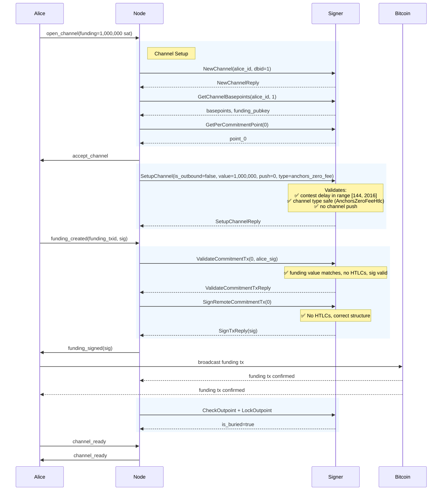
```mermaid
sequenceDiagram
    participant Alice
    participant Node
    participant Signer
    participant Bitcoin

    Alice->>Node: open_channel(funding=1,000,000 sat)

    rect rgb(240, 248, 255)
        Note right of Node: Channel Setup
        Node->>Signer: NewChannel(alice_id, dbid=1)
        Signer-->>Node: NewChannelReply
        Node->>Signer: GetChannelBasepoints(alice_id, 1)
        Signer-->>Node: basepoints, funding_pubkey
        Node->>Signer: GetPerCommitmentPoint(0)
        Signer-->>Node: point_0
    end

    Node->>Alice: accept_channel

    rect rgb(240, 248, 255)
        Node->>Signer: SetupChannel(is_outbound=false, value=1,000,000, push=0, type=anchors_zero_fee)
        Note over Signer: Validates:<br/>✅ contest delay in range [144, 2016]<br/>✅ channel type safe (AnchorsZeroFeeHtlc)<br/>✅ no channel push
        Signer-->>Node: SetupChannelReply
    end

    Alice->>Node: funding_created(funding_txid, sig)

    rect rgb(240, 248, 255)
        Node->>Signer: ValidateCommitmentTx(0, alice_sig)
        Note over Signer: ✅ funding value matches, no HTLCs, sig valid
        Signer-->>Node: ValidateCommitmentTxReply
        Node->>Signer: SignRemoteCommitmentTx(0)
        Note over Signer: ✅ No HTLCs, correct structure
        Signer-->>Node: SignTxReply(sig)
    end

    Node->>Alice: funding_signed(sig)
    Alice->>Bitcoin: broadcast funding tx
    Bitcoin-->>Node: funding tx confirmed
    Bitcoin-->>Alice: funding tx confirmed

    rect rgb(240, 248, 255)
        Node->>Signer: CheckOutpoint + LockOutpoint
        Signer-->>Node: is_buried=true
    end

    Alice->>Node: channel_ready
    Node->>Alice: channel_ready
```

### Channel 2: Bob ↔ Us (1,000,000 sat, we fund)

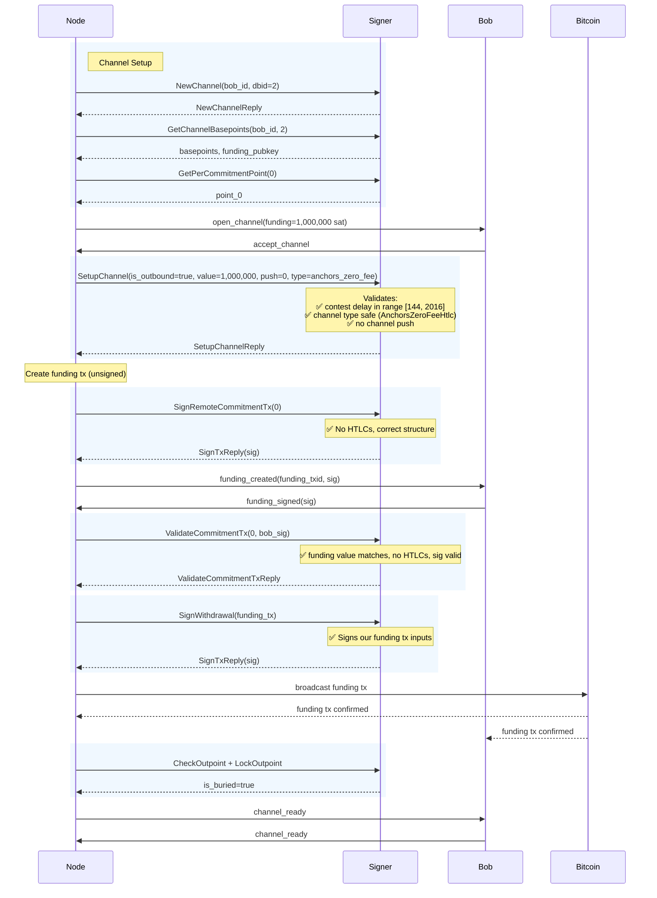
```mermaid
sequenceDiagram
    participant Node
    participant Signer
    participant Bob
    participant Bitcoin

    rect rgb(240, 248, 255)
        Note right of Node: Channel Setup
        Node->>Signer: NewChannel(bob_id, dbid=2)
        Signer-->>Node: NewChannelReply
        Node->>Signer: GetChannelBasepoints(bob_id, 2)
        Signer-->>Node: basepoints, funding_pubkey
        Node->>Signer: GetPerCommitmentPoint(0)
        Signer-->>Node: point_0
    end

    Node->>Bob: open_channel(funding=1,000,000 sat)
    Bob->>Node: accept_channel

    rect rgb(240, 248, 255)
        Node->>Signer: SetupChannel(is_outbound=true, value=1,000,000, push=0, type=anchors_zero_fee)
        Note over Signer: Validates:<br/>✅ contest delay in range [144, 2016]<br/>✅ channel type safe (AnchorsZeroFeeHtlc)<br/>✅ no channel push
        Signer-->>Node: SetupChannelReply
    end

    Note over Node: Create funding tx (unsigned)

    rect rgb(240, 248, 255)
        Node->>Signer: SignRemoteCommitmentTx(0)
        Note over Signer: ✅ No HTLCs, correct structure
        Signer-->>Node: SignTxReply(sig)
    end

    Node->>Bob: funding_created(funding_txid, sig)
    Bob->>Node: funding_signed(sig)

    rect rgb(240, 248, 255)
        Node->>Signer: ValidateCommitmentTx(0, bob_sig)
        Note over Signer: ✅ funding value matches, no HTLCs, sig valid
        Signer-->>Node: ValidateCommitmentTxReply
    end

    rect rgb(240, 248, 255)
        Node->>Signer: SignWithdrawal(funding_tx)
        Note over Signer: ✅ Signs our funding tx inputs
        Signer-->>Node: SignTxReply(sig)
    end

    Node->>Bitcoin: broadcast funding tx
    Bitcoin-->>Node: funding tx confirmed
    Bitcoin-->>Bob: funding tx confirmed

    rect rgb(240, 248, 255)
        Node->>Signer: CheckOutpoint + LockOutpoint
        Signer-->>Node: is_buried=true
    end

    Node->>Bob: channel_ready
    Bob->>Node: channel_ready
```

After both channels are open:

```
Signer State:
├── channels:
│   ├── CH1 (Alice): value=1,000,000, our_balance=0, alice_balance=1,000,000
│   └── CH2 (Bob):   value=1,000,000, our_balance=1,000,000, bob_balance=0
├── payments: {} (empty)
└── excess_amount: 0
```

---

## Phase 3: Receive and Forward an HTLC (Routing)

Alice wants to pay Bob 100,000 sat through our routing node. She sends an HTLC to us, and we forward it to Bob.

### 3.1 — Alice Sends HTLC to Us (Incoming)

Alice proposes a new commitment on Channel 1 that includes an HTLC she's offering to us.

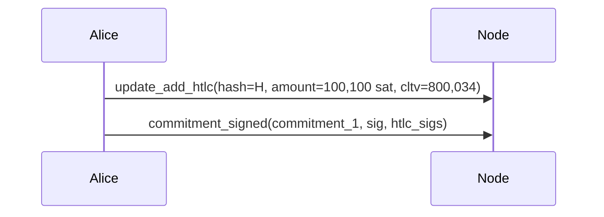
```mermaid
sequenceDiagram
    participant Alice
    participant Node
    Alice->>Node: update_add_htlc(hash=H, amount=100,100 sat, cltv=800,034)
    Alice->>Node: commitment_signed(commitment_1, sig, htlc_sigs)
```

The amount is 100,100 sat because Alice includes a routing fee (100 sat).

Our node passes Alice's commitment_signed to the signer:

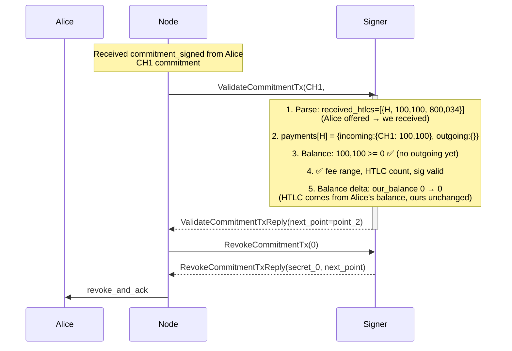
```mermaid
sequenceDiagram
    participant Alice
    participant Node
    participant Signer

    Note over Node: Received commitment_signed from Alice<br/>CH1 commitment #1<br/>Contains: offered HTLC (H, 100,100 sat, cltv=800,034)

    Node->>Signer: ValidateCommitmentTx(CH1, #1, feerate=2500,<br/>htlcs=[{remote, 100,100, H, 800,034}], alice_sig)
    activate Signer

    Note over Signer: 1. Parse: received_htlcs=[{H, 100,100, 800,034}]<br/>(Alice offered → we received)<br/><br/>2. payments[H] = {incoming:{CH1: 100,100}, outgoing:{}}<br/><br/>3. Balance: 100,100 >= 0 ✅ (no outgoing yet)<br/><br/>4. ✅ fee range, HTLC count, sig valid<br/><br/>5. Balance delta: our_balance 0 → 0<br/>(HTLC comes from Alice's balance, ours unchanged)

    Signer-->>Node: ValidateCommitmentTxReply(next_point=point_2)
    deactivate Signer

    Node->>Signer: RevokeCommitmentTx(0)
    Signer-->>Node: RevokeCommitmentTxReply(secret_0, next_point)

    Node->>Alice: revoke_and_ack
```

### 3.2 — We Forward HTLC to Bob (Outgoing)

Now we forward the HTLC to Bob on Channel 2. We subtract our routing fee and reduce the CLTV.

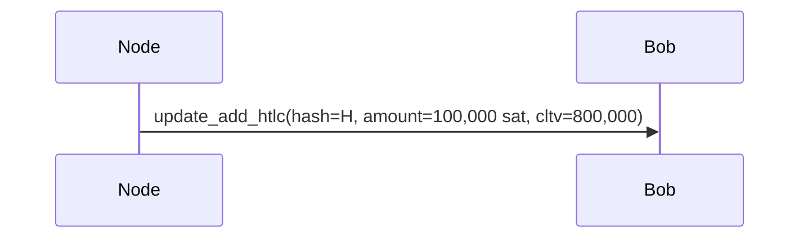
```mermaid
sequenceDiagram
    participant Node
    participant Bob
    Node->>Bob: update_add_htlc(hash=H, amount=100,000 sat, cltv=800,000)
```

Note: amount reduced by 100 sat (routing fee), CLTV reduced by 34 blocks (min delta).

We sign Bob's new commitment (with the HTLC):

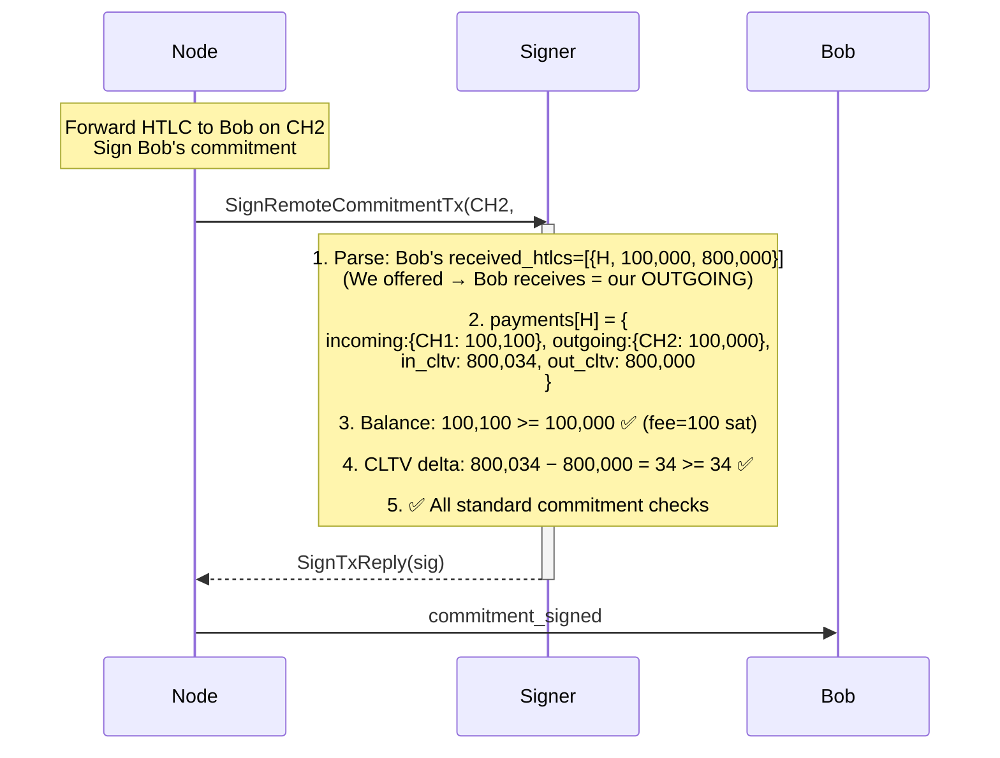
```mermaid
sequenceDiagram
    participant Node
    participant Signer
    participant Bob

    Note over Node: Forward HTLC to Bob on CH2<br/>Sign Bob's commitment #1 with HTLC

    Node->>Signer: SignRemoteCommitmentTx(CH2, #1, feerate=2500,<br/>htlcs=[{local, 100,000, H, 800,000}])
    activate Signer

    Note over Signer: 1. Parse: Bob's received_htlcs=[{H, 100,000, 800,000}]<br/>(We offered → Bob receives = our OUTGOING)<br/><br/>2. payments[H] = {<br/>  incoming:{CH1: 100,100}, outgoing:{CH2: 100,000},<br/>  in_cltv: 800,034, out_cltv: 800,000<br/>}<br/><br/>3. Balance: 100,100 >= 100,000 ✅ (fee=100 sat)<br/><br/>4. CLTV delta: 800,034 − 800,000 = 34 >= 34 ✅<br/><br/>5. ✅ All standard commitment checks

    Signer-->>Node: SignTxReply(sig)
    deactivate Signer

    Node->>Bob: commitment_signed
```

### 3.3 — Bob Revokes Old Commitment

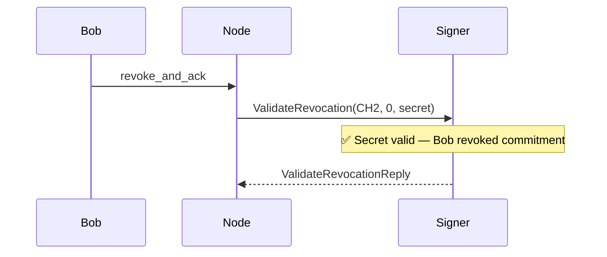
```mermaid
sequenceDiagram
    participant Bob
    participant Node
    participant Signer

    Bob->>Node: revoke_and_ack

    Node->>Signer: ValidateRevocation(CH2, 0, secret)
    Note over Signer: ✅ Secret valid — Bob revoked commitment #0
    Signer-->>Node: ValidateRevocationReply
```

### 3.4 — Bob Sends Us New Commitment (Acknowledging Our HTLC)

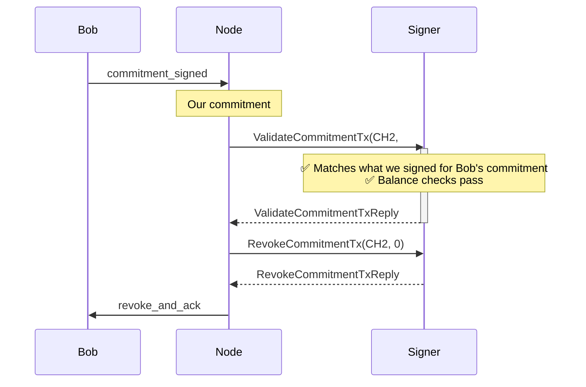
```mermaid
sequenceDiagram
    participant Bob
    participant Node
    participant Signer

    Bob->>Node: commitment_signed
    Note over Node: Our commitment #1 on CH2<br/>now has the offered HTLC

    Node->>Signer: ValidateCommitmentTx(CH2, #1,<br/>htlcs=[{local, 100,000 sat, H, 800,000}], bob_sig)
    activate Signer
    Note over Signer: ✅ Matches what we signed for Bob's commitment<br/>✅ Balance checks pass
    Signer-->>Node: ValidateCommitmentTxReply
    deactivate Signer

    Node->>Signer: RevokeCommitmentTx(CH2, 0)
    Signer-->>Node: RevokeCommitmentTxReply

    Node->>Bob: revoke_and_ack
```

### State After Phase 3

```
Signer State:
├── channels:
│   ├── CH1 (Alice): our_balance=0, alice_balance=899,900, HTLC_incoming=100,100
│   └── CH2 (Bob):   our_balance=900,000, bob_balance=0, HTLC_outgoing=100,000
├── payments:
│   └── H: { incoming:{CH1: 100,100}, outgoing:{CH2: 100,000},
│            in_cltv: 800,034, out_cltv: 800,000 }
└── excess_amount: 0  (fee not yet earned, HTLC still in-flight)
```

---

## Phase 4: HTLC Settlement (Preimage Flows Back)

Bob receives the preimage from the final recipient (or Bob IS the final recipient). He sends `update_fulfill_htlc` back to us, and we forward the fulfillment to Alice.

### 4.1 — Bob Fulfills HTLC (Sends Preimage)

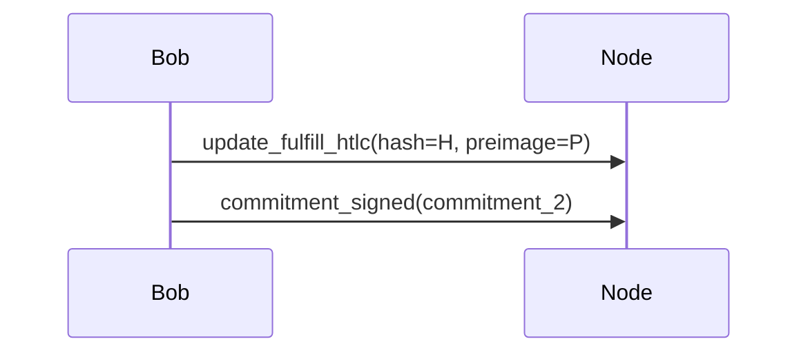
```mermaid
sequenceDiagram
    participant Bob
    participant Node
    Bob->>Node: update_fulfill_htlc(hash=H, preimage=P)
    Bob->>Node: commitment_signed(commitment_2)
```

Bob's new commitment #2 removes the HTLC and gives Bob the 100,000 sat:

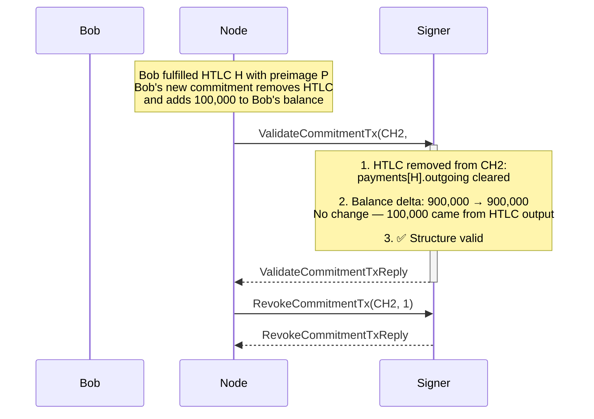
```mermaid
sequenceDiagram
    participant Bob
    participant Node
    participant Signer

    Note over Node: Bob fulfilled HTLC H with preimage P<br/>Bob's new commitment removes HTLC<br/>and adds 100,000 to Bob's balance

    Node->>Signer: ValidateCommitmentTx(CH2, #2, feerate=2500,<br/>htlcs=[], to_local=900,000, to_remote=100,000, bob_sig)
    activate Signer

    Note over Signer: 1. HTLC removed from CH2:<br/>payments[H].outgoing cleared<br/><br/>2. Balance delta: 900,000 → 900,000<br/>No change — 100,000 came from HTLC output<br/><br/>3. ✅ Structure valid

    Signer-->>Node: ValidateCommitmentTxReply
    deactivate Signer

    Node->>Signer: RevokeCommitmentTx(CH2, 1)
    Signer-->>Node: RevokeCommitmentTxReply
```

### 4.2 — We Fulfill HTLC to Alice

We now send the preimage back to Alice and remove the incoming HTLC:

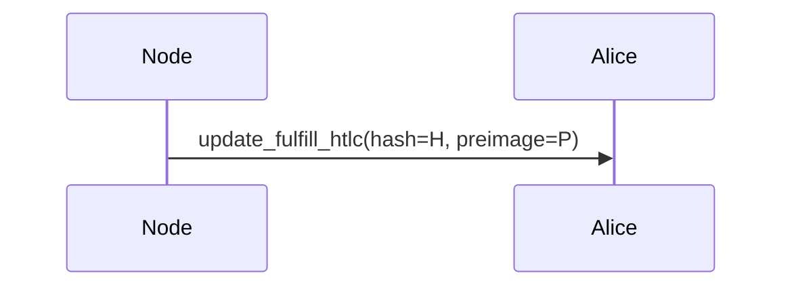
```mermaid
sequenceDiagram
    participant Node
    participant Alice
    Node->>Alice: update_fulfill_htlc(hash=H, preimage=P)
```

Sign Alice's new commitment (HTLC removed, our balance increased by 100,100):

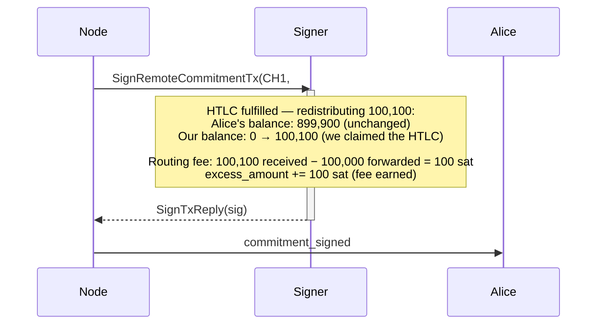
```mermaid
sequenceDiagram
    participant Node
    participant Signer
    participant Alice

    Node->>Signer: SignRemoteCommitmentTx(CH1, #2,<br/>htlcs=[], to_local=899,900, to_remote=100,100)
    activate Signer

    Note over Signer: HTLC fulfilled — redistributing 100,100:<br/>Alice's balance: 899,900 (unchanged)<br/>Our balance: 0 → 100,100 (we claimed the HTLC)<br/><br/>Routing fee: 100,100 received − 100,000 forwarded = 100 sat<br/>excess_amount += 100 sat (fee earned)

    Signer-->>Node: SignTxReply(sig)
    deactivate Signer

    Node->>Alice: commitment_signed
```

### 4.3 — Alice Revokes, We Validate Our New Commitment

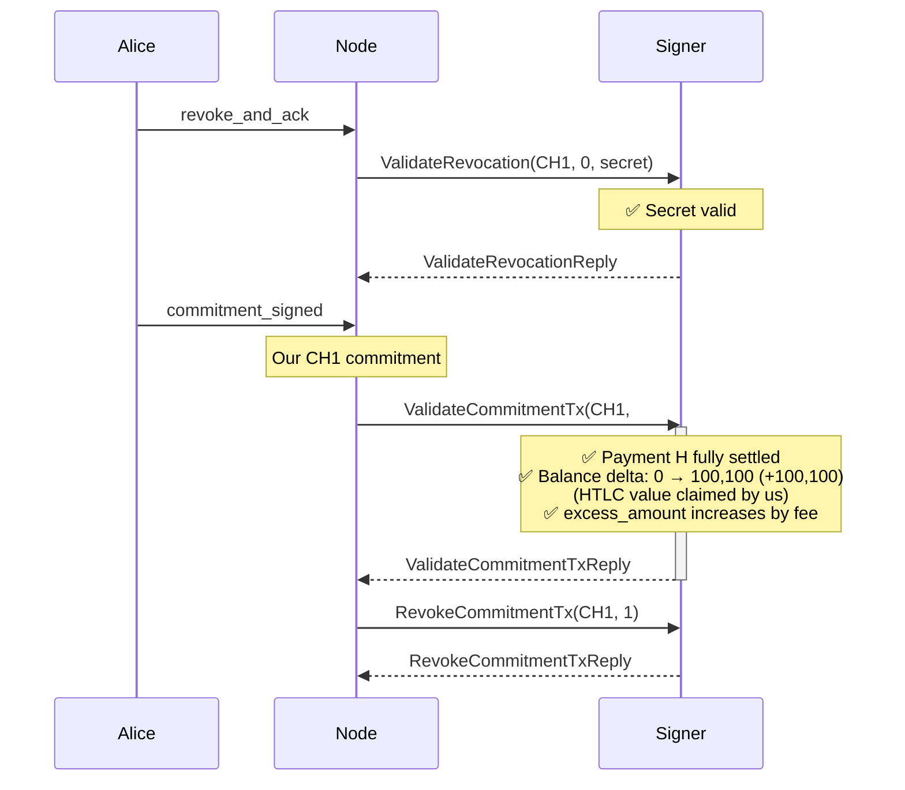
```mermaid
sequenceDiagram
    participant Alice
    participant Node
    participant Signer

    Alice->>Node: revoke_and_ack
    Node->>Signer: ValidateRevocation(CH1, 0, secret)
    Note over Signer: ✅ Secret valid
    Signer-->>Node: ValidateRevocationReply

    Alice->>Node: commitment_signed
    Note over Node: Our CH1 commitment #2, HTLC gone

    Node->>Signer: ValidateCommitmentTx(CH1, #2,<br/>htlcs=[], to_local=100,100, alice_sig)
    activate Signer
    Note over Signer: ✅ Payment H fully settled<br/>✅ Balance delta: 0 → 100,100 (+100,100)<br/>(HTLC value claimed by us)<br/>✅ excess_amount increases by fee
    Signer-->>Node: ValidateCommitmentTxReply
    deactivate Signer

    Node->>Signer: RevokeCommitmentTx(CH1, 1)
    Signer-->>Node: RevokeCommitmentTxReply
```

### State After Phase 4

```
Signer State:
├── channels:
│   ├── CH1 (Alice): our_balance=100,100, alice_balance=899,900
│   └── CH2 (Bob):   our_balance=900,000, bob_balance=100,000
├── payments:
│   └── H: settled (preimage known, incoming=outgoing=0)
└── excess_amount: 100 sat (routing fee earned!)
```

### Balance Summary

| | CH1 (Alice funded) | CH2 (We funded) |
|---|---|---|
| **After open** | alice=1,000,000 us=0 | us=1,000,000 bob=0 |
| **After HTLC added** | alice=899,900 us=0 htlc=100,100 | us=900,000 bob=0 htlc=100,000 |
| **After settlement** | alice=899,900 us=100,100 | us=900,000 bob=100,000 |
| **Net change** | We gained 100,100 | We lost 100,000 |
| **Net profit** | 100,100 - 100,000 = **100 sat routing fee** | |

---

## Phase 5: Accumulate Routing Fees

### Excess Amount Tracking

The signer tracks routing fees via the `excess_amount` accumulator:

```
Before routing:  excess_amount = 0
After 1 route:   excess_amount = 100      (earned 100 sat fee)
After 10 routes: excess_amount = 1,000    (earned 1,000 sat total)
After 100 routes: excess_amount = 10,000  (earned 10,000 sat total)
```

### How Balance Deltas Work

For each commitment update, the signer calculates:

```
balance_delta = (old_balance, new_balance)

excess_amount = excess_amount + new_balance - old_balance
```

The `excess_amount` must never go negative. If it would, the signer rejects:

```
excess_amount + new_balance - old_balance < 0  →  REJECT
(policy-routing-balanced)
```

This means our total balance across all channels can only increase (by routing fees) or stay the same. It can never decrease unless an approved invoice payment is made.

### Multiple Routes

```
Route 1: Alice→Us→Bob    fee=100 sat    excess=100
Route 2: Bob→Us→Alice    fee=150 sat    excess=250
Route 3: Carol→Us→Dave   fee=50 sat     excess=300
...
```

Each successful route adds to the excess. The signer permits these increases because they represent legitimate routing income.

---

## Phase 6: Cooperative Close

After routing for some time, we close channels cooperatively.

### Close Channel 2 (Bob)

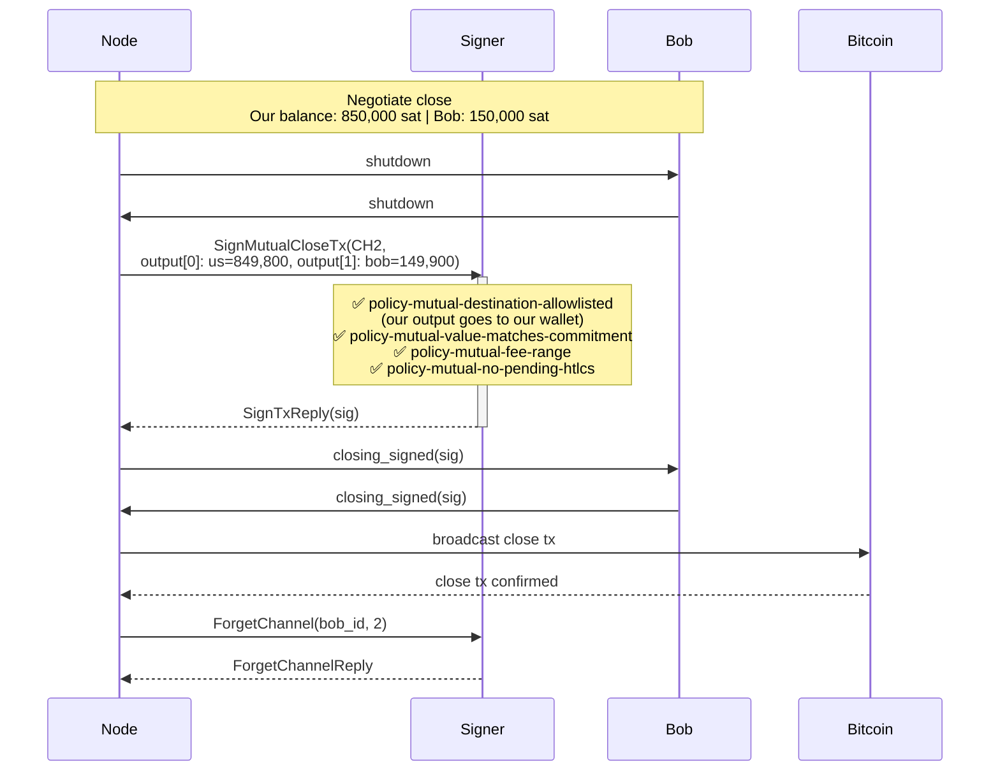
```mermaid
sequenceDiagram
    participant Node
    participant Signer
    participant Bob
    participant Bitcoin

    Note over Node, Bob: Negotiate close<br/>Our balance: 850,000 sat | Bob: 150,000 sat

    Node->>Bob: shutdown
    Bob->>Node: shutdown

    Node->>Signer: SignMutualCloseTx(CH2,<br/>output[0]: us=849,800, output[1]: bob=149,900)
    activate Signer

    Note over Signer: ✅ policy-mutual-destination-allowlisted<br/>(our output goes to our wallet)<br/>✅ policy-mutual-value-matches-commitment<br/>✅ policy-mutual-fee-range<br/>✅ policy-mutual-no-pending-htlcs

    Signer-->>Node: SignTxReply(sig)
    deactivate Signer

    Node->>Bob: closing_signed(sig)
    Bob->>Node: closing_signed(sig)
    Node->>Bitcoin: broadcast close tx
    Bitcoin-->>Node: close tx confirmed

    Node->>Signer: ForgetChannel(bob_id, 2)
    Signer-->>Node: ForgetChannelReply
```

---

## Signer-Side Validation Deep Dive

### The Core Routing Validation (per commitment update)

Every time a commitment is signed or validated, the signer runs this logic:

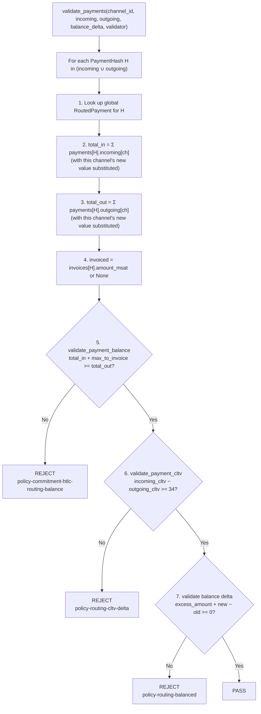
```mermaid
flowchart TD
    Start["validate_payments(channel_id, incoming, outgoing, balance_delta, validator)"]
    Start --> Loop["For each PaymentHash H in (incoming ∪ outgoing)"]
    Loop --> S1["1. Look up global RoutedPayment for H"]
    S1 --> S2["2. total_in = Σ payments[H].incoming[ch]<br/>(with this channel's new value substituted)"]
    S2 --> S3["3. total_out = Σ payments[H].outgoing[ch]<br/>(with this channel's new value substituted)"]
    S3 --> S4["4. invoiced = invoices[H].amount_msat or None"]
    S4 --> C1{"5. validate_payment_balance<br/>total_in + max_to_invoice >= total_out?"}
    C1 -->|No| R1["REJECT<br/>policy-commitment-htlc-routing-balance"]
    C1 -->|Yes| C2{"6. validate_payment_cltv<br/>incoming_cltv − outgoing_cltv >= 34?"}
    C2 -->|No| R2["REJECT<br/>policy-routing-cltv-delta"]
    C2 -->|Yes| C3{"7. validate balance delta<br/>excess_amount + new − old >= 0?"}
    C3 -->|No| R3["REJECT<br/>policy-routing-balanced"]
    C3 -->|Yes| OK["PASS"]
```

### What Gets Checked on Each Message

| Message | Commitment Checks | Routing Checks |
|---------|-------------------|----------------|
| `ValidateCommitmentTx` | Structure, fee, keys, state | Balance, CLTV delta, excess |
| `SignRemoteCommitmentTx` | Structure, fee, keys, state | Balance, CLTV delta, excess |
| `SignMutualCloseTx` | Destination, value, fee | No pending HTLCs |
| `PreapproveInvoice` | N/A | Invoice expiry, velocity |

---

## Routing Fee Economics

### Fee Calculation from Signer's Perspective

```
Incoming HTLC (CH1):  100,100 sat  @ CLTV 800,034
Outgoing HTLC (CH2):  100,000 sat  @ CLTV 800,000

Routing Fee = Incoming - Outgoing = 100 sat
CLTV Delta  = 800,034 - 800,000   = 34 blocks
```

### Signer's Balance Validation Formula

```
For pure routing (no invoices):
  total_incoming_msat >= total_outgoing_msat

For own payments (with invoice):
  total_incoming_msat + invoiced_amount + max_routing_fee >= total_outgoing_msat
```

### Fee Accumulation

The signer doesn't explicitly track "fees earned." Instead, it uses the `excess_amount` accumulator:

- When an HTLC is fulfilled on the incoming side: our balance increases by `incoming_amount`
- When an HTLC is fulfilled on the outgoing side: our balance decreases by `outgoing_amount`
- Net gain (routing fee) is added to `excess_amount`
- If `excess_amount` ever goes negative → policy violation

This elegantly handles complex multi-hop scenarios where HTLCs settle at different times across different channels.

---

## Edge Cases and Error Handling

### Case 1: Incoming HTLC Settles Before Outgoing Is Created

```
Timeline:
  T1: Receive HTLC on CH1 (incoming = 100,100)
  T2: Not yet forwarded (outgoing = 0)

  Validation: 100,100 >= 0 ✅ (always valid — more incoming than outgoing)
```

### Case 2: Outgoing HTLC Created Before Incoming Is Committed

This CANNOT happen legitimately in the protocol — you must receive before you can forward. If the signer sees outgoing without incoming:

```
  incoming = 0, outgoing = 100,000
  Validation: 0 >= 100,000 ❌ → REJECT (policy-commitment-htlc-routing-balance)
```

### Case 3: Multiple Incoming Channels for Same Payment (MPP)

Multi-part payments split across channels:

```
  CH1 incoming: 50,050 sat (hash=H)
  CH3 incoming: 50,050 sat (hash=H)
  CH2 outgoing: 100,000 sat (hash=H)

  total_incoming = 50,050 + 50,050 = 100,100
  total_outgoing = 100,000
  Validation: 100,100 >= 100,000 ✅
```

### Case 4: HTLC Timeout (Payment Fails)

If the HTLC times out without settlement:

```
  HTLC removed from both commitments
  Balance returns to pre-HTLC state
  excess_amount unchanged (no fee earned, no loss either)
  payments[H] cleaned up
```

### Case 5: Rapid Successive Routes

```
  Route 1: H1 incoming=200, outgoing=190  → fee=10,  excess=10
  Route 2: H2 incoming=500, outgoing=480  → fee=20,  excess=30
  Route 3: H3 incoming=1000, outgoing=950 → fee=50,  excess=80

  Each validated independently by payment hash.
  excess_amount grows monotonically for pure routing.
```

### Case 6: CLTV Delta Too Small

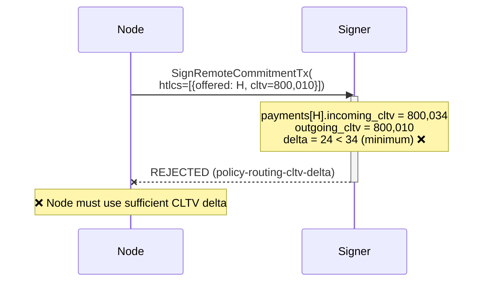
```mermaid
sequenceDiagram
    participant Node
    participant Signer

    Node->>Signer: SignRemoteCommitmentTx(<br/>htlcs=[{offered: H, cltv=800,010}])
    activate Signer
    Note over Signer: payments[H].incoming_cltv = 800,034<br/>outgoing_cltv = 800,010<br/>delta = 24 < 34 (minimum) ❌
    Signer--xNode: REJECTED (policy-routing-cltv-delta)
    deactivate Signer
    Note over Node: ❌ Node must use sufficient CLTV delta
```

**Why 34 blocks minimum?**
- 3R = 3 × retry timeout blocks (time to claim if first attempt fails)
- 2G = 2 × grace period blocks (network propagation buffer)
- 2S = 2 × settlement blocks (time for tx to confirm)
- Total = 34 blocks ≈ 5.7 hours

If the delta is too small, we risk: outgoing HTLC succeeds (Bob gets paid), but incoming HTLC times out (Alice reclaims) before we can claim the preimage on-chain. Result: we lose the routed amount.

---

## Complete Message Sequence Summary

For one routed payment through two channels, the signer handles:

| # | Message | Channel | Direction | Purpose |
|---|---------|---------|-----------|---------|
| 1 | ValidateCommitmentTx(1) | CH1 | Incoming HTLC | Accept Alice's HTLC |
| 2 | RevokeCommitmentTx(0) | CH1 | - | Revoke old CH1 state |
| 3 | SignRemoteCommitmentTx(1) | CH2 | Outgoing HTLC | Forward HTLC to Bob |
| 4 | ValidateRevocation(0) | CH2 | - | Accept Bob's revocation |
| 5 | ValidateCommitmentTx(1) | CH2 | - | Validate our CH2 commitment |
| 6 | RevokeCommitmentTx(0) | CH2 | - | Revoke old CH2 state |
| 7 | SignRemoteCommitmentTx(1) | CH1 | - | Sign Alice's updated commitment |
| 8 | ValidateRevocation(0) | CH1 | - | Accept Alice's revocation |
| — | *HTLC in flight* | — | — | *Waiting for preimage* |
| 9 | ValidateCommitmentTx(2) | CH2 | HTLC settled | HTLC removed from CH2 |
| 10 | RevokeCommitmentTx(1) | CH2 | - | Revoke CH2 #1 |
| 11 | SignRemoteCommitmentTx(2) | CH1 | HTLC settled | Remove HTLC from Alice |
| 12 | ValidateRevocation(1) | CH1 | - | Accept Alice's revocation |
| 13 | ValidateCommitmentTx(2) | CH1 | - | Validate our CH1 #2 |
| 14 | RevokeCommitmentTx(1) | CH1 | - | Revoke CH1 #1 |

**Total: 14 signer interactions for one routed payment.**

Each of the commitment-related messages (1, 3, 5, 7, 9, 11, 13) triggers the full routing validation: balance check, CLTV check, excess amount tracking, and all structural commitment rules.

### Complete Lifecycle Diagram

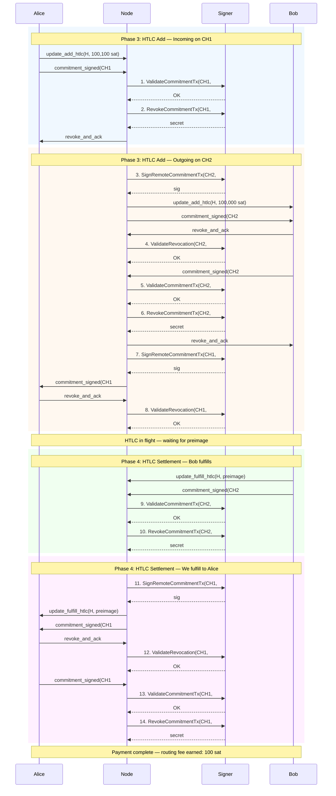
```mermaid
sequenceDiagram
    participant Alice
    participant Node
    participant Signer
    participant Bob

    rect rgb(240, 248, 255)
        Note over Alice, Bob: Phase 3: HTLC Add — Incoming on CH1

        Alice->>Node: update_add_htlc(H, 100,100 sat)
        Alice->>Node: commitment_signed(CH1 #1)

        Node->>Signer: 1. ValidateCommitmentTx(CH1, #1)
        Signer-->>Node: OK
        Node->>Signer: 2. RevokeCommitmentTx(CH1, #0)
        Signer-->>Node: secret
        Node->>Alice: revoke_and_ack
    end

    rect rgb(255, 248, 240)
        Note over Alice, Bob: Phase 3: HTLC Add — Outgoing on CH2

        Node->>Signer: 3. SignRemoteCommitmentTx(CH2, #1)
        Signer-->>Node: sig
        Node->>Bob: update_add_htlc(H, 100,000 sat)
        Node->>Bob: commitment_signed(CH2 #1)

        Bob->>Node: revoke_and_ack
        Node->>Signer: 4. ValidateRevocation(CH2, #0)
        Signer-->>Node: OK

        Bob->>Node: commitment_signed(CH2 #1)
        Node->>Signer: 5. ValidateCommitmentTx(CH2, #1)
        Signer-->>Node: OK
        Node->>Signer: 6. RevokeCommitmentTx(CH2, #0)
        Signer-->>Node: secret
        Node->>Bob: revoke_and_ack

        Node->>Signer: 7. SignRemoteCommitmentTx(CH1, #1)
        Signer-->>Node: sig
        Node->>Alice: commitment_signed(CH1 #1)

        Alice->>Node: revoke_and_ack
        Node->>Signer: 8. ValidateRevocation(CH1, #0)
        Signer-->>Node: OK
    end

    Note over Alice, Bob: HTLC in flight — waiting for preimage

    rect rgb(240, 255, 240)
        Note over Alice, Bob: Phase 4: HTLC Settlement — Bob fulfills

        Bob->>Node: update_fulfill_htlc(H, preimage)
        Bob->>Node: commitment_signed(CH2 #2)
        Node->>Signer: 9. ValidateCommitmentTx(CH2, #2)
        Signer-->>Node: OK
        Node->>Signer: 10. RevokeCommitmentTx(CH2, #1)
        Signer-->>Node: secret
    end

    rect rgb(255, 240, 255)
        Note over Alice, Bob: Phase 4: HTLC Settlement — We fulfill to Alice

        Node->>Signer: 11. SignRemoteCommitmentTx(CH1, #2)
        Signer-->>Node: sig
        Node->>Alice: update_fulfill_htlc(H, preimage)
        Node->>Alice: commitment_signed(CH1 #2)

        Alice->>Node: revoke_and_ack
        Node->>Signer: 12. ValidateRevocation(CH1, #1)
        Signer-->>Node: OK

        Alice->>Node: commitment_signed(CH1 #2)
        Node->>Signer: 13. ValidateCommitmentTx(CH1, #2)
        Signer-->>Node: OK
        Node->>Signer: 14. RevokeCommitmentTx(CH1, #1)
        Signer-->>Node: secret
    end

    Note over Alice, Bob: Payment complete — routing fee earned: 100 sat
```

---

*Source: [VLS Repository](https://gitlab.com/lightning-signer/validating-lightning-signer) — `vls-core/src/node.rs` (payment tracking), `vls-core/src/policy/simple_validator.rs` (validation logic)*
