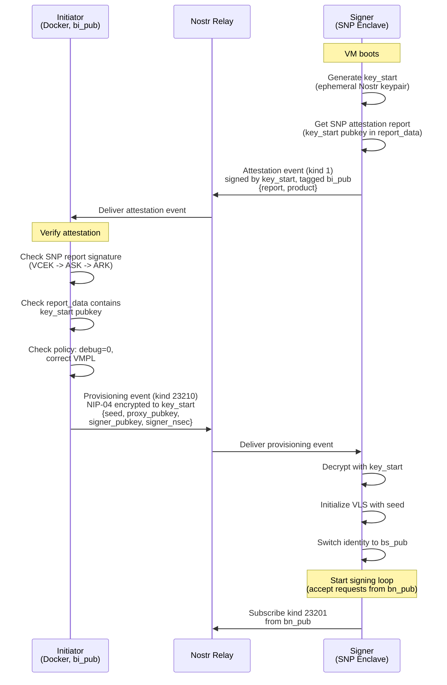
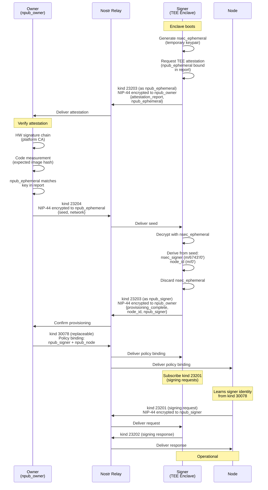

# Provisioning Flow Diagrams

## Mission 6: Initiator-Based Key Provisioning

The implemented provisioning flow from [mission-6-architecture](../workspaces/vls-signer-wks/plans/mission-6-architecture.md). The initiator holds the seed and signer identity, verifies the SNP attestation, and provisions the signer over Nostr (kind 23210).

## TEE Attestation Provisioning (Future Design)

The full provisioning flow from [signer-provisioning](future/signer-provisioning.md). The signer derives its permanent identity from the seed (deterministic), and the owner publishes a policy binding event (kind 30078) to connect signer to node.

## Key Differences

| Aspect | Mission 6 | Future Design |
|--------|-----------|---------------|
| Signer identity | Provisioned by initiator (bs_pub/bs_prv sent explicitly) | Derived from seed (deterministic, m/6743'/0') |
| Attestation kind | kind 1 (text note) | kind 23203 (dedicated) |
| Seed delivery kind | kind 23210 | kind 23204 |
| Node-signer binding | Hardcoded proxy pubkey | Owner publishes kind 30078 policy event |
| Provisioning payload | seed + proxy_pubkey + signer_pubkey + signer_nsec | seed + network |
| Restart behavior | Re-attest, re-provision, same identity (explicitly sent) | Re-attest, re-provision, same identity (derived from seed) |
| Encryption | NIP-04 | NIP-44 |
