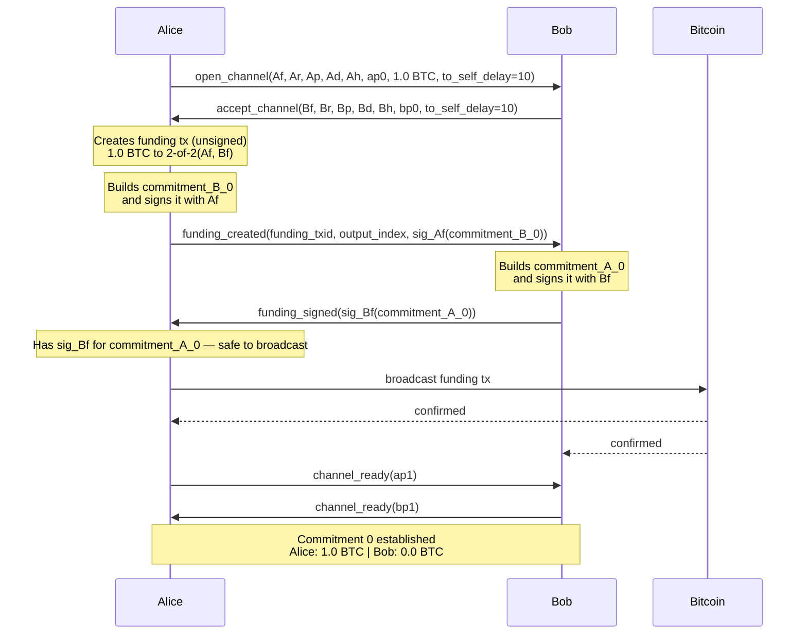
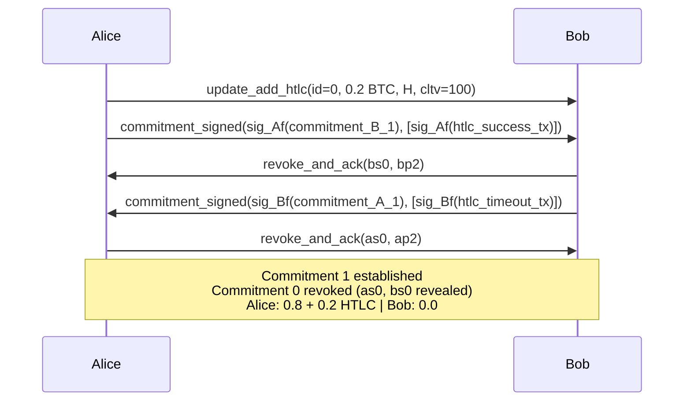
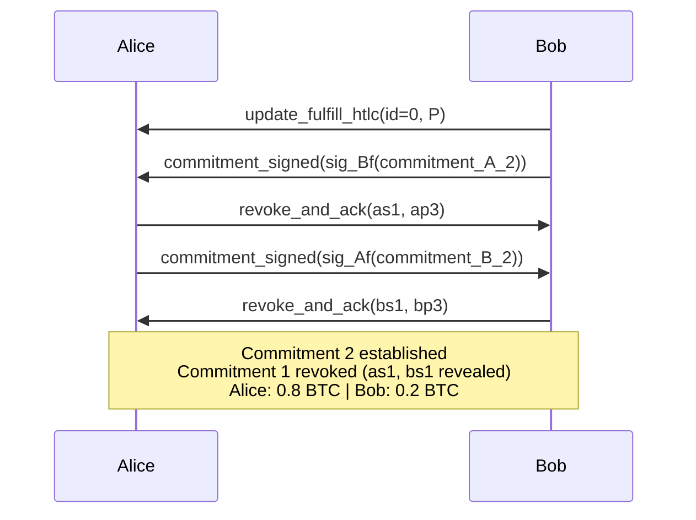
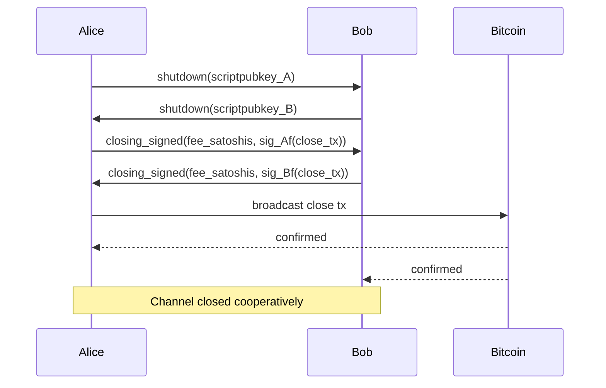

# Scenario 01 — Alice Pays Bob (Lightning Messages)

Sequence diagrams for each state transition. Alice funds the channel with 1.0 BTC, pays Bob 0.2 BTC via HTLC, then they cooperatively close the channel.

See also:
- [Lightning Protocol](lightning-protocol.md) for how the update-commit-revoke cycle works
- [Key Derivation](lightning-key-derivation.md) for the notation legend (`Af`, `Ar`, `ap0`, etc.) and how derived keys are calculated

---

## Commitment 0

Alice funds a 1.0 BTC channel. After this exchange, both sides hold commitment 0.

### Message flow

1. **Alice → Bob: `open_channel`** — Alice proposes a channel. She sends her funding key (`Af`), all basepoints (`Ar`, `Ap`, `Ad`, `Ah`), her first per-commitment point (`ap0`), the funding amount (1.0 BTC), and her requested `to_self_delay` (10 blocks for Bob's side).

2. **Bob → Alice: `accept_channel`** — Bob agrees. He sends his funding key (`Bf`), basepoints (`Br`, `Bp`, `Bd`, `Bh`), first per-commitment point (`bp0`), and his requested `to_self_delay` (10 blocks for Alice's side).

3. **Alice constructs the funding transaction** (unsigned) — a 1.0 BTC output to the 2-of-2 multisig `(Af, Bf)`. She also builds Bob's commitment (`commitment_B_0`) and signs it with her funding key.

4. **Alice → Bob: `funding_created`** — sends the funding txid, output index, and her signature on Bob's commitment: `sig_Af(commitment_B_0)`. This gives Bob his escape hatch before the funding tx is even broadcast.

5. **Bob builds Alice's commitment** (`commitment_A_0`) and signs it with his funding key.

6. **Bob → Alice: `funding_signed`** — sends `sig_Bf(commitment_A_0)`. Now Alice has her escape hatch too — safe to broadcast.

7. **Alice broadcasts the funding transaction.** Both sides watch for confirmation.

8. **After confirmation, both send `channel_ready`** — each provides their next per-commitment point (`ap1`, `bp1`) for commitment state 1. The channel is open.



### Commitment 0 Transactions

After channel open, each side holds:

**commitment_A_0** (Alice holds, signed by Bob with Bf):
```
Input:  funding_outpoint (requires sig_Af + sig_Bf)
Outputs:
  to_local:  1.0 BTC — rp(Br, ap0) | dp(Ad, ap0) + dt=10
  to_remote: 0.0 BTC — Bp (not created, below dust)
```

**commitment_B_0** (Bob holds, signed by Alice with Af):
```
Input:  funding_outpoint (requires sig_Af + sig_Bf)
Outputs:
  to_local:  0.0 BTC — rp(Ar, bp0) | dp(Bd, bp0) + dt=10 (not created, below dust)
  to_remote: 1.0 BTC — Ap
```

---

## Commitment 1 — HTLC Add

Alice sends 0.2 BTC to Bob via HTLC. Payment hash H, CLTV timeout T=100.

### Message flow

1. **Alice → Bob: `update_add_htlc`** — proposes an HTLC: 0.2 BTC locked to payment hash `H`, expires at block height T=100. This doesn't change the commitment yet — it's staged.

2. **Alice → Bob: `commitment_signed`** — Alice signs Bob's new commitment (`commitment_B_1`) that includes the HTLC. She sends:
   - `sig_Af(commitment_B_1)` — her signature on Bob's commitment tx
   - `htlc_sigs` — one signature per HTLC output, each signing the corresponding 2nd-stage transaction. For Bob's received HTLC, this is Alice's signature on the HTLC-success tx that Bob will use to claim funds with the preimage. Bob needs this because the 2nd-stage tx requires *both* funding keys (`sig_Af + sig_Bf`).

   Bob now has a valid commitment with the HTLC, and the pre-signed 2nd-stage tx he needs to claim it.

3. **Bob → Alice: `revoke_and_ack`** — Bob revokes his old commitment (state 0) by revealing `bs0` (the per-commitment secret for state 0). He also provides `bp2` (the per-commitment point for the *next* state). From this point, if Bob broadcasts commitment 0, Alice can take everything via penalty.

4. **Bob → Alice: `commitment_signed`** — Bob signs Alice's new commitment (`commitment_A_1`) that includes the HTLC. He sends:
   - `sig_Bf(commitment_A_1)` — his signature on Alice's commitment tx
   - `htlc_sigs` — his signature on the HTLC-timeout tx that Alice would use to reclaim funds after expiry T=100 (if Bob never reveals the preimage). Alice needs this because the 2nd-stage tx requires both signatures.

5. **Alice → Bob: `revoke_and_ack`** — Alice revokes her old commitment (state 0) by revealing `as0`, and provides `ap2`. Both sides have now irrevocably moved to state 1.



### Commitment 1 Transactions

**commitment_A_1** (Alice holds, signed by Bob with Bf):
```
Input:  funding_outpoint (requires sig_Af + sig_Bf)
Outputs:
  to_local:      0.8 BTC — rp(Br, ap1) | dp(Ad, ap1) + dt=10
  htlc_offered:  0.2 BTC — rp(Br, ap1) | sig_Af+sig_Bf (HTLC-timeout, after T=100) | Bh(bp1) + H(P)
  to_remote:     0.0 BTC — Bp (not created, below dust)
```

**commitment_B_1** (Bob holds, signed by Alice with Af):
```
Input:  funding_outpoint (requires sig_Af + sig_Bf)
Outputs:
  to_local:      0.0 BTC — rp(Ar, bp1) | dp(Bd, bp1) + dt=10 (not created, below dust)
  htlc_received: 0.2 BTC — rp(Ar, bp1) | sig_Af+sig_Bf (HTLC-success, with preimage) | Ah(ap1) + T=100
  to_remote:     0.8 BTC — Ap
```

The HTLC output has three spend paths:
1. **Revocation** — counterparty takes all if revoked commitment is broadcast
2. **2nd-stage tx** — requires both signatures, goes to a timeout or success transaction with CSV delay
3. **Direct claim** — preimage (for received) or timeout (for offered)

---

## Commitment 2 — HTLC Settlement

Bob reveals the preimage, claiming the 0.2 BTC.

### Message flow

1. **Bob → Alice: `update_fulfill_htlc`** — Bob reveals the preimage `P` that satisfies hash `H`. This proves the payment reached its destination. The HTLC is now resolved — it will be removed in the next commitment.

2. **Bob → Alice: `commitment_signed`** — Bob signs Alice's new commitment (`commitment_A_2`) with the HTLC removed and 0.2 BTC moved to Bob's balance. He sends `sig_Bf(commitment_A_2)`.

3. **Alice → Bob: `revoke_and_ack`** — Alice revokes state 1 by revealing `as1`, provides `ap3`.

4. **Alice → Bob: `commitment_signed`** — Alice signs Bob's new commitment (`commitment_B_2`) with the HTLC removed. She sends `sig_Af(commitment_B_2)`.

5. **Bob → Alice: `revoke_and_ack`** — Bob revokes state 1 by revealing `bs1`, provides `bp3`. Both sides are now at state 2: Alice 0.8 BTC, Bob 0.2 BTC, no HTLCs.



### Commitment 2 Transactions

**commitment_A_2** (Alice holds, signed by Bob with Bf):
```
Input:  funding_outpoint (requires sig_Af + sig_Bf)
Outputs:
  to_local:  0.8 BTC — rp(Br, ap2) | dp(Ad, ap2) + dt=10
  to_remote: 0.2 BTC — Bp
```

**commitment_B_2** (Bob holds, signed by Alice with Af):
```
Input:  funding_outpoint (requires sig_Af + sig_Bf)
Outputs:
  to_local:  0.2 BTC — rp(Ar, bp2) | dp(Bd, bp2) + dt=10
  to_remote: 0.8 BTC — Ap
```

---

## Cooperative Close

Both sides agree to close the channel. No more HTLCs pending.

### Message flow

1. **Alice → Bob: `shutdown`** — Alice signals she wants to close the channel. She includes `scriptpubkey_A`, the on-chain address where she wants her funds sent. After this, no new HTLCs can be added.

2. **Bob → Alice: `shutdown`** — Bob agrees and sends his `scriptpubkey_B`. Both sides are now committed to closing.

3. **Alice → Bob: `closing_signed`** — Alice proposes a fee and signs the close transaction with her funding key: `sig_Af(close_tx)`. The close tx pays each side's balance to their chosen scriptpubkey, minus the fee.

4. **Bob → Alice: `closing_signed`** — Bob agrees to the fee (or counter-proposes). Once they agree, he sends `sig_Bf(close_tx)`. Now both sides have both signatures needed to spend the 2-of-2 funding output.

5. **Broadcast** — either side can assemble and broadcast the fully-signed close transaction.



### Close Transaction

```
Input:  funding_outpoint (requires sig_Af + sig_Bf)
Outputs:
  0.8 BTC → scriptpubkey_A (Alice's chosen address)
  0.2 BTC → scriptpubkey_B (Bob's chosen address)
```

No timelocks, no revocation paths — a simple pay-out to each party's chosen address, minus the negotiated fee.
